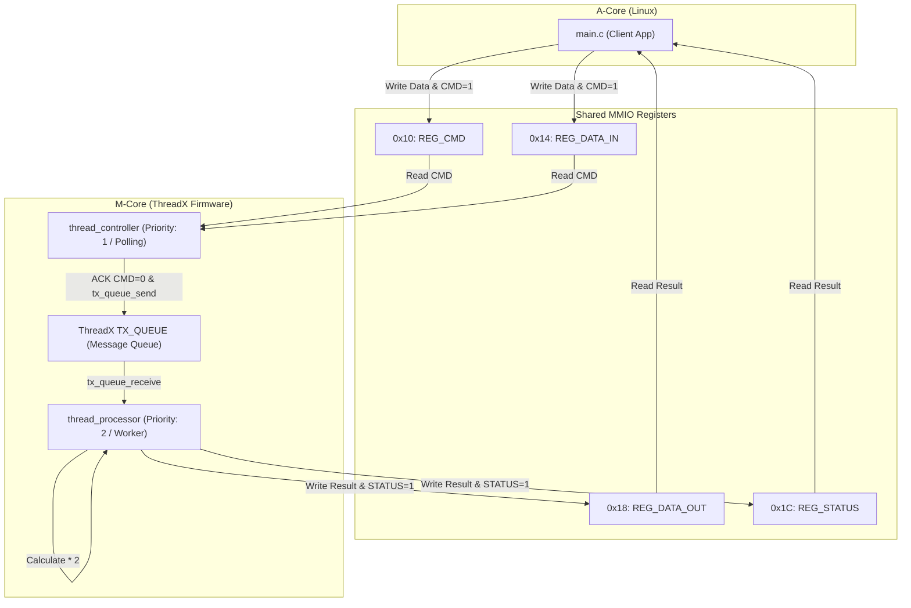

# Scenario 11: Eclipse ThreadX による M コアマルチタスク制御 - 詳細設計 & アーキテクチャ解説

本ドキュメントは、Eclipse ThreadX (Azure RTOS) Linux Port、スレッド間メッセージキュー (`TX_QUEUE`)、優先度継承、および Aコア（Linux）との共有レジスタコマンドプロトコルの詳細仕様書です。

---

## 1. ThreadX スレッド間連携アーキテクチャ

---

## 2. ThreadX API と設計仕様

1. **`tx_kernel_enter()`**: ThreadX カーネル初期化およびエントリポイント。
2. **`tx_application_define()`**: スレッド（`tx_thread_create`）およびキュー（`tx_queue_create`）の静的リソース割り当て。
3. **`tx_queue_send` / `tx_queue_receive`**: 高速なスレッドセーフ・メッセージ受け渡し。
