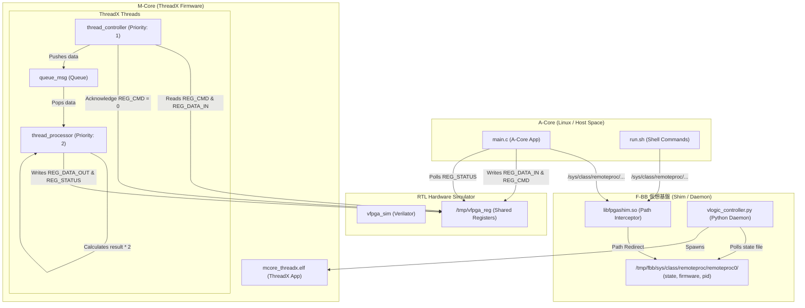

# 11_amp_mcore_threadx: Eclipse ThreadXを用いたMコア側マルチタスク制御とAコアとの協調動作

このシナリオでは、Mコア（Coprocessor）側でリアルタイムOS（Eclipse ThreadX）を用いたマルチスレッド処理（周辺監視スレッド、演算処理スレッド）を実行し、Aコア（Linux側アプリケーション）からの処理要求（コマンド）を仮想FPGAレジスタ経由で受信・キューイングし、スレッド間連携のもとで演算処理を行って結果をAコアへ返す、本格的なマルチコア（AMP）協調システムをF-BB上で検証・学習します。

---

## アーキテクチャ概念図



---

## シナリオの仕組みと特徴

1. **ThreadX Linux Port によるマルチタスクエミュレーション**:
   - ホストLinux上のスレッドとしてThreadXカーネルのスレッド制御（Pthreadsベース）を実行します。これにより、マルチタスク構造（`thread_controller` と `thread_processor`）、スレッド間通信（`queue_msg`）、およびタイマ遅延（`tx_thread_sleep`）などのOS API機能がPC上でそのまま機能します。

2. **非同期マルチタスク協調設計**:
   - **`thread_controller` (周辺監視スレッド / 優先度: 1)**: 
     10ms周期で `REG_CMD` を監視し、Aコアからの処理コマンド（`0xA1`）を検知すると `REG_DATA_IN` の値を読み出し、データ処理スレッドに渡すために ThreadX メッセージキュー（`queue_msg`）へ送信します。送信後、コマンドクリアのために `REG_CMD` を `0` にリセットします。
   - **`thread_processor` (演算処理スレッド / 優先度: 2)**: 
     キューにデータが届くまでブロック状態で待機します。データ受信後、100msのスリープ（`tx_thread_sleep(10)` による擬似演算時間）を挟んだのち、データを2倍して `REG_DATA_OUT` に書き込み、ステータスレジスタ `REG_STATUS` に `0x01` (READY) を書き込んで処理完了をAコアに通知します。

3. **メモリプールの安全な分離**:
   - ThreadX が割り当てるヒープやスタック領域が、仮想 FPGA レジスタ空間（`0x40000000` - `0x40001000`）と重ならないように、タスク用のバイトプールは静的配列 `static uint8_t threadx_pool[POOL_SIZE]` として明示的に定義し、そこからすべての ThreadX スレッドスタックおよびメッセージキューメモリを切り出しています。

---

## 学習のポイント

1. **リアルタイムOS (RTOS) を用いた非同期並行処理の設計**:
   - ポーリング処理などの「時間を要する/CPUを占有しがちなタスク」と、「データの演算タスク」をキューで分離し、ThreadXによる優先度制御を用いた協調動作を行うマルチタスク設計を学びます。
2. **Aコア・Mコア間の物理レジスタによる非同期通信シーケンス**:
   - Aコアによるコマンド発行、Mコア側タスクでの検知、処理、およびステータスレジスタ経由での完了通知という、実機でもそのまま使われる基本的な非同期通信ハンドシェイクフローを習得します。
3. **F-BBを用いたRTOSシミュレーションの統合設計**:
   - POSIX移植レイヤーを利用したRTOS機能のモックビルドと、F-BBの自動マッピング機能の組み合わせによる、効率的なPC上での結合テスト実装を理解します。

---

## 実機で動作させるための注意点（ビルド・コンパイル構成の移行）

F-BB環境（PCシミュレーション）では、テストの利便性からAコア・Mコア双方をホストPC上の `gcc` でコンパイルし、ThreadXのPOSIXエミュレーションレイヤーを利用していますが、実機ボードで本ファームウェアを動作させる場合は、以下の手順でビルド環境（CMake等）を実機用に移行します。

* **Aコア（Linux アプリ: `test_bin`）のビルド**:
   - 実機ボード上の Linux で直接コンパイルするか、またはターゲットプロセッサ用のクロスコンパイラ（例: `aarch64-linux-gnu-gcc`）を利用します。
   - UIOドライバのデバイスファイル `/dev/uio0` を介してレジスタ空間にマップするため、Cソースコード（`main.c`）は実機でもそのまま無修正で動作します。

* **Mコア（ThreadX FW: `mcore_threadx.elf`）のビルド**:
   MコアはOSの管理下にないベアメタル環境で直接動作させるため、ツールチェーンおよびThreadX構成の差し替えを行います。
   1. **クロスコンパイラの使用**:
      Mコア（コプロセッサ）専用のクロスコンパイラ（例: Cortex-M/R向けなら `arm-none-eabi-gcc`）を指定します。
   2. **ThreadX 移植レイヤー (Port) の差し替え**:
      シミュレータ環境用だった `-lpthread -lrt` や `threadx/ports/linux/gnu/` のファイル群をビルド対象から**除外**します。代わりに、実機プロセッサのCPUアーキテクチャに適したリアルPortレイヤー（例: `ports/cortex_m4/gnu/` など）をビルド対象に含めます。
   3. **スタートアップコードとリンカスクリプトの指定**:
      実機の物理メモリ空間（TCMや共有SRAM、予約DDR領域など）に合わせてデータとコードを正しく配置するため、実機ボード専用の**リンカスクリプト（`.ld`）**および**スタートアップコード**をビルド時に指定・リンクします。
   4. **Mコアファームウェアソースの互換性**:
      ポインタ直叩きによるメモリアクセスを行っているため、`mcore_threadx.c` のCソースコードそのものは**1文字も書き換えることなく**、ビルド設定の差し替えだけで実機に移植することができます。

---

## 実行方法

F-BB環境において本ディレクトリに移動して、以下のスクリプトを実行してください。

```bash
./run.sh          # ビルドと実行 (自動テストが走り、AコアとThreadXマルチスレッドMコアの協調がパスします)
```

### 期待される出力ログの例
実行が成功すると、以下のようにMコア（`[M-Core]`）のThreadXマルチタスク起動ののち、Aコア（`[A-Core]`）との間で正常にデータのやり取りが行われ、テストが成功します。

```text
--- ThreadX AMP Multitask Test Start ---
[A-Core] Opening /dev/uio0...
[Shim M-Core] Successfully mapped 0x40000000 -> 0x40000000 (size: 4096, offset: 0)
[M-Core] ThreadX firmware starting...
[M-Core] FPGA Controller thread started.
[M-Core] Data Processor thread started.
[A-Core] Writing test value 12345 to REG_DATA_IN...
[A-Core] Sending Command 0xA1 to REG_CMD...
[A-Core] Waiting for M-Core to set REG_STATUS to READY (0x01)...
[M-Core] Command 0xA1 detected. Data input: 12345. Sending to processing queue...
[M-Core] Processing data: 12345...
[M-Core] Data processed. Result 24690 written to REG_DATA_OUT.
[A-Core] READY status received from M-Core.
[A-Core] Reading REG_DATA_OUT: 24690 (Expected: 24690)
[A-Core] SUCCESS: Data correctly processed by ThreadX multitasking firmware!
--- ThreadX AMP Multitask Test Finished ---
```
