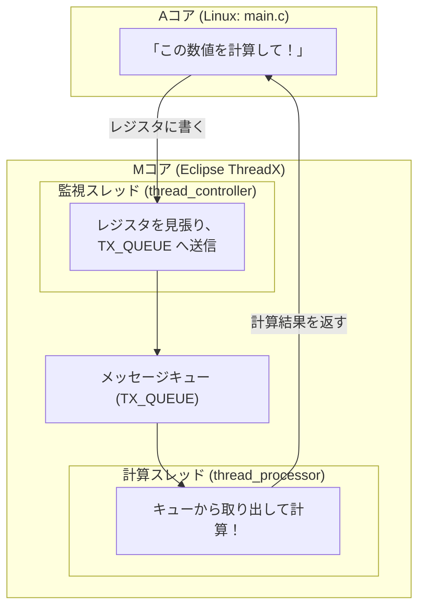

# 11_amp_mcore_threadx: 高信頼RTOS「Eclipse ThreadX」

前回の [10_amp_mcore_freertos](../10_amp_mcore_freertos/README.md) ではFreeRTOSを動かしました。
組み込みの世界には、もう一つ世界中で極めて高い信頼性を誇る商用グレードRTOSである **「Eclipse ThreadX（旧 Microsoft Azure RTOS）」** があります。

航空宇宙（NASAの宇宙探査機等）や医療機器、自動車などで広く採用されているThreadXを使って、Mコア側でマルチスレッド処理を動かしてみましょう！

---

## このシナリオのゴール
**「Mコア側でEclipse ThreadXを起動し、メッセージキュー（TX_QUEUE）を使ってAコア（Linux）からの計算要求を並行処理する」**

---

## 直感イメージ：CPUとFPGAのやり取り
ThreadXの2つのスレッド（監視スレッドと計算スレッド）が連携してリクエストを処理します。


```mermaid
flowchart TD
    subgraph Linux ["Aコア (Linux: main.c)"]
        Client["「この数値を計算して！」"]
    end

    subgraph MCore ["Mコア (Eclipse ThreadX)"]
        subgraph Thread1 ["監視スレッド (thread_controller)"]
            T1["レジスタを見張り、\nTX_QUEUE へ送信"]
        end

        Queue["メッセージキュー (TX_QUEUE)"]

        subgraph Thread2 ["計算スレッド (thread_processor)"]
            T2["キューから取り出して計算！"]
        end
    end

    Client -->|"レジスタに書く"| T1
    T1 --> Queue
    Queue --> T2
    T2 -->|"計算結果を返す"| Client
```

---

## 3つの基本ステップ（コードの読み方）

[mcore_threadx.c](mcore_threadx.c) で行っていることは、以下の3ステップです。

1. **ThreadXのエントリポイントを呼ぶ (`tx_kernel_enter`)**
   - カーネルを初期化し、`tx_application_define` でスレッドとキューを生成します。
2. **スレッド間メッセージキューでデータを受け渡す**
   - `tx_queue_send(&queue_msg, ...)` で監視スレッドから計算スレッドへ要求を渡します。
   - `tx_queue_receive(&queue_msg, ...)` で計算スレッドが即座に起床して処理します。
3. **計算結果をレジスタに書き込んでAコアへ通知する**
   - 計算完了ステータスを立てて、Linux側へ結果を返します。

---

## 1. まずは動かしてみよう！

ターミナルで以下のコマンドを実行します。

```bash
./run.sh
```

**期待される出力例：**
```text
=== Scenario 11: Eclipse ThreadX on M-Core Test Start ===
[A-Core] Booting M-Core ThreadX firmware...
[M-Core ThreadX] ThreadX Kernel Started. Threads running!
[A-Core] Sending Task Request: DATA_IN = 0x00000100...
[M-Core ThreadX] Processed Request in ThreadProcessor: Result = 0x00000200
[A-Core] Received Result: DATA_OUT = 0x00000200
[A-Core] SUCCESS: ThreadX multi-thread coordination verified!
=== Scenario 11 Test Result: SUCCESS ===
```

---

## 2. ちょこっと改造チャレンジ！

理解を深めるために、ThreadX側の計算処理を変更してみましょう。

- **実験:** [mcore_threadx.c](mcore_threadx.c#L60) の 60行目付近を見てみてください。
  ```c
  uint32_t result = data * 2;
  ```
  この計算式を書き換えて `./run.sh` を実行してみてください。FreeRTOSの時と同様にThreadXでも正しく演算結果が更新されることが確認できます！

---

## 次のステップへ
これで「FreeRTOSとThreadXという代表的な2大RTOS」の基本を体験しました！

- **次のシナリオ [14_amp_mcore_OpenAMP_baremetal](../14_amp_mcore_OpenAMP_baremetal/README.md)**:  
  次は、Linuxとマイコンの間で共有メモリを使って高速にメッセージパケットをやり取りする業界標準フレームワーク**「OpenAMP (RPMsg)」**に進みましょう。

---

## さらに詳しく知りたい方へ
ThreadX Linux Portの内部構造やAPI仕様の詳細は、**[ADVANCED.md](ADVANCED.md)** を参照してください。
