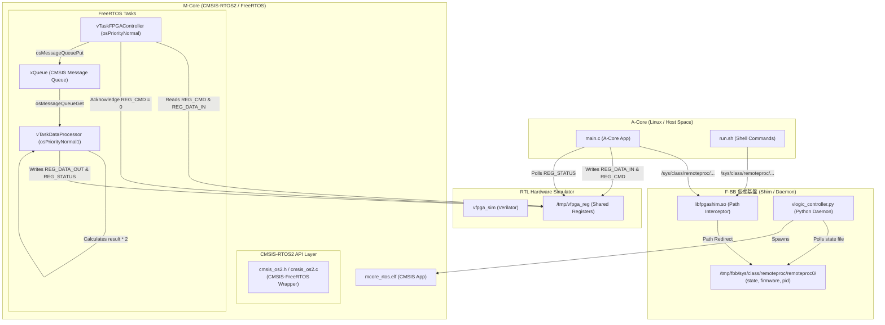

# 12_amp_mcore_cmsis-rtos2-freertos: CMSIS-RTOS2 API と FreeRTOS を用いたマルチコア (AMP) 協調動作

このシナリオでは、Mコア（Coprocessor）側で標準的な抽象化APIである **CMSIS-RTOS2 API** を使用し、下層のリアルタイムOSカーネルとして **FreeRTOS**（Linux POSIX ポート版）を組み合わせた構成の動作検証を行います。

Aコア（Linux側アプリケーション）からの処理要求（コマンド）を仮想FPGAレジスタ経由で受信・キューイングし、OSのマルチタスク間連携のもとで演算処理を行って結果をAコアへ返す、本格的なマルチコア（AMP）協調システムを検証します。

---

## アーキテクチャ概念図



---

## `mcore_rtos.c` 共通ソースコードの同期メカニズム

本シナリオのMコアファームウェア `mcore_rtos.c` は、**シナリオ13 (`13_amp_mcore_cmsis-rtos2-threadx`) と完全に同一のソースコード**を使用します。

### タイムスタンプ比較による自動同期とフォールバック設計
12と13のそれぞれに `mcore_rtos.c` の実ファイルを配置しつつ、開発時の更新漏れや片方の削除に耐えられるよう、CMakeによるビルド構成時に以下の同期ロジックが自動実行されます：
1. **両方のファイルが存在する場合**: シナリオ12とシナリオ13の `mcore_rtos.c` の最終更新タイムスタンプを比較し、**より新しい（更新された）ファイルを自動的もう一方へ上書きコピー（同期）**します。これにより、どちらのディレクトリのファイルを編集しても自動的に同期が維持されます。
   * **無限ループ防止策**: 同期時のタイムスタンプ更新による「無限ビルド同期ループ（無限ビルドピンポン）」を防ぐため、コピー処理の前にファイル内容の差分（`compare_files`）を検出し、**実際に内容に差異がある場合のみ**上書きコピーを実行します。
2. **片方のファイルが失われている場合**: もう一方のディレクトリが存在する限り、残っている側の `mcore_rtos.c` を欠損している側へ自動的にコピーして自己修復します。
3. **相手のディレクトリ自体が削除されている場合**: コピー処理をスキップし、本ディレクトリ内にあるローカルの `mcore_rtos.c` を使ってビルドを継続します。

これにより、ポータビリティの担保（同一コードでの複数RTOS動作）と、各テストケースの独立性（片方削除時の動作継続性）を両立しています。

---

## シナリオの仕組みと特徴

1. **CMSIS-FreeRTOS 移植による標準APIの利用**:
   - ARM公式の [CMSIS-FreeRTOS](https://github.com/ARM-software/CMSIS-FreeRTOS) ラッパーを利用し、標準の `osKernelInitialize`, `osThreadNew`, `osMessageQueueNew` などの汎用APIを用いてマルチタスクおよびキュー通信を構築しています。これにより、特定のOS（FreeRTOS）の独自APIへの依存をなくしています。

2. **非同期マルチタスク協調設計**:
   - **`vTaskFPGAController` (周辺監視スレッド)**: 
     Aコアからの処理コマンド（`0xA1`）を検知すると、`REG_DATA_IN` の値を読み出し、`osMessageQueuePut` を使用してメッセージキュー（`xQueue`）へ送信します。送信後、コマンドクリアのために `REG_CMD` を `0` にリセットします。
   - **`vTaskDataProcessor` (演算処理スレッド)**: 
     キューにデータが届くまで `osMessageQueueGet` でブロック状態で待機します。データ受信後、擬似ディレイを挟んでデータを2倍にし、`REG_DATA_OUT` に結果、`REG_STATUS` に `0x01` (READY) を書き込んでAコアに完了を通知します。

3. **アセンブラ依存コードのバイパス**:
   - Linux POSIX ポート上で Cortex-M 用のアセンブラ命令（`__get_IPSR` や `__get_CONTROL` など）がビルドエラーになるのを防ぐため、ダミーの [cmsis_compiler.h](./cmsis_compiler.h) 内でこれらを安全なダミーマクロとして定義しバイパスしています。

4. **OS_Tick リンカ要件の解決（スタブ実装）**:
   - FreeRTOSのPOSIXポートを使用するにあたり、CMSIS-RTOS2ラッパーのリンクに必要なOS Tick APIスタブ関数群 (`OS_Tick_Setup`, `OS_Tick_Enable`, `OS_Tick_Disable`, `OS_Tick_AcknowledgeIRQ`, `OS_Tick_GetIRQn`, `OS_Tick_GetClock`, `OS_Tick_GetInterval`, `OS_Tick_GetCount`, `OS_Tick_GetOverflow`) を [mcore_rtos.c](./mcore_rtos.c) の末尾にダミー実装として定義し、ビルドエラーを回避しています。

5. **SystemCoreClock グローバル変数の定義**:
   - CMSIS ラッパーが参照するグローバルクロック変数である `uint32_t SystemCoreClock = 1000000U;` (1MHz想定) を定義し、リンク時の未定義シンボルエラー（`undefined reference to 'SystemCoreClock'`）を解消しています。

---

## 学習のポイント

1. **RTOSに依存しない汎用的なファームウェア設計**:
   - CMSIS-RTOS2 APIを使用することで、ソースコードに手を加えることなく下層のRTOSカーネル（FreeRTOS / ThreadX）を切り替えても全く同じ協調動作が機能することを学びます。
2. **Aコア・Mコア間の物理レジスタによる非同期通信シーケンス**:
   - Aコアによるコマンド発行、Mコア側タスクでの検知、処理、およびステータスレジスタ経由での完了通知という、実機でもそのまま使われる基本的な非同期通信ハンドシェイクフローを習得します。
3. **安全なエラーハンドリング実装**:
   - OSの初期化やスレッド起動時に異常が発生した場合、サイレントにハングアップするのを防ぐための適切なステータスチェックと出力方法を学びます。

---

## 実機で動作させるための注意点（ビルド・コンパイル構成の移行）

F-BB環境（PCシミュレーション）では、テストの利便性からFreeRTOSのPOSIXエミュレーションレイヤーを利用していますが、実機ボード（Zynqやi.MX95など）で本ファームウェアを動作させる場合は、以下の手順でビルド環境を実機用に移行します。

* **Aコア（Linux アプリ: `test_bin`）のビルド**:
   - 開発ホストPCからクロスビルドする場合は、ターゲットプロセッサに合わせたクロスコンパイラ（例: `aarch64-linux-gnu-gcc`）を使用します。
   - UIOドライバのデバイスファイル `/dev/uio0` を介してレジスタ空間にマップするため、Cソースコード（`main.c`）は実機でもそのまま無修正で動作します。

* **Mコア（FreeRTOS FW: `mcore_rtos.elf`）のビルド**:
   Bコア（コプロセッサ）専用のクロスコンパイラと移植レイヤーを指定します。
   1. **クロスコンパイラの使用**: Cortex-M向けなら `arm-none-eabi-gcc` を指定します。
   2. **FreeRTOS Portの差し替え**: シミュレータ用の `portable/ThirdParty/GCC/Posix/` を除外し、実機CPUに適したリアルPortレイヤー（例: `portable/GCC/ARM_CM4F/port.c` など）をビルド対象に含めます。
   3. **ヒープ管理 (Heap) の変更**: 標準 `malloc` に依存する `heap_3.c` から、ベアメタル用の静的ヒープ管理を行う `heap_4.c` などに変更します。
   4. **リンカスクリプトとスタートアップコード**: 実機の物理メモリ空間（TCMや共有SRAM、予約DDR領域など）に合わせてデータとコードを正しく配置するため、実機ボード専用のリンカスクリプト（`.ld`）およびスタートアップコードをリンクします。
   5. **ソースコードの透過性**: `mcore_rtos.c` そのものは**1文字も書き換えることなく**、上記ビルド設定の差し替えだけで実機に移植することができます。

---

## コンパイラ警告の抑制とその発生原因について

本シナリオでは、64bit Linuxのシミュレーション環境特有のミスマッチにより発生する一部の警告を抑制するため、CMakeLists.txt にて `-Wno-pointer-to-int-cast`, `-Wno-int-to-pointer-cast`, `-Wno-overflow` オプションを追加しています。これらの警告が発生していた原因と抑制目的は以下の通りです。

### 1. ポインタキャスト警告 (`-Wno-pointer-to-int-cast`, `-Wno-int-to-pointer-cast`)
* **原因**: 
  ARM CMSIS-RTOS2 API は、スレッドやキューの識別ハンドルを 32bit の整数値（`uint32_t` など）として受け渡しする設計になっています。しかし、シミュレータが動作するホスト環境（64bit Linux）ではポインタ（`void*` や `TaskHandle_t` 等）のサイズが 64bit になります。
  このため、ラッパーコード（`cmsis_os2.c`）の内部で 64bit ポインタと 32bit 整数型の間で相互キャストが行われ、GCC から「ポインタと整数のサイズ不一致」を示す警告が出力されていました。
* **抑制目的**: 
  シミュレーション環境上でのハンドル識別子の値の変換に起因するものであり、実動作（値の格納・比較）において問題はないため、ビルドログをクリーンに保つために抑制しています。なお、実機（Cortex-M 等の 32bit マイコン）向けビルドでは、ポインタも整数も共に 32bit となるため、この警告は元々発生しません。

### 2. データ変換オーバーフロー警告 (`-Wno-overflow`)
* **原因**: 
  `ARM-software/CMSIS-FreeRTOS` の公式ラッパー（`cmsis_os2.c`）では、内部的なステータス処理（例：スレッドフラグ待ち時のエラーハンドリングなど）において、負の整数値をとる列挙型定数（`osErrorISR` や `osErrorParameter` 等）を `(uintptr_t)` でキャストして返す処理が記述されています。
  64bit環境において負数を 64bit 無符号（`uintptr_t`）でキャストすると、`18446744073709551610` のような極めて大きな値になります。これを 32bit の変数（`rflags`）に代入する際、GCC が値の切り捨てとオーバーフローを検知し、`-Woverflow` 警告を発生させていました。
* **抑制目的**: 
  最終的に変数に代入された時点で下位 32bit に正しく切り捨てられ、元のエラー値表現に復元されるため、動作上は安全であり影響はありません。サードパーティ公式コードの可読性や保守性を考慮し、ファイルを無理に書き換えることなくコンパイルオプション側で非表示にしています。

---

## 実行方法

F-BB環境において本ディレクトリに移動して、以下のスクリプトを実行してください。

```bash
./run.sh          # ビルドと実行 (自動テストが走り、AコアとFreeRTOSマルチタスクMコアの協調がパスします)
./run.sh --clean  # ビルド成果物とログの削除
```

### 期待される出力ログの例
実行が成功すると、以下のようにMコア（`[M-Core]`）のCMSIS-RTOS2マルチタスク起動ののち、Aコア（`[A-Core]`）との間で正常にデータのやり取りが行われ、テストが成功します。

```text
--- FreeRTOS AMP Multitask Test Start ---
[A-Core] Opening /dev/uio0...
[Shim M-Core] Successfully mapped 0x40000000 -> 0x40000000 (size: 4096, offset: 0)
[M-Core] CMSIS-RTOS2 firmware starting...
[M-Core] Data Processor thread started.
[M-Core] FPGA Controller thread started.
[A-Core] Writing test value 12345 to REG_DATA_IN...
[A-Core] Sending Command 0xA1 to REG_CMD...
[A-Core] Waiting for M-Core to set REG_STATUS to READY (0x01)...
[M-Core] Command 0xA1 detected via CMSIS-RTOS2 thread. Data input: 12345. Sending to processing queue...
[M-Core] Processing data: 12345...
[M-Core] Data processed. Result 24690 written to REG_DATA_OUT.
[A-Core] READY status received from M-Core.
[A-Core] Reading REG_DATA_OUT: 24690 (Expected: 24690)
[A-Core] SUCCESS: Data correctly processed via CMSIS-RTOS2!
--- FreeRTOS AMP Multitask Test Finished ---

[Runner] RESULT: SUCCESS
```
