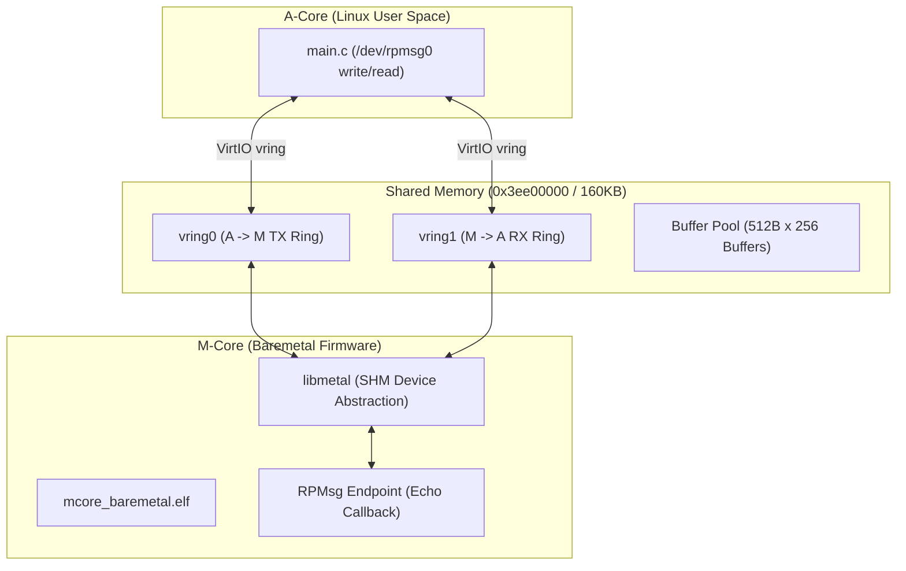

# Scenario 14: OpenAMP / RPMsg コア間通信 - 詳細設計 & アーキテクチャ解説

本ドキュメントは、オープン標準の異種マルチコア通信フレームワーク **OpenAMP (Open Asymmetric Multi-Processing)**、RPMsg (Remote Processor Messaging)、VirtIO vring、および共有メモリ（`libmetal`）の詳細仕様書です。

---

## 1. OpenAMP / RPMsg 共有メモリアーキテクチャ

---

## 2. OpenAMP / RPMsg の通信手順

1. **エンドポイントの作成 (`rpmsg_create_ept`)**:
   Mコア側で特定のサービス名（例: `"rpmsg-openamp-demo-channel"`）をバインド。
2. **共有メモリ (vring) へのパケット配置**:
   Aコアが `/dev/rpmsg0` へ `write()` すると、vring 内の空きバッファにメッセージがコピーされ、ヘッドインデックスが更新される。
3. **IPI（コア間割り込み）Kick**:
   Aコアから Mコアへ割り込みが入り、Mコア側コールバック関数が起動してメッセージを受信・エコーバック返信。
