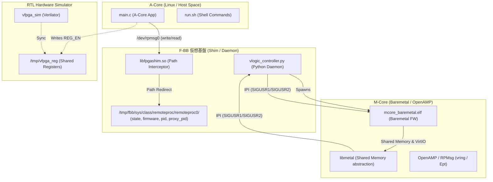

# 14_amp_mcore_OpenAMP_baremetal: ベアメタルでのOpenAMPおよびRPMsg協調動作の検証

このシナリオでは、マルチコアSoC環境における標準的なコア間通信プロトコル **OpenAMP (RPMsg)** を用い、Aコア（Linux アプリ）とMコア（ベアメタル FW）の間で双方向メッセージ通信を行う協調システムをF-BB上で検証・学習します。

---

## アーキテクチャ概念図



---

## シナリオの仕組みと特徴

1. **本物の OpenAMP & libmetal のホスト実行**:
   - `FetchContent` を用いて GitHub から公式の `libmetal` および `open-amp` ライブラリを自動取得し、ホスト PC 向けにビルドしてファームウェアとリンクします。これにより、実機で使用する本物の OpenAMP プロトコルスタックがそのままホスト PC 上で動作します。

2. **固定アドレスマッピングによる共有メモリ再現**:
   - `libmetal` のデバイス登録・抽象化機能を用いて、物理アドレス `0x3ee00000`（サイズ 160KB）の仮想共有メモリ（SHM）を登録します。この空間の中に、VirtIO の送受信用 vring と、実データを格納するバッファプールが定義され、双方のコアから透過的にアクセスされます。

3. **POSIXシグナルを用いた仮想IPI（割り込み）エミュレーション**:
   - 実機のコア間割り込み（IPI: Inter-Processor Interrupt）を模擬するため、プロセスID（`pid` / `proxy_pid`）と POSIX シグナル（`SIGUSR1`/`SIGUSR2`）を連携させたメッセージング機構を実装しています。
   - Mコアが IPI を Kick する際は `fbb_ipi_notify` を通じて Aコア側のプロセスに `SIGUSR2` を送ります。
   - Aコア側から Mコアへ通知する際は `SIGUSR1` が送られ、Mコアはシグナルハンドラ経由でイベント検知し、`rproc_virtio_notified` を呼び出して VirtIO ディスパッチ処理を行います。

---

## 学習のポイント

1. **OpenAMP / RPMsg の通信モデルとアーキテクチャの理解**:
   - 非対称マルチコア（AMP）構成においてデファクトスタンダードとなっている OpenAMP / RPMsg の初期化、エンドポイント（`rpmsg-openamp-demo-channel`）作成、および `rpmsg_send` によるメッセージ送信フローの基礎を学びます。
2. **共有メモリと IPI（割り込み）のホストシミュレーション**:
   - 実機のハードウェア資源（共有SRAM/DDR、および割り込みコントローラ）を、ホスト Linux のプロセス間共有メモリと POSIX シグナルへ「翻訳」してエミュレートする設計手法を習得します。
3. **コード透過性の担保**:
   - 実機用のポインタ直叩きや OpenAMP API のコードを一切変更することなく、C Shim の透過マッピング（`MAP_FIXED`）によってホスト上でもセグフォを起こさずに OpenAMP スタックをリンクして動作させるノウハウを理解します。

---

## 実行方法

本ディレクトリに移動して、以下のスクリプトを実行してください。

```bash
./run.sh          # ビルドと実行 (自動的に OpenAMP ライブラリがクローン・ビルドされ、A-Core/M-Core 間のエコーバックがパスします)
./run.sh --clean  # ビルド成果物とログのクリーンアップ
```
