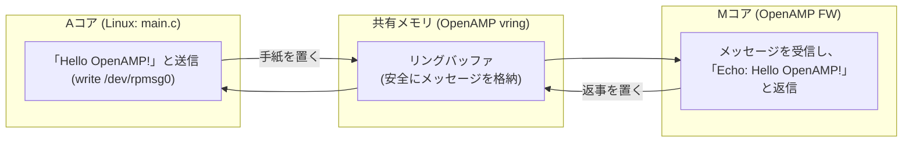

# 14_amp_mcore_OpenAMP_baremetal: 共有メモリで会話する「OpenAMP / RPMsg」

これまでのマルチコアシナリオでは、単純なレジスタ経由で数値をやり取りしていました。
しかし、実際の製品開発で「文字列」や「構造体データ」などの複雑なメッセージをLinuxとマイコンの間でやり取りするには、業界標準の通信フレームワーク **「OpenAMP (RPMsg: Remote Processor Messaging)」** を使います。

OpenAMPは、両方のコアから見える「共有メモリ（vring）」をリングバッファとして使い、パケット通信を実現します。

このシナリオでは、Linuxとマイコン間でメッセージを双方向に送受信するエコーバック通信を体験します！

---

## このシナリオのゴール
**「Linuxの `/dev/rpmsg0` からマイコンへ文字列を送信し、OpenAMP経由でマイコンから返信を受け取る」**

---

## 直感イメージ：CPUとFPGAのやり取り
共有メモリ上の「回覧板（リングバッファ）」を使って、AコアとMコアがメッセージを交換します。


```mermaid
flowchart LR
    subgraph A_Core ["Aコア (Linux: main.c)"]
        Client["「Hello OpenAMP!」と送信\n(write /dev/rpmsg0)"]
    end

    subgraph SHM ["共有メモリ (OpenAMP vring)"]
        Ring["リングバッファ\n(安全にメッセージを格納)"]
    end

    subgraph M_Core ["Mコア (OpenAMP FW)"]
        Server["メッセージを受信し、\n「Echo: Hello OpenAMP!」と返信"]
    end

    Client -->|"手紙を置く"| Ring
    Ring --> Server
    Server -->|"返事を置く"| Ring
    Ring --> Client
```

---

## 3つの基本ステップ（コードの読み方）

[main.c](main.c) で行っていることは、以下の3ステップです。

1. **RPMsgデバイスを開く (`/dev/rpmsg0`)**
   - Linux標準のキャラクタデバイスとしてRPMsgエンドポイントをオープンします。
2. **メッセージを送信する (`write`)**
   - `write(fd, "Hello OpenAMP!", 14);` で共有メモリ経由でマイコンへ手紙を送ります。
3. **マイコンからの返信を受け取る (`read`)**
   - マイコンが受信コールバックでエコーバックを作成し、`read(fd, buf, sizeof(buf));` で返信を受け取ります。

---

## 1. まずは動かしてみよう！

ターミナルで以下のコマンドを実行します。

```bash
./run.sh
```

**期待される出力例：**
```text
=== Scenario 14: OpenAMP RPMsg Echo Test Start ===
[A-Core] Opening /dev/rpmsg0...
[A-Core] Sending message: "Hello OpenAMP from Linux!"
[M-Core] RPMsg Endpoint received message: "Hello OpenAMP from Linux!"
[M-Core] Echoing back to A-Core...
[A-Core] Received Echo: "Echo: Hello OpenAMP from Linux!"
[A-Core] SUCCESS: Bi-directional RPMsg communication verified!
=== Scenario 14 Test Result: SUCCESS ===
```

---

## 2. ちょこっと改造チャレンジ！

理解を深めるために、送信するメッセージを変えてみましょう。

- **実験:** [main.c](main.c) 内の送信文字列を `"OpenAMP is awesome!"` などに変更して `./run.sh` を実行してみてください。マイコンが同じ内容を正確にエコーバックしてくることが確認できます！

---

## 次のステップへ
これで「業界標準のコア間通信（OpenAMP）」が身につきました！

- **次のシナリオ [20b_mcore_cdma](../20b_mcore_cdma/README.md)**:  
  Stage 4の総仕上げとして、**「マイコン側からFPGAのDMAを直接動かす超高速データパイプライン」**に進みましょう。

---

## さらに詳しく知りたい方へ
VirtIO vring構造やlibmetalによる共有メモリ抽象化レイヤーの詳細は、**[ADVANCED.md](ADVANCED.md)** を参照してください。
