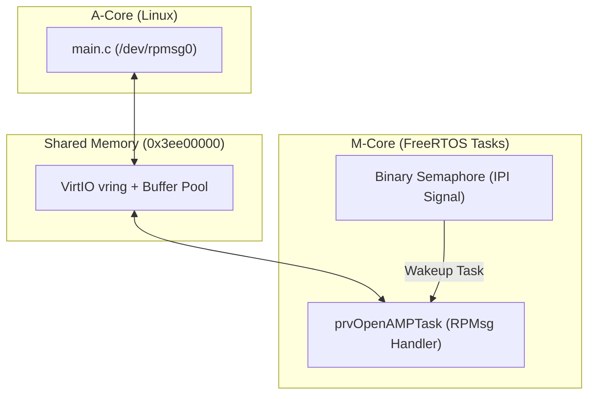

# Scenario 15: OpenAMP / RPMsg with FreeRTOS - 詳細設計 & アーキテクチャ解説

本ドキュメントは、FreeRTOS タスク環境下で動作する OpenAMP / RPMsg プロトコルスタック、セマフォによるイベント待機、およびスレッドセーフなコア間メッセージングの詳細仕様書です。

---

## 1. FreeRTOS + OpenAMP 協調アーキテクチャ

---

## 2. FreeRTOS タスクと RPMsg コールバックの連携

FreeRTOS 環境下では、シグナルハンドラ（またはハードウェア ISR）からセマフォ（`xSemaphoreGiveFromISR`）を解放し、`prvOpenAMPTask` が起床して `virtqueue_notification` を安全にディスパッチする構造を採用しています。
