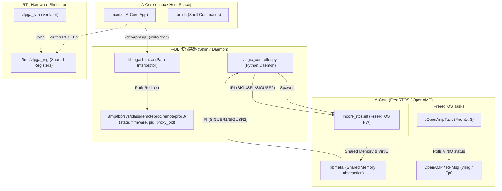

# 15_amp_mcore_OpenAMP_freertos: FreeRTOSを用いたOpenAMPおよびRPMsg協調動作の検証

このシナリオでは、Mコア（Coprocessor）側でリアルタイムOS（FreeRTOS）を動作させ、そのタスク管理下で **OpenAMP (RPMsg)** プロトコルスタックを駆動し、Aコア（Linux アプリ）からの非同期な処理要求（メッセージ）にキューイング・ハンドシェイクを介して応答する、本格的なマルチコアRTOS協調システムをF-BB上で検証・学習します。

---

## アーキテクチャ概念図



---

## シナリオの仕組みと特徴

1. **FreeRTOS POSIX Port 上での OpenAMP 統合**:
   - `FetchContent` によって自動ビルドされた `libmetal` と `open-amp` を、ホスト PC 上の Pthreads ベースで動作する FreeRTOS カーネル（POSIX Port）と統合します。
   - Mコアファームウェア内では、`xTaskCreate` によって生成された `vOpenAmpTask` タスク（優先度 3）が、OpenAMP のポーリングおよびメッセージ処理を非同期に担当します。

2. **低オーバーヘッドなイベントポーリング設計**:
   - `vOpenAmpTask` タスクは、5ms周期の `vTaskDelay` を挟みながら VirtIO の接続ステータスを監視します。ドライバ接続（`VIRTIO_CONFIG_STATUS_DRIVER_OK`）が確立されたのちは、`rproc_virtio_notified` を介して定期的にメッセージ受信イベントをディスパッチし、相手コアからの Kick を処理します。

3. **シグナルと RTOS タスクの協調動作**:
   - ベアメタル版とは異なり、Mコアプロセスは常に起動した状態で FreeRTOS のスケジューリングにより動作します。
   - Aコアアプリ（`main.c`）が `/dev/rpmsg0` への書き込みと読み出しを行うと、背後で POSIX シグナルと共有メモリ（`0x3ee00000`）を介した VirtIO vring パケット処理が非同期タスク間で実行され、正常に `[FreeRTOS Echo] ...` レスポンスが返されます。

---

## 学習のポイント

1. **リアルタイムOS (RTOS) 環境下での OpenAMP の実装作法**:
   - ベアメタルでのループ処理とは異なり、RTOS のマルチタスクスケジューリング環境下で `libmetal` および `open-amp` の実行ループ（タスク）を定義し、適切に CPU 実行権を譲りながら非同期通信を行う設計手法を学びます。
2. **AMP 協調システムにおけるリソース統合の理解**:
   - 共有メモリ（vring）、IPI 割り込み（シグナル）、および OSAPI（FreeRTOS タスク）が、どのように密結合して 1 つのマルチコアメッセージ通信を成立させているかをホストシミュレーションを通じて習得します。
3. **実機移植性の高い CMake ビルド構成**:
   - `CMakeLists.txt` を用いて、外部からの FreeRTOS-Kernel の自動クローン・構成（スパースチェックアウト）、および libmetal/OpenAMP のリンク設定を CMake 記述としてクリーンにまとめ、実機クロスコンパイル環境へのスムーズな移行パスを理解します。

---

## 実行方法

本ディレクトリに移動して、以下のスクリプトを実行してください。

```bash
./run.sh          # ビルドと実行 (FreeRTOS タスク上で OpenAMP が駆動し、A-Core との双方向通信がパスします)
./run.sh --clean  # ビルド成果物とログのクリーンアップ
```
