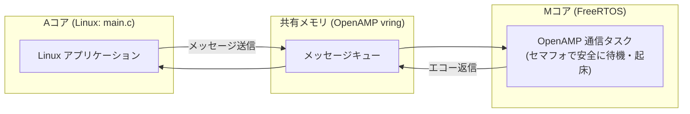

# 15_amp_mcore_OpenAMP_freertos: RTOS上で動かす「OpenAMP」

前回の [14_amp_mcore_OpenAMP_baremetal](../14_amp_mcore_OpenAMP_baremetal/README.md) ではベアメタルのMコアでOpenAMPを動かしました。
このシナリオでは、マイコン側で **FreeRTOS** を動かしながら、そのタスクの1つとして **OpenAMP (RPMsg)** を動作させる実践的な構成を体験します。

---

## このシナリオのゴール
**「マイコン側のFreeRTOSタスクとしてOpenAMPを稼働させ、Linux（Aコア）との双方向メッセージングを行う」**

---

## 直感イメージ：CPUとFPGAのやり取り
FreeRTOSの通信タスクがセマフォで起床し、Linuxからのメッセージを安全に処理してエコーバックを返します。


```mermaid
flowchart LR
    subgraph A_Core ["Aコア (Linux: main.c)"]
        LinuxApp["Linux アプリケーション"]
    end

    subgraph SHM ["共有メモリ (OpenAMP vring)"]
        Vring["メッセージキュー"]
    end

    subgraph M_Core ["Mコア (FreeRTOS)"]
        Task["OpenAMP 通信タスク\n(セマフォで安全に待機・起床)"]
    end

    LinuxApp -->|"メッセージ送信"| Vring
    Vring --> Task
    Task -->|"エコー返信"| Vring
    Vring --> LinuxApp
```

---

## 3つの基本ステップ（コードの読み方）

[mcore_rtos.c](mcore_rtos.c) で行っていることは、以下の3ステップです。

1. **FreeRTOSのOpenAMPタスクを作成する**
   - `xTaskCreate(prvOpenAMPTask, "OpenAMP", ...)` で通信専用タスクを立ち上げます。
2. **コア間割り込みをセマフォで受ける**
   - Linuxからメッセージが届くと、セマフォが解放されてタスクがスリープから目覚めます。
3. **エコーバックメッセージを返信する**
   - メッセージを処理し、相手へ返信して再び安全に休止状態に入ります。

---

## 1. まずは動かしてみよう！

ターミナルで以下のコマンドを実行します。

```bash
./run.sh
```

**期待される出力例：**
```text
=== Scenario 15: OpenAMP FreeRTOS Echo Test Start ===
[A-Core] Opening /dev/rpmsg0...
[A-Core] Sending message: "Hello OpenAMP FreeRTOS!"
[M-Core RTOS] Received message on FreeRTOS task: "Hello OpenAMP FreeRTOS!"
[A-Core] Received Echo: "Echo: Hello OpenAMP FreeRTOS!"
[A-Core] SUCCESS: OpenAMP FreeRTOS communication verified!
=== Scenario 15 Test Result: SUCCESS ===
```

---

## 2. ちょこっと改造チャレンジ！

- **実験:** [main.c](main.c) の送信メッセージを変更して `./run.sh` を実行してみてください。FreeRTOSタスクが正確に起床して処理を行う様子が確認できます！

---

## 次のステップへ
- **次のシナリオ [20b_mcore_cdma](../20b_mcore_cdma/README.md)**:  
  Stage 4の総仕上げとして、**「マイコン（Mコア）からFPGAのDMAを直接動かす制御」**に進みましょう。

---

## さらに詳しく知りたい方へ
FreeRTOS環境下でのVirtIOディスパッチやセマフォ連携の詳細は、**[ADVANCED.md](ADVANCED.md)** を参照してください。
