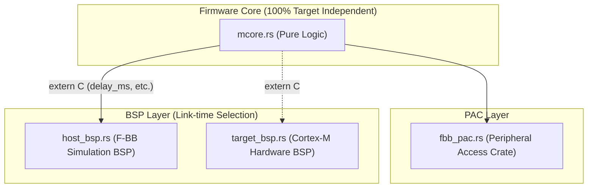

# Scenario 16: Rust によるベアメタル M コア - 詳細設計 & アーキテクチャ解説

本ドキュメントは、Embedded Rust、DTS 駆動の PAC (Peripheral Access Crate)、リンク時多態（Link-time Polymorphism）、および `MAP_FIXED_NOREPLACE` によるホスト MMIO エミュレーションの詳細仕様書です。

---

## 1. Rust PAC & リンク時多態アーキテクチャ



---

## 2. PAC による型安全なレジスタアクセス

```rust
let dp = Peripherals::take().unwrap();
// 生ポインタではなく型安全な Register<T> でアクセス
dp.vfpga_reg.cmd.write(0x1);
let status = dp.vfpga_reg.status.read();
```
DTS から自動生成された `fbb_pac.rs` により、アドレスの直打ちやポインタ演算ミスをコンパイル時に完全に排除します。
