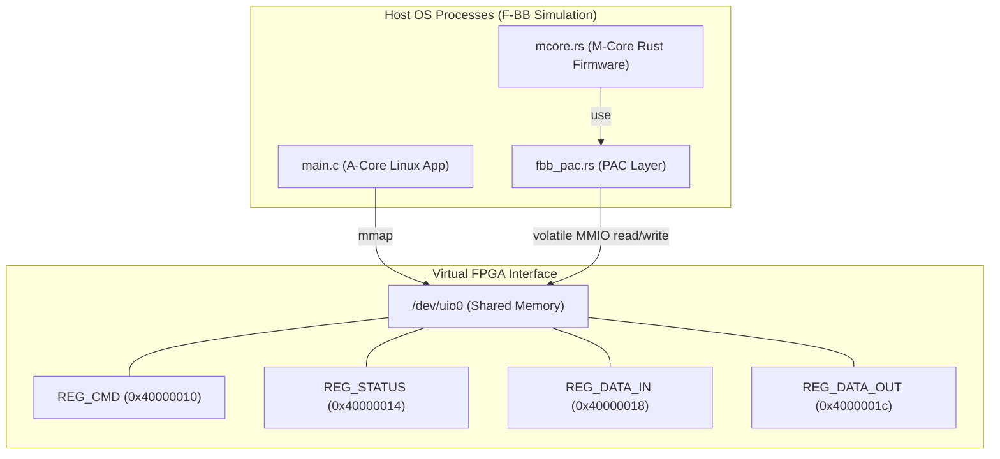
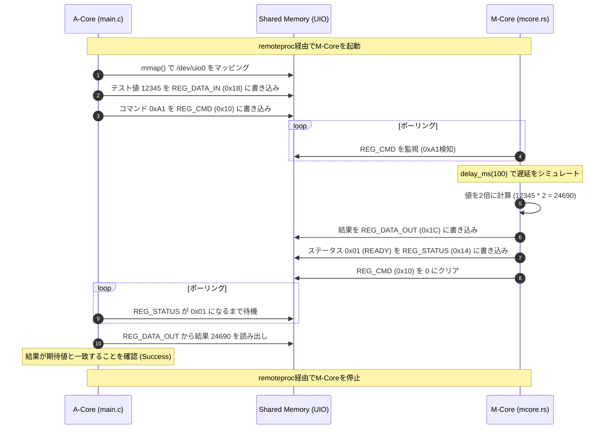

「CPUアーキテクチャなんてx86（ホストPC）のままでいいじゃん。no_std の縛りプレイをさせつつ、レジスタのアドレスさえ実機と同じ場所に MAP_FIXED_NOREPLACE でだまして突っ込めば、Rustの論理チェック能力を100%活かしたまま、軽くて速いテスト環境ができるじゃん」

# 16_amp_mcore_Rust_baremetal: RustによるベアメタルMコアエミュレーション

このシナリオでは、MコアのファームウェアをC言語やRTOSではなく、**Rust（ベアメタル想定）** で実装し、F-BB上でAコア（C言語/Linux）とレジスタを介したAMP通信デバッグを行う方法を学習します。

## アーキテクチャ概念図



## 学習のポイント

1. **他言語（Rust）によるMコアの開発:**
   F-BBの仮想MコアはホストOSのネイティブプロセスとして起動するため、ホストコンパイラ (`rustc`) でビルドしたバイナリに `libfpgashim.so` をロードすることで、C言語のファームウェアと全く同等に機能します。
2. **PAC (Peripheral Access Crate) によるレジスタアクセス:**
   DTSから自動生成される `fbb_pac.rs` を使い、生ポインタの直接操作（`unsafe` を伴う `read_volatile` / `write_volatile`）をカプセル化した `Register<T>` や `Peripherals` シングルトンパターンによる、安全で本来のEmbedded Rustに近いペリフェラル制御を学習します。
3. **remoteproc ライフサイクル管理:**
   Linuxアプリケーションが `/sys/class/remoteproc/` にコマンドを書き込むことで、F-BBコントローラが背後でRustバイナリの起動・停止を完全に制御します。

---

## 真の実機透過性（リンク時多態）の仕組み

本シナリオでは、RustやC言語の組み込み開発でよく使われる条件付きコンパイル（`#[cfg]` 等）をあえて使わず、**「リンク時多態（Link-time Polymorphism）」**というアプローチで実機透過性を100%実現しています。

`mcore.rs`（ファームウェアのコアロジック）のソースコードは、F-BBシミュレーション環境と実機ターゲット（物理マイコン）で1文字も変更せずにそのまま動かすことが可能です。

### 1. 外部関数インターフェース（`extern "C"`）による抽象化
`mcore.rs` 内では、時間待機（`delay_ms`）などを以下のように外部関数として宣言しています。

```rust
extern "C" {
    fn delay_ms(ms: u32);
}
```

これは「関数の中身（実装）はリンク時に結合する」という宣言であり、コンパイル時点では呼び出し方しか必要としないため、ターゲットがシミュレータか実機かを気にする必要がありません。

### 2. ビルドターゲットに応じたBSP（ボードサポートパッケージ）の切り替えと結合手法
リンクの段階で、ターゲットに合わせて結合するオブジェクト/ライブラリを切り替えます。

* **F-BB（シミュレータ）で動かす場合:**
  `rustc` は複数ファイルを一度にコンパイルできず、かつバイナリクレートのコンパイル時に `#[panic_handler]` の存在を厳しくチェックします。そのため以下の手順で結合します：
  1. `mcore.rs` をライブラリとしてオブジェクトファイル化（パニックハンドラ未定義でもエラーになりません）：
     `rustc --crate-type=lib --emit=obj -C panic=abort mcore.rs -o mcore.o`
  2. `host_bsp.rs`（パニックハンドラ定義あり）をバイナリとしてビルドし、リンク引数で `mcore.o` を結合します。同時にCライブラリをリンクします：
     `rustc -C panic=abort -C link-arg=mcore.o host_bsp.rs -l c -o mcore_rust.elf`
* **実機ハードウェア（マイコン等）で動かす場合:**
  - `mcore.rs` を実機ターゲット（例: `thumbv7em-none-eabihf` 等）向けにクロスコンパイルしてライブラリ化します。
  - ビルド時に `host_bsp.rs` は含めず、実機のハードウェアタイマーを制御して待機する「実機用BSPライブラリ」をリンクします。

このように結合相手（BSP）を変えるだけなので、コアロジックである `mcore.rs` には一切手を加える必要がありません。

### 3. F-BB（ホストPC）ビルド時の Rust 特有の注意点と対策
ホストLinux環境で `no_std` バイナリを動かすために、以下のコンパイラ/リンクの工夫を行っています：
* **`-C panic=abort` の指定:**
  `no_std` 環境では標準のスタック展開（unwind）によるパニック処理が使えないため、パニック時は強制終了するよう指定します。
* **`-l c` による C標準ライブラリのリンク:**
  `no_std` は標準でCライブラリをリンクしないため、`host_bsp.rs` が呼ぶ `usleep` や、プログラム初期化コード（`__libc_start_main`）を解決するために `-l c` を指定して明示的にリンクします。
* **`rust_eh_personality` のダミー定義:**
  標準の `libcore`（事前コンパイル済みのコアラリ）が例外処理用のシンボルを参照するため、`host_bsp.rs` 内にダミーの `#[no_mangle] pub extern "C" fn rust_eh_personality() {}` を定義してリンクエラーを防いでいます。

### 4. PAC (Peripheral Access Crate) を用いた型安全なアクセス
本シナリオでは、自動生成された `fbb_pac.rs` を使用してレジスタへのアクセスを抽象化しています。

* **`Register<T>` 構造体:** 生ポインタに対する `volatile` な読み書き（`read()` / `write()`）を安全にカプセル化します。
* **`Peripherals` シングルトン:** グローバルな `TAKEN` フラグを用いて `Peripherals::take()` から排他的にペリフェラルオブジェクト（`Vfpga`）を取得することで、マルチスレッドや割り込みによる競合アクセスをRustの所有権モデルに基づいてコンパイル時・実行時に防止します。

### 5. `MAP_FIXED_NOREPLACE` による実機アドレス空間のエミュレーション
PACがどれほど型安全でも、アクセスするメモリアドレス自体がホスト環境と実機環境で異なれば、コードの書き換え（あるいは実行時アドレス変換）が必要になります。

F-BBでは、Shimレイヤー（`libfpgashim.so`）がホストプロセス起動時に `mmap` の `MAP_FIXED_NOREPLACE` フラグを利用し、DTSに記述された実機と同じ物理ベースアドレス（例: `0x40000000`）へ共有メモリ空間を強制マッピングします。これにより、PACの `Vfpga::new()` が内部で保持するアドレス（`0x40000010` 等）は、**ホスト上でも実機上でも物理的に全く同一のアドレス値**となり、ポインタ変換やアドレスの再定義を一切挟むことなく、完全な実機透過性（アドレスレベルでの等価性）が担保されます。

---

## 実運用（実機へのデプロイ）に向けた注意点

この設計のまま実機プロジェクトへ展開・統合する際は、以下のポイントが正しく整備されている必要があります：

1. **メモリマップの一致:**
   シミュレータ上のFPGA定義（`config.dts` や Verilog）が再現しているレジスタのアドレスや挙動が、実機の物理ハードウェアと完全に一致している必要があります。
2. **パニックハンドラの分離:**
   `no_std` 環境では、異常終了時の `#[panic_handler]` を定義する必要があります。これはシミュレータ用（`host_bsp.rs` 内）と、実機用（実機BSP内）でそれぞれ別個に実装されたものがリンクされるように設定します。
3. **リンクスクリプト（`memory.x` 等）の用意:**
   実機マイコンの物理的な ROM/RAM アドレス配置に合わせて、適切なリンクスクリプトを用意してクロスコンパイル（リンク）時に指定する必要があります（これはソースコードの変更ではなく、ビルド構成の追加です）。
4. **実機PACと自動生成PACのエイリアス化による統合:**
   シミュレータ環境で開発した `mcore.rs` を実機ビルドに統合する際は、実機のSVDから生成した本物のPACを `fbb_pac` としてエイリアス定義（インポート名の変更）することで、ロジック側のコード修正を完全に不要にします。
   
   * **シミュレータ（F-BB）ビルド時:** 自動生成された `fbb_pac.rs` をそのままモジュールとして読み込みます。
   * **実機ターゲットビルド時:** 実機BSP側で以下のようにモジュール名をエイリアス定義してエクスポートします。
     ```rust
     // 実機BSP側で本物のPACを fbb_pac という名前でエクスポートする
     pub use stm32f4xx_pac as fbb_pac; 
     ```
     これにより、`mcore.rs` 内の `fbb_pac::Peripherals::take()` という呼び出しがそのまま実機PACの初期化処理としてリンクされ、ソースコードの完全な共通化（透過性）が維持されます。


---

## テストシナリオの動作シーケンス

シナリオ実行時（`run.sh`）は、Aコア（C言語/Linuxアプリケーション）とMコア（Rustファームウェア）の間で以下の流れでレジスタを介したAMP通信テストが実行されます。



## 開発環境（Rust）の準備

本シナリオを動作させるには、コンテナ環境に Rust ツールチェーン（`rustc`）がインストールされている必要があります。もしインストールされていない場合は、以下の手順でセットアップを行ってください。

1. **手動インストール:**
   ```bash
   curl --proto '=https' --tlsv1.2 -sSf https://sh.rustup.rs | sh -s -- -y
   ```
2. **環境変数の反映:**
   ```bash
   source $HOME/.cargo/env
   ```

---

## 実行方法

本ディレクトリに移動して、以下のスクリプトを実行してください。シミュレーション環境の立ち上げからアプリケーションのビルド・実行までが自動的に行われます。

```bash
./run.sh          # ビルドと実行
./run.sh --clean  # 成果物とログの削除
```
