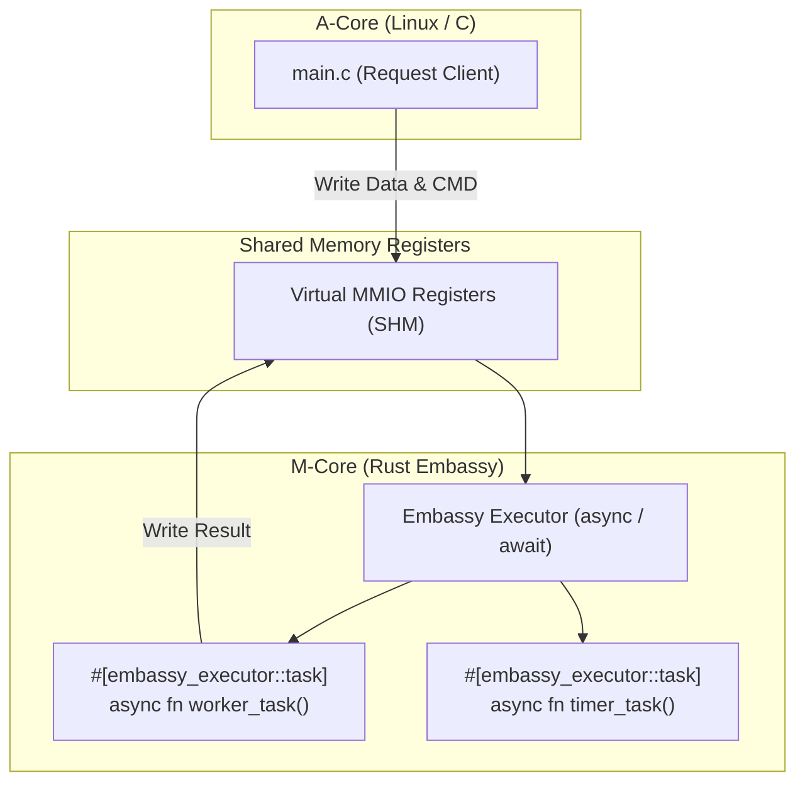

# Scenario 17: Rust Embassy 非同期ランタイム - 詳細設計 & アーキテクチャ解説

本ドキュメントは、非同期駆動型組み込み Rust フレームワーク **Embassy**、`embassy-executor` (arch-std POSIX バックエンド)、および非同期コルーチンによる超省電力タスクスケジューリングの詳細仕様書です。

---

## 1. Embassy 非同期パイプラインアーキテクチャ

---

## 2. Embassy の特徴と利点

- **スタックレス非同期コルーチン**: 各タスクに巨大なコールスタックを割り当てる必要がなく、RAM が極端に少ないマイコンでも数十個の並行タスクを数KBで動作可能。
- **超低消費電力**: すべてのタスクが待機中になると自動的に CPU がスリープ（`wfi` / POSIX では `thread::park`）に移行。
