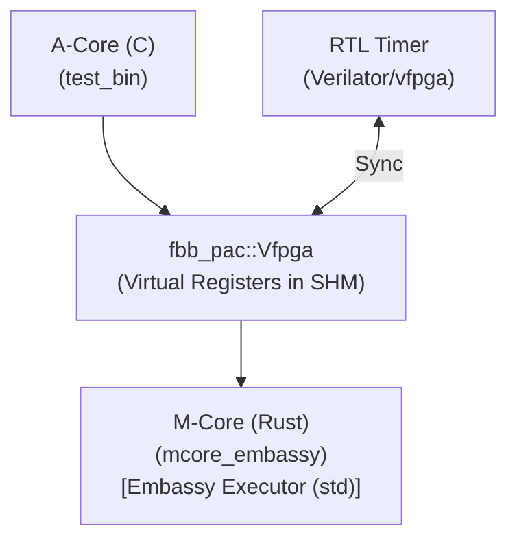

# Scenario 17: AMP M-Core Rust Embassy

F-BB（FPGA-BoardlessBench）環境において、モダンな非同期駆動型組み込み Rust OS/ランタイムである **Embassy** の動作を検証するシナリオです。

## 概要

本シナリオは、Aコア（Linuxアプリ/C）からMコア（Embassyランタイム/Rust）に対してデータ処理要求を送り、Mコア側が非同期エグゼキュータ上で効率的に要求を処理して応答を返す様子をシミュレートします。

Mコア側（Rust）は `embassy-executor` の `arch-std` 機能を使用し、ホストOS上でマルチタスク非同期動作（`async/await`）をエミュレートします。

---

## シナリオの仕組みと特徴

1. **POSIX 機能による実行基盤の切り替え (std フィーチャ)**:
   - Embassy の非同期エグゼキュータは、タスク管理を純粋なポインタとビット演算で行っているため、Linux上でもそのまま動作します。
   - タスクが待機状態に入りCPUを眠らせる処理（実機なら `wfi` 命令など）のみを、Linux環境下では **`std::thread::park`** や **条件変数（`Condvar`）** に透過的に差し替えることで、ホストPC上でのマルチタスク動作を実現しています。
   - `Cargo.toml` で `features = ["std"]` を有効にするだけで、コンパイラが自動的にこのPOSIX実行基盤へとスイッチします。

2. **実機 HAL の隠蔽と抽象化境界の確保 (ダミーモック)**:
   - 実機のペリフェラルを直接制御する HAL クレート（例: `embassy-stm32` など）はホストPC上ではビルドできません。
   - そのため、シミュレーション（Linux）ビルド時は実機 HAL の読み込みをスキップし、F-BB 用のダミーモック（レジスタ生ポインタアクセスに置き換えるラッパー）へ切り替える構成を採用しています。これにより、非同期ロジック本体は共通化されたままでコンパイルを可能にしています。

3. **時間精度に関する注意点 (ジッタ)**:
   - `embassy-time` によるタイマー（例: `Timer::after_millis(10).await`）は、ホスト Linux 上のタイマー精度に依存するためジッタが発生する可能性があります。
   - 本環境は論理的な非同期シーケンスの整合性を検証する場であり、厳密なマイクロ秒精度のタイミング測定は対象外とすることを前提としています。

---

## ディレクトリ構成（対称設計）

本シナリオは、Aコア（C言語）とMコア（Rust）の対等な協調関係を明示するため、双方のソースコードを対称的に整理しています。

* **[a_core/](file:///workspaces/FPGA-BoardlessBench/tests/scenarios/17_amp_mcore_Rust_embassy/a_core)**: Aコア側のC言語アプリケーション (`main.c`)
* **[m_core/](file:///workspaces/FPGA-BoardlessBench/tests/scenarios/17_amp_mcore_Rust_embassy/m_core)**: Mコア側のRustアプリケーションとモジュール (`Cargo.toml`, `src/`)

## アーキテクチャ



### 1. 単一の情報源 (DTS)
本シナリオは以下の DTS 定義に基づき、自動生成された PAC（Peripheral Access Crate）および C Shim を使用します。

* **Timer レジスタ**: `timer_target`, `timer_current`, `timer_irq`
* **通信用レジスタ**: `cmd` (Aコアからのコマンド), `status` (Mコアの処理状態), `data_in`/`data_out` (データ入出力)

## ビルドと実行

ホストPC上の `cargo` を使用して依存関係を自動的にダウンロードし、ファームウェアをコンパイルします。依存ライブラリのソースはホスト側の Cargo キャッシュに格納され、本プロジェクトのリポジトリには混入しません。

```bash
# シナリオ単体での実行
./run.sh
```
