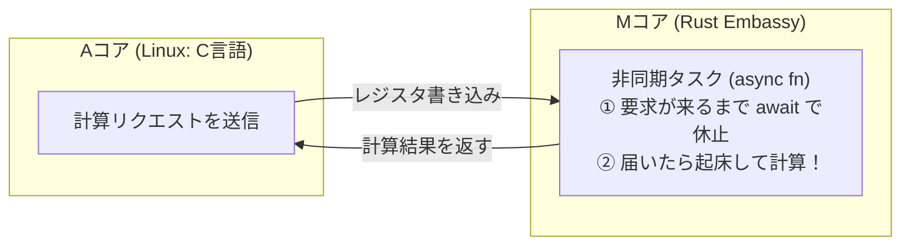

# 17_amp_mcore_Rust_embassy: 非同期で省電力な「Rust Embassy」

RTOS（FreeRTOS等）では、タスクごとに「スタックメモリ」という専用のメモリ領域を確保する必要があり、マイコンの貴重なメモリ（RAM）をたくさん消費してしまいます。

そこで最新の組み込みRust開発で大注目されているのが **「Embassy（エンバシー）」** です。
Rust言語標準の **「非同期処理（async / await）」** を使うことで、メモリをほとんど消費せずに複数のタスクを超省電力で並行処理できます。

---

## このシナリオのゴール
**「Rust Embassyの非同期エグゼキュータ上でタスクを動かし、Linux（Aコア）からの要求をasync/awaitで処理する」**

---

## 直感イメージ：CPUとFPGAのやり取り
タスクが「待機中（await）」になると、CPUは自動的に完全に休止（省電力スリープ）に入ります。


```mermaid
flowchart LR
    subgraph A_Core ["Aコア (Linux: C言語)"]
        LinuxApp["計算リクエストを送信"]
    end

    subgraph M_Core ["Mコア (Rust Embassy)"]
        Task["非同期タスク (async fn)\n① 要求が来るまで await で休止\n② 届いたら起床して計算！"]
    end

    LinuxApp -->|"レジスタ書き込み"| Task
    Task -->|"計算結果を返す"| LinuxApp
```

---

## 3つの基本ステップ（コードの読み方）

1. **非同期タスクを定義する (`async fn`)**
   - `#[embassy_executor::task]` を付けた非同期関数を定義します。
2. **待機処理を `await` で書く**
   - `Timer::after_millis(100).await` のように書くと、待っている間CPUを1%も使わずに休止します。
3. **エグゼキュータで並行タスクを起動する**
   - `spawner.spawn(worker_task(...))` で複数のタスクを同時に走らせます。

---

## 1. まずは動かしてみよう！

ターミナルで以下のコマンドを実行します。

```bash
./run.sh
```

**期待される出力例：**
```text
=== Scenario 17: Rust Embassy on M-Core Test Start ===
[A-Core] Booting Embassy M-Core firmware...
[M-Core Embassy] Embassy Executor Started! Spawning async tasks...
[A-Core] Sending Task Request: DATA_IN = 0x00000100...
[M-Core Embassy] Async Task executed: Result = 0x00000200
[A-Core] SUCCESS: Rust Embassy async coordination verified!
=== Scenario 17 Test Result: SUCCESS ===
```

---

## 2. ちょこっと改造チャレンジ！

- **実験:** `m_core/src/main.rs` 内の非同期タイマー値や演算処理を変更して `./run.sh` を実行してみてください。モダンな非同期Rustが即座にビルドされて動く様子が体験できます！

---

## 次のステップへ
- **次のシナリオ [18_amp_mcore_Rust_rtic](../18_amp_mcore_Rust_rtic/README.md)**:  
  次は、優先度付き並行処理でデッドロックを完全に排除するもう一つの注目フレームワーク**「RTIC」**に進みましょう。

---

## さらに詳しく知りたい方へ
Embassy arch-std POSIX実行基盤やメモリスタック削減の仕組みは、**[ADVANCED.md](ADVANCED.md)** を参照してください。
