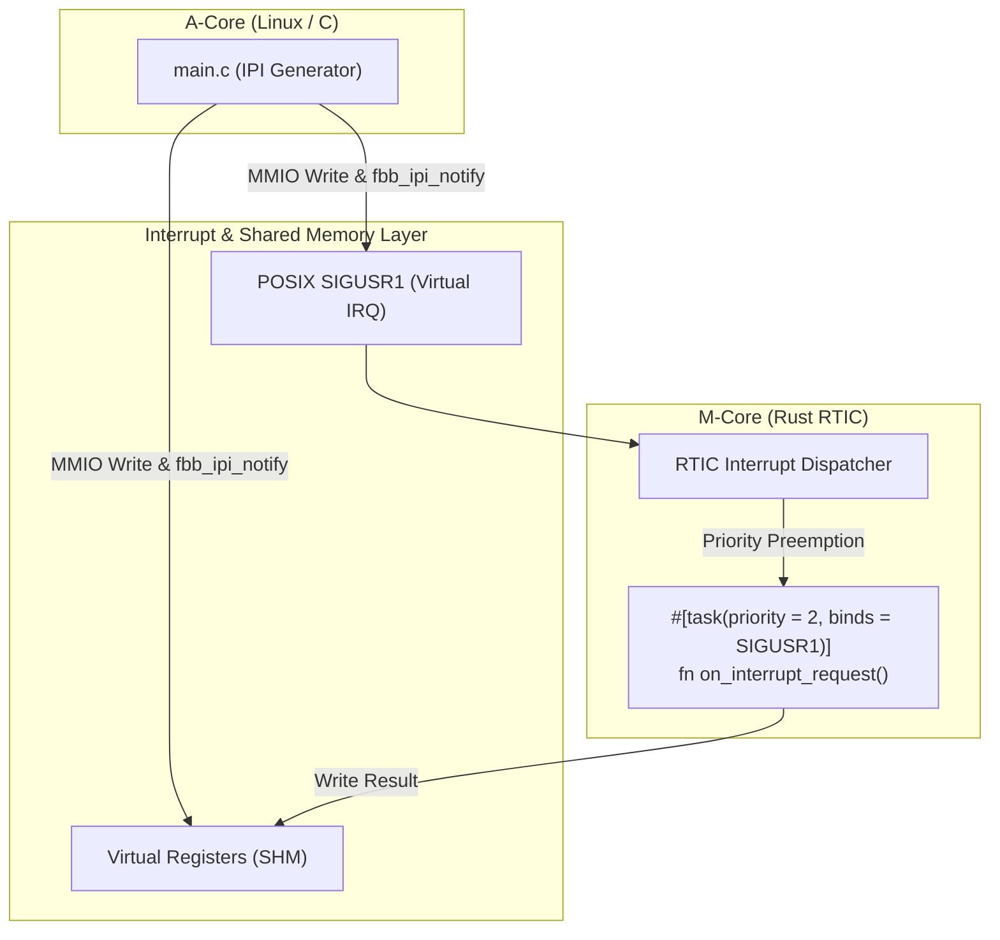

# Scenario 18: Rust RTIC ハードリアルタイム制御 - 詳細設計 & アーキテクチャ解説

本ドキュメントは、ハードリアルタイム並行処理フレームワーク **RTIC (Real-Time Interrupt-driven Concurrency)**、デッドロックフリーな優先度継承プロトコル (SRP)、および仮想割り込みシグナルディスパッチの詳細仕様書です。

---

## 1. RTIC 割り込み駆動アーキテクチャ

---

## 2. RTIC (SRP) によるデッドロックフリー保証

RTIC は **Stack Resource Policy (SRP)** に基づいて共有リソースのアクセス優先度を制御するため、ミューテックス（Mutex）によるデッドロック（相互待ち）が数学的に発生しないことが保証されています。
