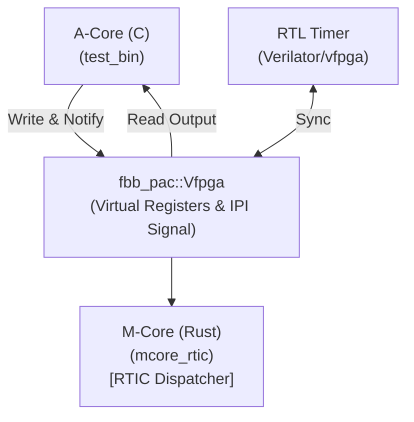

# Scenario 18: AMP M-Core Rust RTIC

F-BB（FPGA-BoardlessBench）環境において、リアルタイム割り込み駆動型組み込み Rust フレームワークである **RTIC** の動作を検証するシナリオです。

## 概要

本シナリオは、Aコア（Linuxアプリ/C）からMコア（RTICランタイム/Rust）に対してデータを送信し、仮想割り込み（`SIGUSR1` シグナル）をトリガーにしてMコアがタスクを優先度起動して処理を行う仕組みをシミュレートします。

Mコア側（Rust）は `SIGUSR1` のシグナルハンドラをトラップし、RTICのスケジューラへ通知して割り込みハンドラに対応する優先タスクをディスパッチします。


## ディレクトリ構成（対称設計）

本シナリオは、Aコア（C言語）とMコア（Rust）の対等な協調関係を明示するため、双方のソースコードを対称的に整理しています。

* **[a_core/](file:///workspaces/FPGA-BoardlessBench/tests/scenarios/18_amp_mcore_Rust_rtic/a_core)**: Aコア側のC言語アプリケーション (`main.c`)
* **[m_core/](file:///workspaces/FPGA-BoardlessBench/tests/scenarios/18_amp_mcore_Rust_rtic/m_core)**: Mコア側のRustアプリケーションとモジュール (`Cargo.toml`, `src/`)

## アーキテクチャ



### 1. 単一の情報源 (DTS)
本シナリオは以下の DTS 定義に基づき、自動生成された PAC（Peripheral Access Crate）および C Shim を使用します。

* **割り込みレジスタ**: `fbb_ipi_notify` 関数による `SIGUSR1` 通知。
* **通信用レジスタ**: `cmd`, `status`, `data_in`/`data_out`

### 2. 割り込みエミュレーション
ホスト環境上での割り込みを模擬するため、Aコアがレジスタアクセス等を通じて通知を行うと、F-BBの仮想割り込み層（Shim）によってMコアプロセスに `SIGUSR1` が送信されます。
Mコアの `host_bsp.rs` はこのシグナルをハンドリングし、RTICのタスクディスパッチを実行します。

## ビルドと実行

```bash
# シナリオ単体での実行
./run.sh
```
