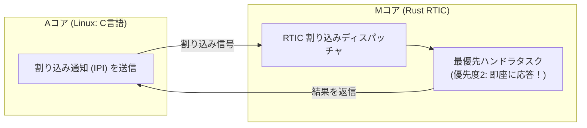

# 18_amp_mcore_Rust_rtic: 割り込みで瞬時に動く「Rust RTIC」

組み込みシステムにおいて、最も応答速度が求められるのは「割り込み（センサーの検知や異常信号）」が発生した瞬間です。

**RTIC（Real-Time Interrupt-driven Concurrency）** は、割り込み駆動に特化した組み込みRustフレームワークです。
タスク同士が資源を取り合ってフリーズする「デッドロック」をコンパイル時に完全に排除する驚異的な安全設計を持っています。

---

## このシナリオのゴール
**「Aコア（Linux）からの割り込み通知を受け取り、RTICの優先度タスクで即座に応答処理を行う」**

---

## 直感イメージ：CPUとFPGAのやり取り
Linuxからの割り込み合図が入ると、RTICのディスパッチャが優先タスクを瞬時に起動します。


```mermaid
flowchart LR
    subgraph A_Core ["Aコア (Linux: C言語)"]
        LinuxApp["割り込み通知 (IPI) を送信"]
    end

    subgraph M_Core ["Mコア (Rust RTIC)"]
        Dispatcher["RTIC 割り込みディスパッチャ"]
        Task["最優先ハンドラタスク\n(優先度2: 即座に応答！)"]
    end

    LinuxApp -->|"割り込み信号"| Dispatcher
    Dispatcher --> Task
    Task -->|"結果を返信"| LinuxApp
```

---

## 3つの基本ステップ（コードの読み方）

1. **優先度付きタスクを定義する (`#[task]`)**
   - `#[task(priority = 2, binds = SIGUSR1)]` で割り込みに直結したタスクを定義します。
2. **割り込み発生時に自動ディスパッチされる**
   - 割り込みシグナルを検知した瞬間、通常処理を中断（プリエンプト）して優先タスクが即座に実行されます。
3. **安全に共有リソースを更新する**
   - ロック待ちのデッドロックなしに安全に結果レジスタを更新して完了します。

---

## 1. まずは動かしてみよう！

ターミナルで以下のコマンドを実行します。

```bash
./run.sh
```

**期待される出力例：**
```text
=== Scenario 18: Rust RTIC on M-Core Test Start ===
[A-Core] Booting RTIC M-Core firmware...
[M-Core RTIC] RTIC Dispatcher Started! Waiting for interrupt signals...
[A-Core] Triggering IPI Interrupt...
[M-Core RTIC] Interrupt Handled in Priority Task: Result = 0x00000200
[A-Core] Received Result: DATA_OUT = 0x00000200
[A-Core] SUCCESS: Rust RTIC interrupt handling verified!
=== Scenario 18 Test Result: SUCCESS ===
```

---

## 2. ちょこっと改造チャレンジ！

- **実験:** `m_core/src/main.rs` 内のタスク処理を変更して `./run.sh` を実行してみてください。割り込みに対して安全に処理が実行されることが確認できます！

---

## 次のステップへ
- **次のシナリオ [S01_cpp_lfsr_sequencer](../S01_cpp_lfsr_sequencer/README.md)**:  
  ロードマップの最終シナリオとして、**「C++を用いた高度なシミュレーション検証」**に進みましょう。

---

## さらに詳しく知りたい方へ
Stack Resource Policy (SRP) によるデッドロックフリー保証の詳細は、**[ADVANCED.md](ADVANCED.md)** を参照してください。
