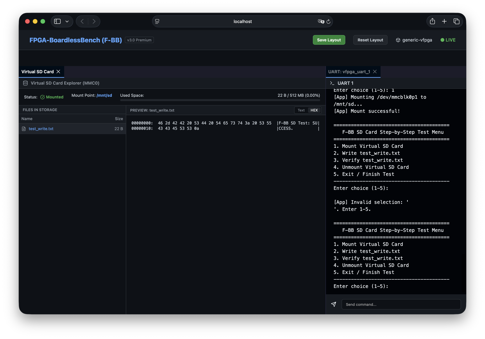

# シナリオ 19_acore_sd: Aコア仮想SDカード・マウント検証

## 概要
本シナリオは、Aコア（Linux環境）アプリケーションにおけるSDカードのファイルシステムマウントおよびファイル読み書き操作を、F-BBのC-Shim（`libfpgashim.so`）によるシステムコールフック機能を用いて仮想化検証するシナリオです。

実機でのブロックデバイス `/dev/mmcblk0p1` に対する `mount` および `umount` 操作をインターセプトし、ホスト側のローカルディレクトリ（`sd_card/`）へのシンボリックリンク操作に透過的にマッピングします。



## システム構成と検証フロー
1. **仮想マウント**:
   - `mount("/dev/mmcblk0p1", "/mnt/sd", "vfat", 0, NULL)` の呼び出し。
   - `libfpgashim.so` がコールをフックし、ホスト側一時ディレクトリ（`tests/scenarios/19_acore_sd/sd_card`）へのシンボリックリンク `/mnt/sd` を作成。
2. **書込および読込ベリファイテスト**:
   - `/mnt/sd/test_write.txt` へ動的データの書き込みを実行。
   - 同ファイルを読み込んで内容が書き込みデータと完全一致することをアサート検証。
3. **アンマウント**:
   - `umount("/mnt/sd")` の呼び出し。
   - Shimがフックし、作成したシンボリックリンクを安全に削除。
4. **クリーンアップ**:
   - テスト完了後、`./tests/run_tests.sh --clean` を実行すると動的に生成された `sd_card/` フォルダと書き込みファイルは自動的に完全にクリーンアップされ、Gitの未追跡差分として残りません。

## 実行方法
本シナリオディレクトリ内で以下のコマンドを実行します：
```bash
./run.sh
```

## 対話モード（UARTコンソールによるステップ実行）
`start_lab.sh` から本シナリオを起動した場合、ダッシュボード上に **Virtual SD Card** パネルと **UART Console (vfpga_uart_1)** パネルが左右に並んで表示され、対話型テストメニューが起動します。

UARTコンソール上でキーボード入力することで、1ステップずつテスト操作を選択して実行することができます：
- **`1`**: 仮想マウントを実行 (`mount`)
- **`2`**: `test_write.txt` の書き込みを実行
- **`3`**: `test_write.txt` の読み出し＆検証を実行
- **`4`**: アンマウントを実行 (`umount` ➔ クリーンアップ確認)
- **`5`**: テストを終了して終了コードを返す

## ダッシュボードでの可視化
本シナリオ実行中、ダッシュボード上に以下の機能を持つペインが表示されます：
- **Status**: マウント時には「Mounted（緑色発光）」、アンマウント時には「Unmounted（赤色/グレー）」と表示されます。
- **Used Space**: 仮想サイズ512MBに対する使用容量をプログレスバー表示します。
- **Files Table**: 現在仮想SDカード内に保存されているファイルの一覧（名前、サイズ）をリアルタイム表示します。
- **Text/HEX プレビューア**: リストからファイル名をクリックすると、中身をテキスト表示または16進数（HEX）ダンプ表示で切り替えて閲覧できます。
