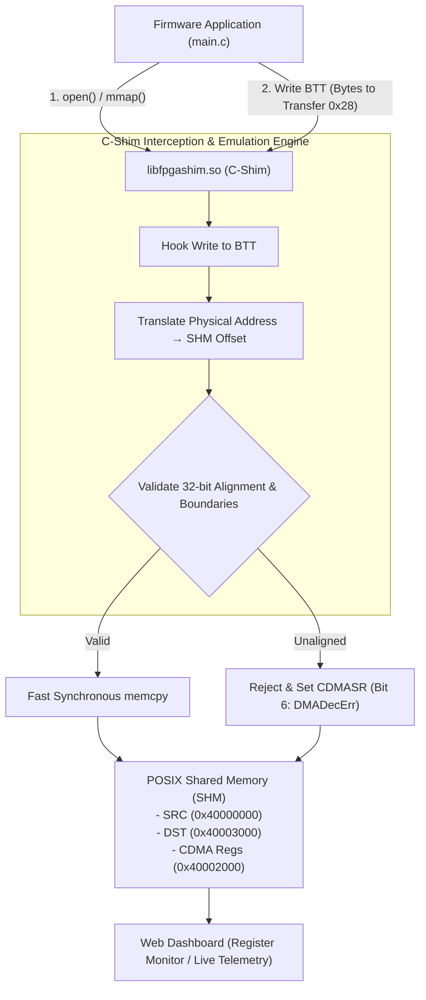

# Scenario 20: Zynq AXI CDMA - 詳細設計 & アーキテクチャ解説

本ドキュメントは、Xilinx AXI CDMA IP (`xlnx,axi-cdma-1.00.a`) のエミュレーション、アライメント検査 (`DMADecErr`)、バッファアンダーラン/オーバーラン検出、および実機ポーティングに関する詳細仕様書です。

---

## 1. AXI CDMA 転送パイプラインアーキテクチャ



---

## 2. AXI CDMA レジスタマップ (`config.dts`)

```text
ベースアドレス : 0x40002000 (サイズ: 4KB)
デバイスノード : /dev/uio0
```

| オフセット | レジスタ名 | 属性 | 機能説明 |
| :--- | :--- | :--- | :--- |
| `0x00` | `CDMACR` | R/W | CDMA 制御レジスタ (`bit 2`: リセット) |
| `0x04` | `CDMASR` | R | CDMA ステータスレジスタ (`bit 1`: Idle, `bit 6`: DMADecErr) |
| `0x18` | `SA` | R/W | 転送元ソース物理アドレス (Source Address: 32-bit) |
| `0x20` | `DA` | R/W | 転送先デスティネーション物理アドレス (Destination Address: 32-bit) |
| `0x28` | `BTT` | R/W | 転送バイト数 (Bytes to Transfer: 書き込みで転送トリガー) |

---

## 3. エラー検出ロジック

1. **DMADecErr (非アライメントエラー: Bit 6)**:
   `SA` または `DA` が 4 バイト境界（下位 2 ビットが非ゼロ）にない場合、転送を拒否して `CDMASR` の Bit 6 をセット。
2. **バッファオーバーラン (OVERRUN_ERR: Bit 5)**:
   転送先領域の許容境界（4KB）を超える転送が要求された場合、溢れたデータを破棄してエラーを通知。
