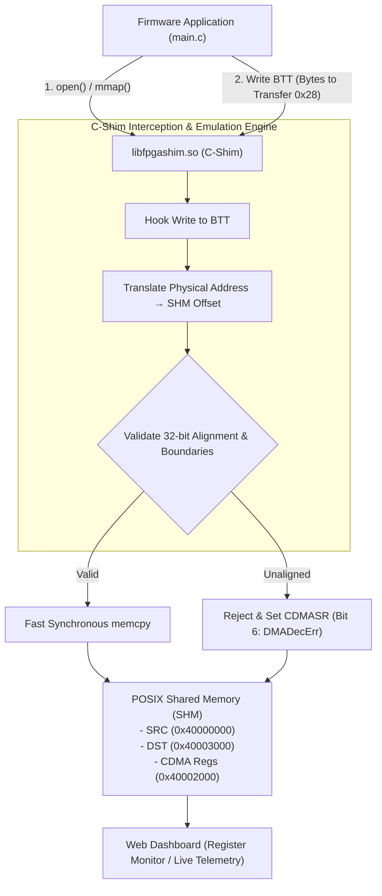
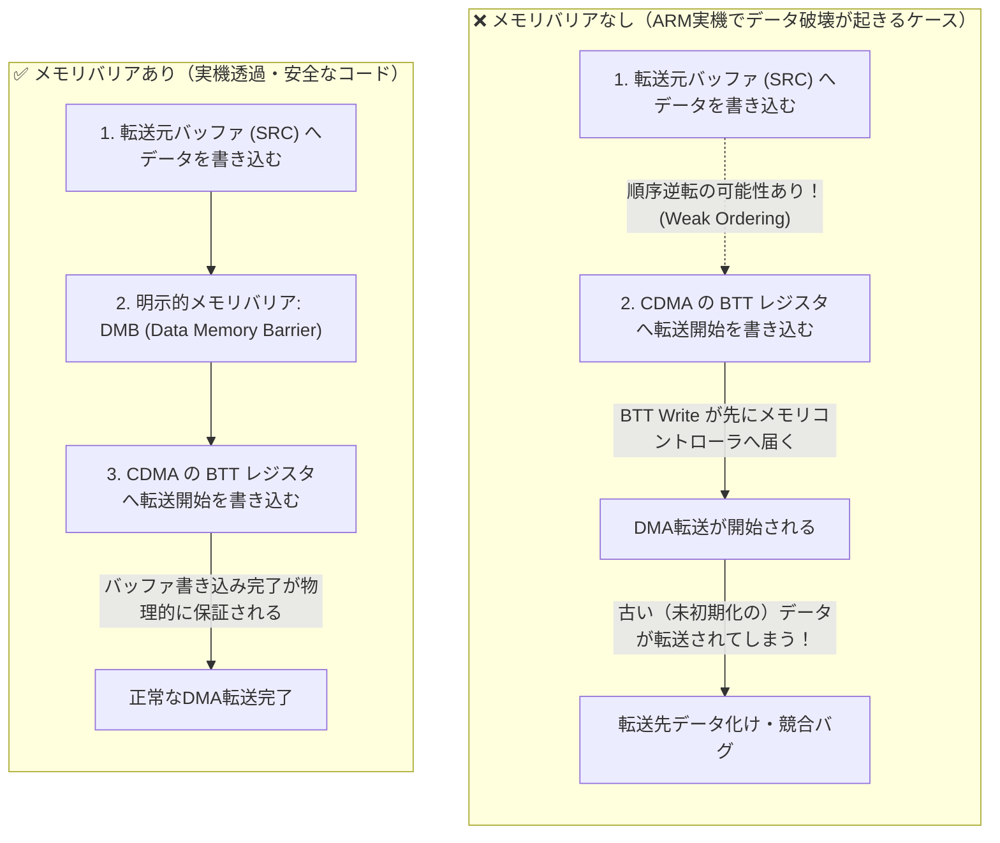

# Scenario 20: Zynq AXI CDMA - 詳細設計 & アーキテクチャ解説

本ドキュメントは、Xilinx AXI CDMA IP (`xlnx,axi-cdma-1.00.a`) のエミュレーション、アライメント検査 (`DMADecErr`)、バッファアンダーラン/オーバーラン検出、および実機ポーティングに関する詳細仕様書です。

---

## 1. AXI CDMA 転送パイプラインアーキテクチャ



---

## 2. AXI CDMA レジスタマップ (`config.dts`)

```text
ベースアドレス : 0x40002000 (サイズ: 4KB)
デバイスノード : /dev/uio0
```

| オフセット | レジスタ名 | 属性 | 機能説明 |
| :--- | :--- | :--- | :--- |
| `0x00` | `CDMACR` | R/W | CDMA 制御レジスタ (`bit 2`: リセット) |
| `0x04` | `CDMASR` | R | CDMA ステータスレジスタ (`bit 1`: Idle, `bit 6`: DMADecErr) |
| `0x18` | `SA` | R/W | 転送元ソース物理アドレス (Source Address: 32-bit) |
| `0x20` | `DA` | R/W | 転送先デスティネーション物理アドレス (Destination Address: 32-bit) |
| `0x28` | `BTT` | R/W | 転送バイト数 (Bytes to Transfer: 書き込みで転送トリガー) |

---

## 3. エラー検出ロジック

1. **DMADecErr (非アライメントエラー: Bit 6)**:
   `SA` または `DA` が 4 バイト境界（下位 2 ビットが非ゼロ）にない場合、転送を拒否して `CDMASR` の Bit 6 をセット。
2. **バッファオーバーラン (OVERRUN_ERR: Bit 5)**:
   転送先領域の許容境界（4KB）を超える転送が要求された場合、溢れたデータを破棄してエラーを通知。

---

## 4. 実機（ARM/RISC-V）移植時の必須プラクティス：弱メモリ順序とメモリバリア（DMB/DSB）

F-BB のホスト環境（x86_64）と実機組込みSoC（ARM Cortex-A/M や RISC-V）の最も危険な構造的差異は、**「メモリ整合性モデル（Memory Consistency Model）」** です。

### 4.1. x86 TSO と ARM 弱メモリ順序の構造的差異

* **x86_64 ホスト（TSO: Total Store Order）**:
  メモリ書き込み（Store）の順序がハードウェアレベルで厳格に維持されます。バッファへデータを書き込んだ後に CDMA レジスタへトリガーを書き込んだ場合、プロセッサがその順序を逆転することはありません。
* **ARM / RISC-V 実機（Weakly-Ordered Memory）**:
  メモリアクセスの順序がハードウェア（アウトオブオーダー実行エンジンやバス・インターコネクト）によって**最適化のために自由に並べ替えられます**。



### 4.2. 実機ポーティング時の必須作法

F-BB（x86）上ではメモリバリアを書き忘れても偶然テストがパスしてしまいますが、**実機ARMで同一コードを動かすと「時々DMA転送結果が化ける」という再現困難なバグ**に直面します。実機でもそのまま動く堅牢なコードにするため、以下の作法を遵守してください。

1. **転送開始トリガー前のメモリバリア (`DMB / DSB`)**:
   ```c
   // 1. 転送元バッファの準備
   for (int i = 0; i < len; i++) src[i] = data[i];

   // 2. 実機ARMでは必須: バッファ書き込みの完了を保証するバリア
   #if defined(__arm__) || defined(__aarch64__)
       __asm__ volatile("dmb sy" ::: "memory");
   #else
       // x86/C11標準: コンパイラ最適化バリアおよびアトミックフェンス
       __atomic_thread_fence(__ATOMIC_RELEASE);
   #endif

   // 3. DMA転送トリガー
   regs[BTT / 4] = len;
   ```

2. **転送完了待ち後のメモリバリアとキャッシュ無効化**:
   DMAがデータをメモリに書き込んだ後、CPUがそのデータを読み出す際にもバリアが必要です。
   ```c
   // 1. CDMA完了ステータス待ち
   while (!(regs[CDMASR / 4] & 0x02));

   // 2. メモリ読み出し前のバリア (DMAの書き込みをCPUから正しく観測する)
   #if defined(__arm__) || defined(__aarch64__)
       __asm__ volatile("dmb sy" ::: "memory");
       // キャッシュが有効な場合はキャッシュラインの無効化 (Invalidate) も必要
   #else
       __atomic_thread_fence(__ATOMIC_ACQUIRE);
   #endif

   // 3. 転送先データの検証
   verify_buffer(dst, len);
   ```

> [!TIP]
> F-BB の C-Shim 環境では `__atomic_thread_fence` を記述してもオーバーヘッドはゼロ（コンパイラ命令のみ）です。常に「実機ARMでもそのまま通用するバリア作法」を意識してファームウェアを記述することが推奨されます。
