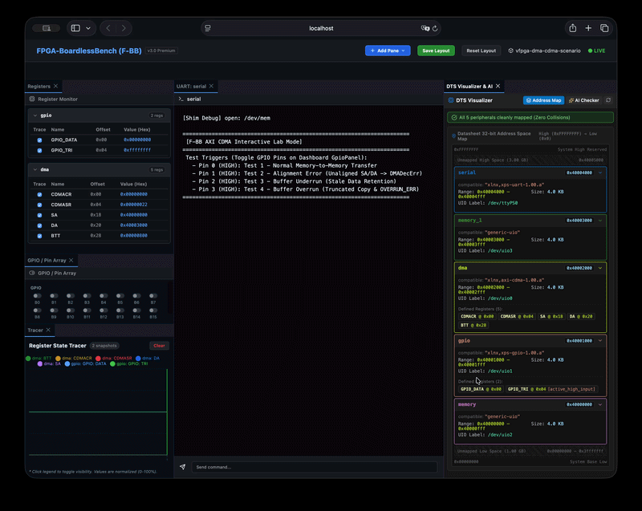
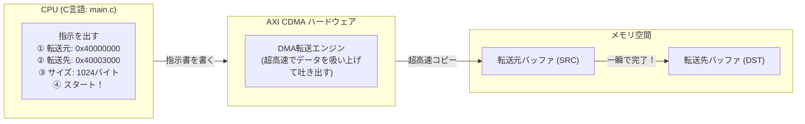

# 20_dma_cdma: CPUを使わずに大量コピーする「DMA転送」

画像データやネットワークパケットなど、メガバイト単位の大きなデータをCPUが1バイトずつ `for` ループでコピーしていると、CPUがそれだけで手一杯になって他の処理が止まってしまいます。

そこで登場するのが **「DMA（Direct Memory Access: 直接メモリアクセス）」** です。
CPUが「ここからここまでコピーしておいて！」と専用のハードウェア（DMAコントローラ）に頼むだけで、CPUは別の仕事をしている間にハードウェアが超高速でメモリ間コピーを完了してくれます。

このシナリオでは、Zynq等のSoCで標準的に使われる **「Xilinx AXI CDMA」** の制御を体験します。



---

## このシナリオのゴール
**「AXI CDMAレジスタに転送元・転送先・サイズを設定し、CPU負荷ゼロでメモリ間高速転送を実行する」**

---

## 直感イメージ：CPUとFPGAのやり取り
CPUは指示書（レジスタ設定）を書くだけ。実際の重労働（データの運搬）はDMAハードウェアが代行します。



---

## 3つの基本ステップ（コードの読み方）

[main.c](main.c) で行っていることは、以下の3ステップです。

1. **転送元（SA）と転送先（DA）のアドレスをセットする**
   - `regs[SA / 4] = 0x40000000;`（コピー元の物理アドレス）
   - `regs[DA / 4] = 0x40003000;`（コピー先の物理アドレス）
2. **転送サイズ（BTT）を書き込んでスタートする**
   - `regs[BTT / 4] = 1024;` と書いた瞬間に、ハードウェアが自動的にコピーを開始します。
3. **完了を待って結果を確認する (`CDMASR`)**
   - ステータスレジスタ `CDMASR` の Idle ビットが 1 になるのを待ち、転送先バッファの内容が一致しているかを確認します。

---

## 1. まずは動かしてみよう！

ターミナルで以下のコマンドを実行します。

```bash
./run.sh
```

**期待される出力例：**
```text
=== Scenario 20: AXI CDMA Memory-to-Memory Test Start ===
[CDMA] Test 1: Normal Transfer (1024 Bytes)...
[CDMA] Triggering transfer: SRC=0x40000000 -> DST=0x40003000, Length=1024
[CDMA] Transfer Complete! Verifying data...
[CDMA] SUCCESS: Destination buffer perfectly matches source buffer!
=== Scenario 20 Test Result: SUCCESS ===
```

> **Webダッシュボードで見てみよう！**  
> `./start_lab.sh tests/scenarios/20_dma_cdma/` を実行し、ブラウザ（http://localhost:8080）を開くと、転送前後のメモリバッファの変化やステータスレジスタの推移を視覚的に観測できます！

---

## 2. ちょこっと改造チャレンジ！

理解を深めるために、転送サイズを変えてみましょう。

- **実験:** [main.c](main.c) の転送バイト数（`1024`）を `2048` や `512` に変更して `./run.sh` を実行してみてください。  
  どんなサイズでも一瞬で正確にコピーされることが確認できます！

---

## 次のステップへ
これで「DMAによる超高速データ転送」の基本が身につきました！

- **次のシナリオ [21_can_socketcan_ecu](../21_can_socketcan_ecu/README.md)**:  
  Stage 3の締めくくりとして、自動車や産業ロボットの命綱である**「車載CAN通信 & OBD-II診断」**に進みましょう。

---

## さらに詳しく知りたい方へ
アライメントエラー (`DMADecErr`) やバッファオーバーラン検知ロジックの詳細は、**[ADVANCED.md](ADVANCED.md)** を参照してください。
