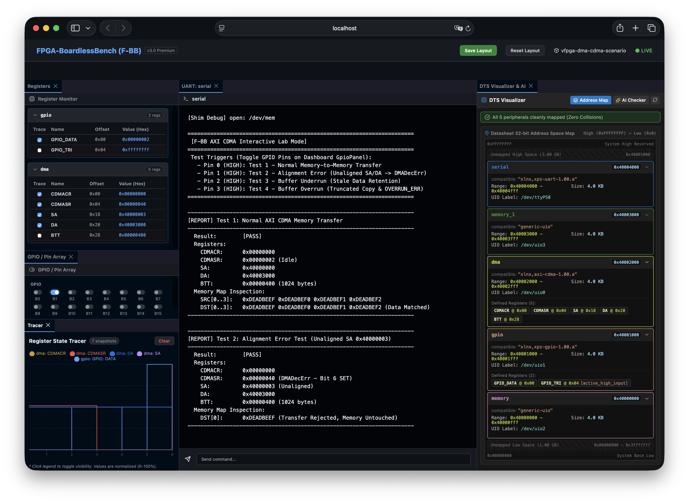
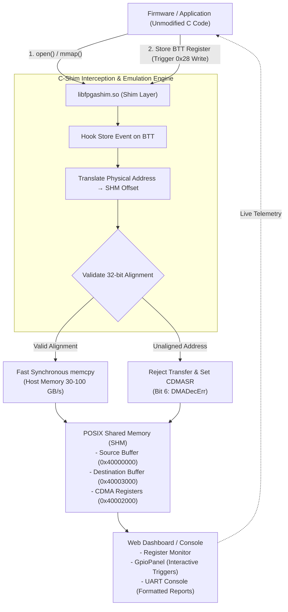

# テストシナリオ 20: Zynq AXI CDMA エミュレーション & メモリ間高速転送

本シナリオは、Zynq SoC 標準の **Xilinx AXI CDMA IP (`xlnx,axi-cdma-1.00.a`)** に完全準拠した **超高速・高信頼 DMA エミュレーション機能** の動作検証および対話型デバッグを目的としたテストシナリオです。



---

## 1. 概要と学習目標 (Overview & Learning Objectives)

従来の重厚な物理バスシミュレータと異なり、F-BB プラットフォームはホスト PC メモリ（DDR4/DDR5: 30〜100 GB/s）の圧倒的帯域を活用した **意図駆動型同期 `memcpy` エミュレーション** を採用しています。
カーネルモジュールや特権（`--privileged`）を一切必要とせず、実機ファームウェアの C コードを 1 行も変更することなく（実機透過性 100%）、以下の動作およびエラー検出ロジックを検証できます：

1. **正常系 Memory-to-Memory 転送**: 32-bit アライメントを満たすデータ転送とデータ完全一致の検証。
2. **事前アライメントチェック (`DMADecErr`)**: 非アライメントアドレス（例: `0x40000003`）指定時の転送拒否およびステータスレジスタ `CDMASR`（Bit 6）の判定。
3. **バッファアンダーラン (短小転送 & Stale Data)**: 要求サイズ未満のデータ転送時における領域外領域の未タッチ（過去ゴミデータ残留）現象の確認。
4. **バッファオーバーラン (溢れ転送 & OVERRUN_ERR)**: バッファ容量超過時における溢れデータの切捨て破棄および `CDMASR`（Bit 5）エラーフラグの判定。

---

## 2. システム構成図 (Architecture Diagram)



---

## 3. アドレスマップと Device Tree 構成 (`config.dts`)

| デバイス名 | ベースアドレス | サイズ | Compatible | 用途 |
| :--- | :--- | :--- | :--- | :--- |
| `src_mem` | `0x40000000` | 4.0 KB | `generic-uio` | 転送元ソースメモリ領域 (`/dev/uio2`) |
| `gpio0` | `0x40001000` | 4.0 KB | `xlnx,xps-gpio-1.00.a` | 対話モード操作用 GPIO コントローラ (`/dev/uio1`) |
| `cdma0` | `0x40002000` | 4.0 KB | `xlnx,axi-cdma-1.00.a` | Xilinx AXI CDMA コントローラ (`/dev/uio0`) |
| `dst_mem` | `0x40003000` | 4.0 KB | `generic-uio` | 転送先デスティネーションメモリ領域 (`/dev/uio3`) |
| `uart0` | `0x40004000` | 4.0 KB | `xlnx,xps-uart-1.00.a` | Web ダッシュボード UART コンソール出力 (`/dev/ttyPS0`) |

---

## 4. 実行モード (Execution Modes)

### モード A: 対話ラボモード (Interactive Lab Mode)

Web ダッシュボード上で GPIO スイッチを操作し、インタラクティブにテストケースを実行します。

```bash
# 対話ラボの起動
./start_lab.sh tests/scenarios/20_dma_cdma
```

* **ブラウザアクセス**: `http://localhost:8080`
* **操作方法**: `GPIO / Pin Array` ペインのトグルスイッチ（B0〜B3）を ON にクリックすると、選択したテストがトリガーされ、`UART Console` ペインに診断レポートが出力されます：
  * **Pin 0 (B0)**: Test 1 - 正常系 AXI CDMA 転送
  * **Pin 1 (B1)**: Test 2 - アライメントエラー (`DMADecErr`)
  * **Pin 2 (B2)**: Test 3 - バッファアンダーラン (`Stale Data`)
  * **Pin 3 (B3)**: Test 4 - バッファオーバーラン (`OVERRUN_ERR`)

### モード B: 一括バッチ回帰テストモード (Batch Regression Mode)

CI/CD や自動回帰テストスクリプトから自動呼び出しされ、4 つのテストを順番に連続実行します。

```bash
# シナリオ単体でのバッチ実行
cd tests/scenarios/20_dma_cdma && ./run.sh

# 全シナリオ一括回帰テストの実行
./tests/regression_test.py
```

---

## 5. テスト結果とレポート出力例

UART コンソール（および標準出力）には、以下のように綺麗に揃えられた診断レポートが出力されます：

```text
----------------------------------------------------------------------
[REPORT] Test 1: Normal AXI CDMA Memory Transfer
----------------------------------------------------------------------
  Result:        [PASS]
  Registers:
    CDMACR:      0x00000000
    CDMASR:      0x00000002 (Idle)
    SA:          0x40000000
    DA:          0x40003000
    BTT:         0x00000400 (1024 bytes)
  Memory Map Inspection:
    SRC[0..3]:   0xDEADBEEF 0xDEADBEF0 0xDEADBEF1 0xDEADBEF2
    DST[0..3]:   0xDEADBEEF 0xDEADBEF0 0xDEADBEF1 0xDEADBEF2 (Data Matched)
----------------------------------------------------------------------
```

---

## 6. 実機（Zynq）透過性および移植時の要点 (Real-Hardware Transparency Notes)

本シナリオの `main.c` は、F-BB プラットフォームでの検証と実機 Zynq（Cortex-A）基板での完動を **1 行のコード変更もなく両立する「100% 実機透過対応 C コード」** として実装されています。

### 1. キャッシュコヒーレンシの完全透過対応
* **課題**: 実機 Cortex-A CPU は L1/L2 キャッシュを介してアクセスしますが、AXI CDMA は DRAM 本体を直接アクセスするため、キャッシュの不整合（データ化け）が発生します。
* **`main.c` での実装**:
  * `/dev/mem` オープン時に `open("/dev/mem", O_RDWR | O_SYNC)` を指定（Uncached マッピング）。
  * DMA 起動前後に GCC/Clang 標準組み込み関数 **`__builtin___clear_cache()`** を用いた `flush_dcache_range()` および `invalidate_dcache_range()` を配置。
* **F-BB での挙動**:
  * F-BB C-Shim (`libfpgashim.so`) が `open()` をトラップして POSIX 共有メモリ (SHM) へ透過リダイレクトするため、`O_SYNC` や `__builtin___clear_cache()` はホスト PC 上でパフォーマンス低下やエラーを起こさず最高速で通過します。
* **効果**:
  * **F-BB で動作確認した `main.c` が、そのまま実機 Zynq に持って行ってもキャッシュ化けを起こさず一発完動します。**

### 2. Vivado アドレス空間 & Reserved Memory（実機設定時の要点）
* **現象**: Linux カーネルが使用中のメモリ領域を DMA 転送先に指定すると、カーネルパニックや SIGSEGV が発生します。
* **実機での対策**: Vivado Address Editor で割り当てられた AXI CDMA ベースアドレスを一致させるとともに、実機 Device Tree (DTS) の `reserved-memory` ノードで OS が使用しない DMA 専用領域を確保し、その物理アドレスを転送バッファとして指定してください。
