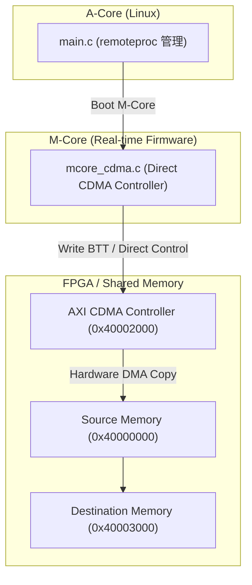

# Scenario 20b: AMP M-Core AXI CDMA オフロード - 詳細設計 & アーキテクチャ解説

本ドキュメントは、Mコア（リアルタイムプロセッサ）主導の AXI CDMA 直接制御、Aコア Linux との連携、およびアライメント/境界エラー検知機構の詳細仕様書です。

---

## 1. Mコア CDMA オフロードアーキテクチャ

---

## 2. 特徴と利点

- **Linux CPU負荷ゼロ**: DMA のセットアップ・転送待ちをすべて M コアが担うため、Linux（Aコア）は UI やネットワーク処理に専念可能。
- **ミリ秒以下の超低遅延起動**: Linux のスケジューラやコンテキストスイッチを挟まず、ハードウェア割り込みに応答して即座に DMA をキック可能。
