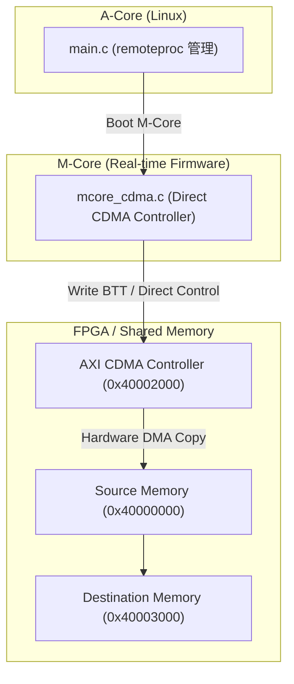

# Scenario 20b: AMP M-Core AXI CDMA オフロード - 詳細設計 & アーキテクチャ解説

本ドキュメントは、Mコア（リアルタイムプロセッサ）主導の AXI CDMA 直接制御、Aコア Linux との連携、およびアライメント/境界エラー検知機構の詳細仕様書です。

---

## 1. Mコア CDMA オフロードアーキテクチャ

---

## 2. 特徴と利点

- **Linux CPU負荷ゼロ**: DMA のセットアップ・転送待ちをすべて M コアが担うため、Linux（Aコア）は UI やネットワーク処理に専念可能。
- **ミリ秒以下の超低遅延起動**: Linux のスケジューラやコンテキストスイッチを挟まず、ハードウェア割り込みに応答して即座に DMA をキック可能。

---

## 3. ヘテロジニアス・マルチコアにおけるメモリコヒーレンシとバリア

Mコア（ベアメタル/RTOS）が DMA 転送を行い、Aコア（Linux）がその結果を参照するようなマルチプロセッサ・ヘテロジニアス環境では、**コア間のキャッシュコヒーレンシとメモリバリア** が極めて重要な設計課題となります。

### 3.1. 実機 SoC におけるマルチコア競合モデル
- **非コヒーレント共有メモリ**:
  多くの SoC では、Aコア（Cortex-A）の L1/L2 キャッシュと Mコア（Cortex-M）の TCM/キャッシュ、および AXI CDMA バスマスタの間でハードウェア・キャッシュコヒーレンシが効いていません。
- **F-BB と実機のギャップ**:
  F-BB 上ではホスト PC の同一アドレス空間（POSIX shm）を直接参照するため、キャッシュ不整合は発生しません。しかし、実機では以下のシーケンスを怠ると破綻します：
  1. **Aコア**: Mコアへ DMA 要求を出す前に、共有バッファの **Clean（メモリへの書き戻し）** を実行。
  2. **Mコア**: DMA 転送キック前に `__DMB()`（Data Memory Barrier）を実行。
  3. **Mコア**: DMA 完了後、Aコアへ割込通知を送る前に `__DSB()`（Data Synchronization Barrier）を実行。
  4. **Aコア**: Mコアからの完了通知を受信後、共有バッファの **Invalidate（キャッシュ破棄）** を実行してからデータを読む。

> [!IMPORTANT]
> `mcore_cdma.c` では `__builtin___clear_cache()` を使用して透過性を維持していますが、実機 Cortex-M / Cortex-R 開発へ移行する際は、CMSIS 提供の `SCB_CleanDCache()` / `SCB_InvalidateDCache()` および `__DMB()` の適用を忘れないよう設計してください。
