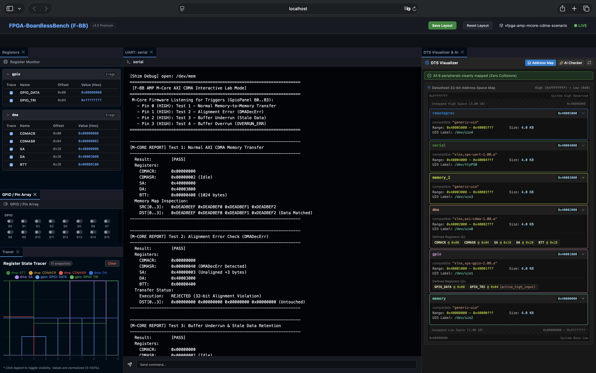
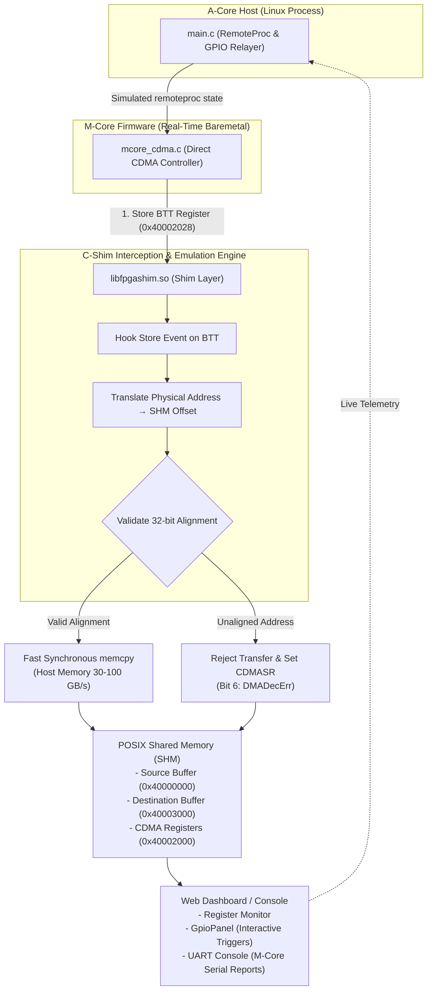

# テストシナリオ 20b: AMP Mコア AXI CDMA オフロード & リアルタイム DMA エミュレーション

本シナリオは、Zynq SoC 標準の **Xilinx AXI CDMA IP (`xlnx,axi-cdma-1.00.a`)** を用いた **AMP (非対称マルチプロセッシング) リアルタイム DMA オフロード機能** の動作検証および対話型デバッグを目的としたテストシナリオです。



---

## 1. 概要と学習目標 (Overview & Learning Objectives)

重厚な OS カーネルの CPU 負荷を避けるため、組み込みシステムではリアルタイムコア（Mコア / Cortex-R / MicroBlaze）へ DMA 転送処理をオフロードする設計が多用されます。
シナリオ 20b では、F-BB プラットフォームの意図駆動型同期 `memcpy` エミュレーションを活用し、Mコアファームウェア（`mcore_cdma.c`）から AXI CDMA IP レジスタを直接制御する以下の動的挙動およびエラー判定ロジックを検証します：

1. **AMP リアルタイム DMA オフロード**: Aコア (Linux) の CPU サイクルを一切消費せず、Mコアベアメタルファームウェアから直接 AXI CDMA を操作して DRAM 共有メモリ間 (`0x40000000` ↔ `0x40003000`) の転送を完結。
2. **事前アライメントチェック (`DMADecErr`)**: Mコアからの非アライメントアドレス指定時における転送拒否およびステータスレジスタ `CDMASR` (Bit 6) の検知。
3. **バッファアンダーラン (Stale Data)**: 要求サイズ未満のデータ転送時における領域外領域の未タッチ（過去データ保持）現象の確認。
4. **バッファオーバーラン (OVERRUN_ERR)**: バッファ容量超過時における溢れデータの切捨て破棄および `CDMASR` (Bit 5) エラーフラグの判定。

---

## 2. システム構成図 (Architecture Diagram)



---

## 3. アドレスマップと Device Tree 構成 (`config.dts`)

| デバイス名 | ベースアドレス | サイズ | Compatible | 用途 |
| :--- | :--- | :--- | :--- | :--- |
| `src_mem` | `0x40000000` | 4.0 KB | `generic-uio` | 転送元ソースメモリ領域 (`/dev/uio2`) |
| `gpio0` | `0x40001000` | 4.0 KB | `xlnx,xps-gpio-1.00.a` | 対話モード操作用 GPIO コントローラ (`/dev/uio1`) |
| `cdma0` | `0x40002000` | 4.0 KB | `xlnx,axi-cdma-1.00.a` | Xilinx AXI CDMA コントローラ (`/dev/uio0`) |
| `dst_mem` | `0x40003000` | 4.0 KB | `generic-uio` | 転送先デスティネーションメモリ領域 (`/dev/uio3`) |
| `uart0` | `0x40004000` | 4.0 KB | `xlnx,xps-uart-1.00.a` | Web ダッシュボード UART コンソール出力 (`/dev/ttyPS0`) |
| `remoteproc0` | `0x40005000` | 4.0 KB | `generic-uio` | Mコア ライフサイクル管理用リモートプロセッサ (`/dev/uio4`) |

---

## 4. 実行モード (Execution Modes)

### モード A: 対話ラボモード (Interactive Lab Mode)

Web ダッシュボード上で GPIO スイッチを操作し、インタラクティブに Mコア DMA テストケースを実行します。

```bash
# 対話ラボの起動
./start_lab.sh tests/scenarios/20b_mcore_cdma
```

* **ブラウザアクセス**: `http://localhost:8080`
* **操作方法**: `GPIO / Pin Array` ペインのトグルスイッチ（B0〜B3）を ON にクリックすると、Mコアファームウェアによって選択したテストがトリガーされ、`UART Console` ペインに Mコア診断レポートが出力されます：
  * **Pin 0 (B0)**: Test 1 - 正常系 Mコア AXI CDMA 転送
  * **Pin 1 (B1)**: Test 2 - アライメントエラー (`DMADecErr`)
  * **Pin 2 (B2)**: Test 3 - バッファアンダーラン (`Stale Data`)
  * **Pin 3 (B3)**: Test 4 - バッファオーバーラン (`OVERRUN_ERR`)

### モード B: 一括バッチ回帰テストモード (Batch Regression Mode)

CI/CD や自動回帰テストスクリプトから自動呼び出しされ、4 つのテストを順番に連続実行します。

```bash
# シナリオ単体でのバッチ実行
cd tests/scenarios/20b_mcore_cdma && ./run.sh
```

---

## 5. テスト結果とレポート出力例

UART コンソールには、Mコアから以下のように綺麗に揃えられた診断レポートが出力されます：

```text
----------------------------------------------------------------------
[M-CORE REPORT] Test 1: Normal AXI CDMA Memory Transfer
----------------------------------------------------------------------
  Result:        [PASS]
  Registers:
    CDMACR:      0x00000000
    CDMASR:      0x00000002 (Idle)
    SA:          0x40000000
    DA:          0x40003000
    BTT:         0x00000400 (1024 bytes)
  Memory Map Inspection:
    SRC[0..3]:   0xDEADBEEF 0xDEADBEF0 0xDEADBEF1 0xDEADBEF2
    DST[0..3]:   0xDEADBEEF 0xDEADBEF0 0xDEADBEF1 0xDEADBEF2 (Data Matched)
----------------------------------------------------------------------
```

---

## 6. 実機（Zynq）透過性および移植時の要点 (Real-Hardware Transparency Notes)

本シナリオの `mcore_cdma.c` は、F-BB プラットフォームでの検証と実機 Zynq（Cortex-R5 / M4）基板での完動を **1 行のコード変更もなく両立する「100% 実機透過対応 C コード」** として実装されています。

1. **`__builtin___clear_cache()` によるプリプロセッサなしのキャッシュ制御**: `#if` 分岐を 1 行も含まず、GCC/Clang 標準組み込み関数により実機での L1/L2 キャッシュ不整合を予防します。
2. **`O_SYNC` フラグの透過性**: `/dev/mem` または MMIO マッピングにおいて、実機では Uncached マッピング、F-BB 上では POSIX SHM への高速リダイレクトとして機能します。
