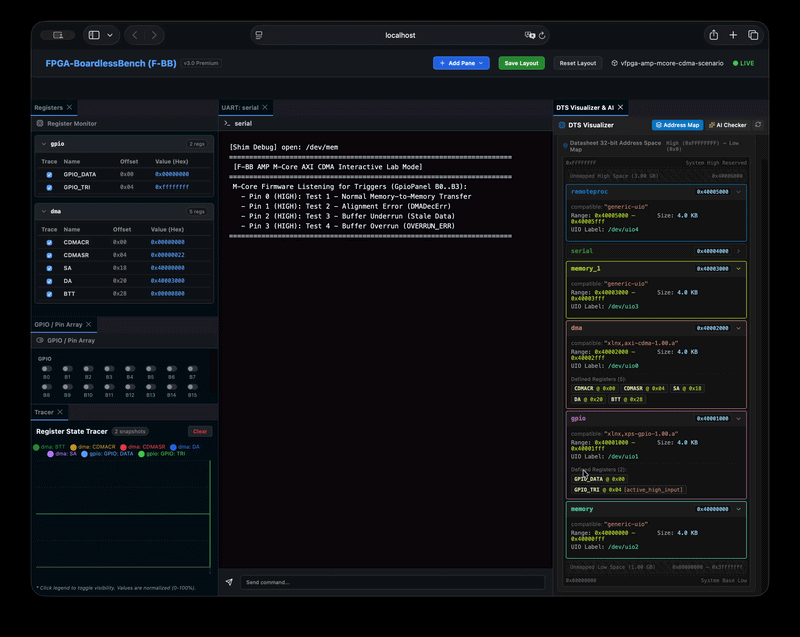
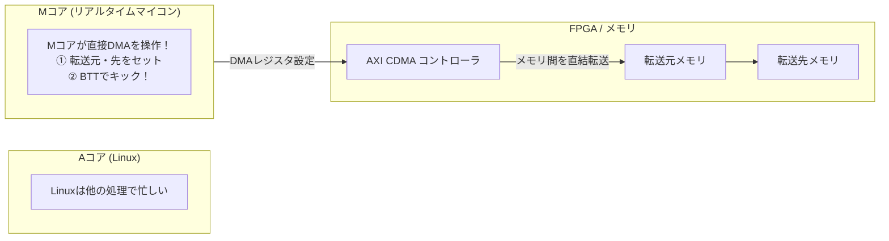

# 20b_mcore_cdma: マイコンが主導する「リアルタイムDMA」

Stage 4（マルチコア & RTOS）の総仕上げです！

Linuxのような大きなOSは、画面描画やネットワーク処理で忙しく、ミリ秒以下の正確なタイミングでDMA転送を開始することが難しい場合があります。
そこで、**「リアルタイムマイコン（Mコア）が直接FPGAのDMAコントローラを操作してデータを転送する」** という高度な協調設計を行います。



---

## このシナリオのゴール
**「Aコア（Linux）のCPU負荷を一切かけず、Mコア（マイコン）から直接AXI CDMAを叩いて高速データ転送を完了させる」**

---

## 直感イメージ：CPUとFPGAのやり取り
Linuxはマイコンの起動を見届けるだけ。DMA転送の指示と監視はすべてMコアが代行します。



---

## 3つの基本ステップ（コードの読み方）

[mcore_cdma.c](mcore_cdma.c) で行っていることは、以下の3ステップです。

1. **MコアがDMAのベースアドレス（0x40002000）をマッピングする**
   - マイコン側から直接FPGAのCDMAレジスタにアクセスできるようにします。
2. **転送元・転送先・転送サイズ（BTT）をセットして起動する**
   - Mコアが `regs[BTT] = 1024;` と書き込み、DMA転送を一瞬でキックします。
3. **Mコアが完了フラグを確認し、Aコアへ完了を通知する**
   - DMAが完了したらステータスを更新し、Linux側へ「転送完了したよ！」と伝えます。

---

## 1. まずは動かしてみよう！

ターミナルで以下のコマンドを実行します。

```bash
./run.sh
```

**期待される出力例：**
```text
=== Scenario 20b: M-Core CDMA Offload Test Start ===
[A-Core] Booting M-Core CDMA Controller firmware...
[M-Core CDMA] M-Core Firmware Started. Controlling AXI CDMA directly...
[M-Core CDMA] Starting Normal Transfer (1024 Bytes)...
[M-Core CDMA] Transfer Completed via M-Core! Verifying destination data...
[M-Core CDMA] SUCCESS: Memory-to-Memory Transfer Verified!
=== Scenario 20b Test Result: SUCCESS ===
```

---

## 2. ちょこっと改造チャレンジ！

- **実験:** [mcore_cdma.c](mcore_cdma.c) の転送サイズを変更して `./run.sh` を実行してみてください。マイコン主導で正確にサイズ通りのデータがコピーされることが確認できます！

---

## 次のステップへ
これで **Stage 4: ヘテロジニアスマルチコア & RTOS（AMP: remoteproc・FreeRTOS・ThreadX・OpenAMP・MコアDMA）** は完了です！

- **次のステージ [16_amp_mcore_Rust_baremetal](../16_amp_mcore_Rust_baremetal/README.md)**:  
  最終ステージ **Stage 5: モダン組み込み & 発展技術** に進みます。C言語に代わる次世代の安全なプログラミング言語**「組み込みRust」**の世界へ飛び込みましょう！

---

## さらに詳しく知りたい方へ
Mコア主導DMAの割り込み制御やアライメントエラー判定の詳細は、**[ADVANCED.md](ADVANCED.md)** を参照してください。
