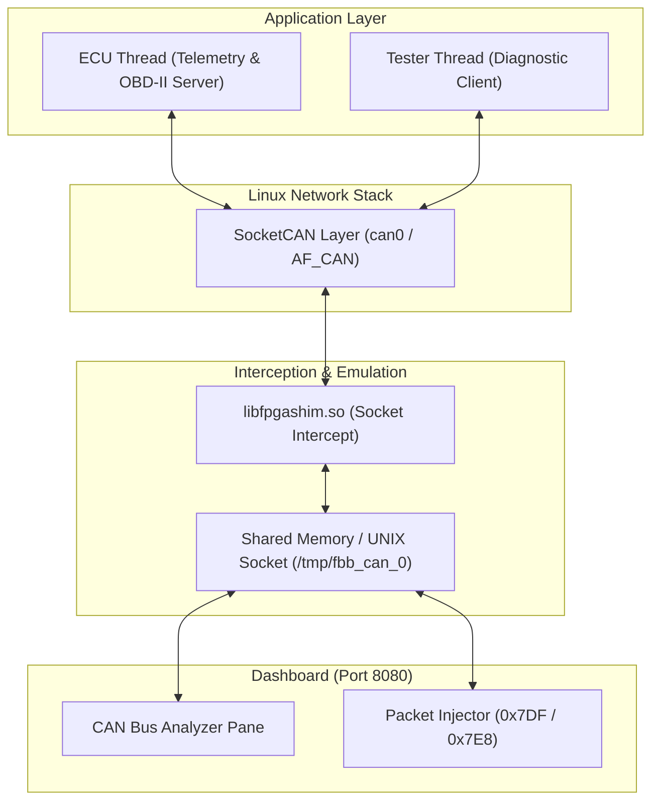

# Scenario 21: 車載 SocketCAN ECU & OBD-II - 詳細設計 & アーキテクチャ解説

本ドキュメントは、Linux SocketCAN (`AF_CAN`)、車載 ECU テレメトリブロードキャスト、および OBD-II (ISO 15765-4 / ISO 14229) 診断プロトコルエミュレーションの詳細仕様書です。

---

## 1. SocketCAN 協調アーキテクチャ

---

## 2. CAN メッセージ仕様 & OBD-II PID 定義

### テレメトリパケット (常時 25Hz ブロードキャスト)
- **ID `0x100`**: Vehicle Speed (`Byte 0`: km/h), Engine RPM (`Byte 1-2`: Big-Endian)
- **ID `0x101`**: Coolant Temp (`Byte 0`: °C - 40), Battery Voltage (`Byte 1-2`: mV)

### OBD-II 診断プロトコル (Request: `0x7DF`, Response: `0x7E8`)
- **Mode 01 PID 0D (Vehicle Speed)**:
  - Request: `0x7DF [02 01 0D 00 00 00 00 00]`
  - Response: `0x7E8 [03 41 0D <Speed> 00 00 00 00]`
- **Mode 01 PID 0C (Engine RPM)**:
  - Request: `0x7DF [02 01 0C 00 00 00 00 00]`
  - Response: `0x7E8 [04 41 0C <RPM_High> <RPM_Low> 00 00 00]` (RPM = $(\text{Raw}) / 4$)
