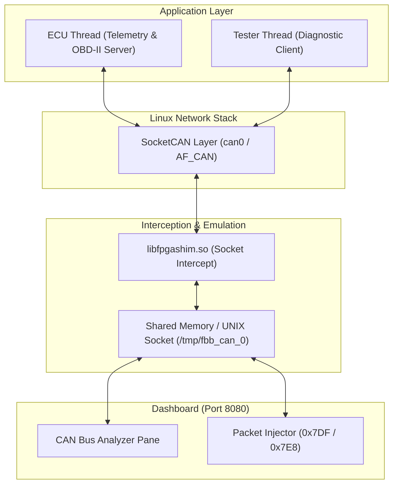

# Scenario 21: 車載 SocketCAN ECU & OBD-II - 詳細設計 & アーキテクチャ解説

本ドキュメントは、Linux SocketCAN (`AF_CAN`)、車載 ECU テレメトリブロードキャスト、および OBD-II (ISO 15765-4 / ISO 14229) 診断プロトコルエミュレーションの詳細仕様書です。

---

## 1. SocketCAN 協調アーキテクチャ



---

## 2. CAN メッセージ仕様 & OBD-II PID 定義

### テレメトリパケット (常時 25Hz ブロードキャスト)
- **ID `0x100`**: Vehicle Speed (`Byte 0`: km/h), Engine RPM (`Byte 1-2`: Big-Endian)
- **ID `0x101`**: Coolant Temp (`Byte 0`: °C - 40), Battery Voltage (`Byte 1-2`: mV)

### OBD-II 診断プロトコル (Request: `0x7DF`, Response: `0x7E8`)
- **Mode 01 PID 0D (Vehicle Speed)**:
  - Request: `0x7DF [02 01 0D 00 00 00 00 00]`
  - Response: `0x7E8 [03 41 0D <Speed> 00 00 00 00]`
- **Mode 01 PID 0C (Engine RPM)**:
  - Request: `0x7DF [02 01 0C 00 00 00 00 00]`
  - Response: `0x7E8 [04 41 0C <RPM_High> <RPM_Low> 00 00 00]` (RPM = $(\text{Raw}) / 4$)


## 3. CANプロトコルにおける特徴的な実装パターン
API（ソケットやドライバ関数）と上位プロトコル（OBD-IIやID仕様）の双方を完全に削ぎ落とした場合、今回の `main.c` 自体にはCANと断定できる決定的なロジックはほぼ残りません。

しかし、実際の車載制御やマイコンのドライバ開発現場には、「初見では意味が広く取れる（あるいは奇妙に見える）が、CAN特有の物理・規格上の制約を知っている人だけが意図を即座に見抜けるコード」がいくつも存在します。

開発経験がなければ見逃しやすい、CAN特有の代表的な実装パターンとテクニックを挙げます。

---

### 1. 「送信用」リングバッファを持たない、または容量が極端に小さい

通常のシリアル通信（UART）やEthernet、TCP/IPでは、送信パケットを溜め込むための大きめのFIFOリングバッファを用意するのが定石です。しかし、本格的なCAN制御コードでは**あえて送信用FIFOを持たず、メールボックスの上書きや破棄（Drop）を行う**実装が頻出します。

* **初見の疑問:** なぜバッファフル時にキューイングせず、最新値で上書きしたり送信要求をスキップしたりするのか？バグではないのか？
* **CANの背景:** CANは「リアルタイム制御」のためのバスです。CANバスが混雑して送信が遅延した場合、数ミリ秒前の古いアクセル開度や舵角を送ることは**システムにとって危険**になります。「遅れて届く過去のデータ」よりも「常に最新の瞬間値」を送る必要があるため、古いフレームをキューに溜めず意図的に破棄・上書きするロジックが組まれます。

---

### 2. バスオフ（Bus-Off）自動復帰の抑制と、段階的リカバリ処理

CANコントローラのステータスレジスタをポーリングまたは割り込みで監視し、エラーカウンタの状態に応じてタイマーを回すロジックです。

```c
// 初見では「なぜ単純にドライバをリセットして即再開しないのか」が分かりにくい例
if (can_reg->STATUS & STATUS_BUS_OFF) {
    can_reg->CTRL |= CTRL_RESET;
    // 即時再開（AUTO_RECOVERY）を禁止し、1秒以上のディレイタイマーをセットする
    set_timer(&bus_off_recovery_timer, 1000); 
}

```

* **初見の疑問:** エラーが起きたなら、即座にモジュールを再初期化して通信復帰を試みるべきではないのか？
* **CANの背景:** CANコントローラにはハードウェアレベルで「TEC（送信エラーカウンタ）」があり、エラーが頻発すると自身をバスから物理的に切り離す「Bus-Off」状態になります。もし故障したECUが即座に自動復帰を繰り返すと、**壊れたノードがバス全体を延々と道連れにして麻痺させる**ことになります。ISO 11898規格や車載OEM仕様では「Bus-Off時は即復帰せず、128回×11ビット分のバスアイドルを待つ、あるいはフェイルセーフとして一定秒数黙る」ことが厳格に義務付けられているため、このような待機ロジックが書かれます。

---

### 3. モトローラ配列（Big-Endian）の「ビット逆順・境界跨ぎ」ビットシフト

マイコンのエンディアンとは無関係に、1つのレジスタやバイト配列からビットフィールドを取り出す際、一見すると天地が逆に見える複雑怪奇なビット演算が行われます。

```c
// 初見では何かの暗号化や難解化に見えるビット抽出
uint16_t val = ((buf[1] & 0x07) << 8) | buf[0]; // バイト順はリトル風だが、ビット位置が逆

```

* **初見の疑問:** なぜ素直に `val = (buf[0] << 8) | buf[1]` やビットフィールド構造体（`struct`）でキャストしないのか？
* **CANの背景:** 車載CANの標準フォーマット（DBCファイル）には、「Motorola Forward (msb)」「Motorola Backward (lsb)」という独特のビットオーダ定義が存在します。バイト境界（8bitの区切り）を跨ぐシグナルを扱う際、コンパイラのビットフィールド構造体に頼るとパディングやエンディアンの差異で壊滅するため、規格書のビットマトリクス図に合わせた特有の「手作業ビットシフト」コードが随所に現れます。

---

### 4. 割り込み禁止（クリティカルセクション）で囲まれた「送信優先度」の動的書き換え

CANコントローラの送信メールボックス（通常3個程度）に空きがあるにもかかわらず、未送信のメールボックスにキャンセル要求を発行してからデータを詰める処理です。

```c
// 送信待ちのフレームをわざわざキャンセル（ABORT）してから入れ直す
can_reg->TXB_ABORT = TXB0_MASK;
while (!(can_reg->TXB_CTRL & TXB_ABORTED));
can_reg->TXB0_ID = HIGH_PRIORITY_ID;
can_reg->TXB0_DATA = ...;
can_reg->TXB0_REQ = 1;

```

* **初見の疑問:** キューに入っているなら、それが送信されるのを待ってから次に送ればいいのではないか？なぜわざわざ送信要求を取り消すのか？
* **CANの背景:** CANは「CAN IDの数値が小さいほどバス調停（アービトレーション）で優先される」仕組みです。しかし、マイコン内部の送信ハードウェアバッファ（メールボックス）に低い優先度のフレームが入っていると、バス上の優先度判定に参加する前にマイコン内部で足止めを食らう（優先度逆転現象）が発生します。緊急度の高い制御フレームを割り込ませるため、ハードウェア送信バッファを強制キャンセルして差し替えるテクニックが使われます。

---

### 5. 受信ループ内での「同一ID・同一データの破棄（デバウンス）」

受信ハンドラの中で、直前に受け取ったデータとまったく同じであれば、上位層にイベントを渡さずに無視する処理です。

* **初見の疑問:** 相手が定期送信しているなら、受信側も周期ごとにそのまま処理するのが自然ではないか？
* **CANの背景:** 車載CANでは「変化があった時だけ送る（イベント駆動）」と「100ms周期で延々と送る（周期送信）」が混在します。周期送信されているフレームを毎回律儀に処理するとマイコンのCPU負荷が跳ね上がるため、状態変化（エッジ）のみを検出して処理を間引くロジックがCANレシーバ層の直後によく組み込まれます。