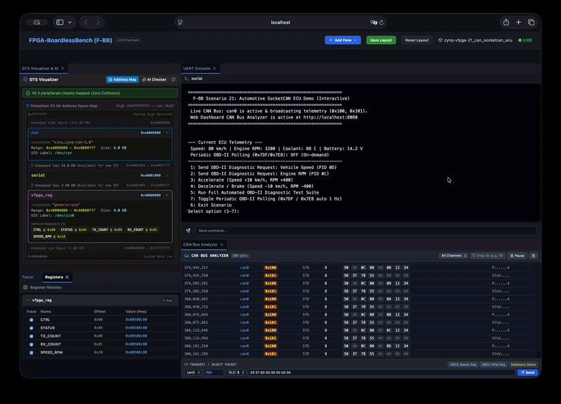

# シナリオ 21: 車載 ECU ゲートウェイ & SocketCAN 診断エミュレーション (`21_can_socketcan_ecu`)

## 概要
本シナリオは、車載・産業機器ファームウェアの標準通信プロトコルである **Linux SocketCAN (`AF_CAN`)** を用い、実機ソースコードを 100% 透過的にエミュレーションする統合検証環境です。



Zynq-7000 SoC 内蔵の CAN コントローラ（`xlnx,zynq-can-1.0`）を Device Tree（`config.dts`）で定義し、Linux 標準の `<linux/can.h>` ソケット API を通じて、**「定期的な車両テレメトリ配信」** および **「OBD-II / UDS 診断リクエストに対する即時レスポンス」** を検証します。

---

## 主な機能と検証項目

1. **Linux SocketCAN API の完全透過性**:
   - `socket(PF_CAN, SOCK_RAW, CAN_RAW)` によるソケットオープン
   - `ioctl(SIOCGIFINDEX)` による `can0` インターフェース識別
   - `bind()` による仮想 CAN バス（Bus 0）へのアタッチ
   - `setsockopt(SOL_CAN_RAW, CAN_RAW_FILTER)` による CAN ID フィルタリング
2. **車載 ECU テレメトリ配信**:
   - CAN ID `0x100`: 車速（km/h）、エンジン回転数（RPM）、シフトポジション
   - CAN ID `0x101`: 冷却水温（°C）、バッテリー電圧（mV）
3. **OBD-II 診断プロトコル (On-Board Diagnostics) 応答**:
   - 診断リクエスト ID `0x7DF`（Functional Request）を受信
   - Mode 01 PID 0D（Vehicle Speed）に対し、ID `0x7E8` で `03 41 0D 50`（80 km/h）を返信
   - Mode 01 PID 0C（Engine RPM）に対し、ID `0x7E8` で `04 41 0C 32 00`（3,200 RPM）を返信
4. **Web ダッシュボード統合**:
   - `CanAnalyzerPane` 上でパケットのリアルタイム監視（ID, DLC, データHEX, 周期）および GUI からのパケット送信（インジェクション）が可能。

---

## 実行方法

### 1. 自動テストモード (Batch Regression)
```bash
fbb test 21_can_socketcan_ecu
# または
./tests/scenarios/21_can_socketcan_ecu/run.sh
```

### 2. 対話型ラボモード (Interactive Web Dashboard & UART Menu)
```bash
./start_lab.sh tests/scenarios/21_can_socketcan_ecu/
```
- **Web ダッシュボード**: ブラウザで `http://localhost:8080` を開き、**CAN Bus Analyzer** ペインからリアルタイムに車両テレメトリ送受信ログ（`0x100`, `0x101`, `0x7DF`, `0x7E8`）を監視したり、パケットインジェクターから手動で診断要求を注入できます。
- **UART 対話メニュー**: ダッシュボードの **UART Console** タブ（または `telnet localhost 2000`）から以下のコマンドを入力し、リアルタイムにテストを実行したり車両パラメータを変更できます：
  - `1`: 車速診断リクエスト（Mode 01 PID 0D）を送信・応答検証
  - `2`: エンジン回転数診断リクエスト（Mode 01 PID 0C）を送信・応答検証
  - `3`: 車両加速（車速 +10 km/h, RPM +400）
  - `4`: 車両減速 / ブレーキ（車速 -10 km/h, RPM -400）
  - `5`: 全 OBD-II 診断テストの一括自動検証
  - `7`: 毎秒 1 回の自動診断ポーリング（1 Hz）を有効化 / 無効化切り替え
  - `6`: シナリオ終了

---

## CAN 通信の仕様とフィルタによる特定パケットの観察方法

### 1. `0x100` と `0x101` が常時流れている理由（テレメトリ常時配信）
実車の車載ネットワーク（CAN バス）では、エンジンの稼働中、車速・エンジン回転数（ID `0x100`）や冷却水温・バッテリー電圧（ID `0x101`）といった車両状態パラメータが **ECU から約25Hz（40ms 周期）で常時ブロードキャスト配信** されます。本シナリオではこの実機動作を忠実にエミュレーションしているため、起動直後からテレメトリパケットが連続して流れます。

### 2. `0x7DF` と `0x7E8` が常時流れない理由（診断オンデマンド応答）
OBD-II / UDS などの車載診断プロトコルは、外部テスターや故障診断機から **「ID `0x7DF`（診断要求）が送信された時のみ、ECU が ID `0x7E8`（診断応答）を返信する」** という一問一答（オンデマンド）のプロトコルです。そのため、リクエストが発行されない限りバス上には流れません。

### 3. フィルタを使って `0x7DF` / `0x7E8` のみを抽出・観察する操作手順

1. **ID フィルタを設定する**:
   - CAN Bus Analyzer 右上の **`Filter ID (e.g. 7D)`** 入力欄に `7D` または `7DF`（応答も含める場合は `7` や `7E`）と入力します。
   - この時点ではまだ診断リクエストが送信されていないため、画面上のテレメトリ（`0x100`, `0x101`）が非表示になり、テーブルはパケット待機状態になります。
2. **診断リクエストを発行する**:
   - **方法 A (UART から送信)**: **UART Console** タブで `1`（車速要求）または `2`（RPM 要求）を入力して送信します。
   - **方法 B (ダッシュボードから送信)**: CAN Bus Analyzer 下部の **TRANSMIT / INJECT PACKET** にある **`[OBD2 Speed Req]`** ボタンをクリックし、右側の **`Send`** ボタンを押します。
   - **方法 C (毎秒自動ポーリング)**: **UART Console** で `7` を入力すると、1 Hz 周期で診断リクエストが自動送信され、フィルタされた画面に毎秒 `0x7DF` と `0x7E8` が定期的に追加されます。
3. **パケットを確認・一時停止する**:
   - フィルタされた画面に送信された要求（`0x7DF`）と ECU からの応答（`0x7E8`）のみがクリアに表示されます。
   - じっくりペイロードを確認したい場合は、右上の **`Pause`** ボタンを押すことでスクロールを固定できます。

---

## アーキテクチャ解説：対向ノード（テスター / 別CPU）のエミュレーションと実機透過性

### 1. 「Zynq とは別の CPU」をどう再現しているのか？
実車では、CAN 通信は物理的に離れた複数の ECU（マイコン / CPU）や外部診断テスター（スキャナー）との間で行われます。
本シナリオでは、自動回帰テストの容易性と堅牢性を両立するため、**Aコア（Linux）内のマルチスレッド（ECU 役スレッド vs テスター役スレッド）** および **Web ダッシュボード（外部テスター役）** による対向通信構成を採用しています。

```text
 [ Aコア (Linux: main.c) ]
  ├─ ECU スレッド (ecu_server_thread)   ──[ can0 ]──┐
  │   (テレメトリ配信 & OBD-II 診断応答)             │
  │                                                  ├── [ C-Shim 仮想 CAN バス ]
  └─ テスター スレッド / UART メニュー  ──[ can0 ]──┤   (UNIXドメインソケット: /tmp/fbb_can_p0/)
      (診断要求送信 & アサーション検証)              │
                                                     │
 [ Web ダッシュボード (CAN Bus Analyzer) ] ──────────┘
  (GUI からのパケットインジェクション & パケット監視)
```

### 2. スレッド分離構成における実機透過性の維持
「同一プロセス内のスレッド通信で、別 CPU との実機透過性が担保できるのか？」という点について、F-BB では以下の理由から**極めて高い実機透過性が維持されています**。

1. **ソケット API による実行コンテキストの完全な隠蔽**:
   - CAN 通信プログラムがハードウェア境界を意識するのは、Linux 標準のソケット API（`socket`, `bind`, `write`, `read`, `setsockopt`）までです。
   - 通信相手が「別スレッド」「別プロセス」「別の M コア（別 CPU）」「物理ハーネスで繋がれた実車の別 ECU」のいずれであっても、**発行するシステムコール・引数・パケット構造（`struct can_frame`）・プロトコル解釈ロジックは 100% 完全に一致**します。
2. **共有メモリ依存の完全な排除（カプセル化）**:
   - ECU スレッドとテスター側はグローバル変数や共有ポインタでデータを直接やり取りせず、すべての通信を規格準拠の CAN フレームにシリアライズし、独立したソケット記述子を介して送受信しています。
3. **別バイナリ / 別 CPU への切り出し容易性**:
   - `ecu_server_thread` の処理ロジックは、そのまま独立した別バイナリ（`ecu_node.c`）や別 CPU 向けファームウェアに移し替えても、CAN 通信コードを 1 行も変更することなくそのまま動作します。
4. **プロセス間通信への自然な拡張性**:
   - F-BB の SocketCAN 仮想バスは UNIX ドメインソケット（`/tmp/fbb_can_p0/`）を用いたプロセス間マルチキャストで動作しているため、将来的に「Aコア（Linux ゲートウェイ）」と「Mコア（FreeRTOS / Rust リアルタイム ECU）」といった複数 CPU プロセス間での車載分散ネットワーク通信にもシームレスに拡張可能な構造となっています。
