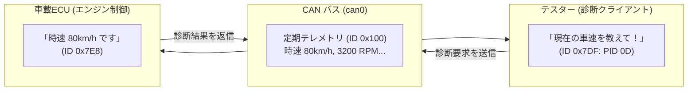

# 21_can_socketcan_ecu: クルマを動かす通信「車載CAN & 診断」

自動車の中には、エンジン、ブレーキ、メーター、エアコンなど100個以上のマイコン（ECU）が搭載されており、ノイズに強く信頼性の高い **「CAN（Controller Area Network: キャン）」** という専用ネットワークで結ばれています。

また、車の整備工場でテスターを繋いで「車速」や「エンジンの回転数」を読み取る点検規格を **「OBD-II（オン・ボード・ダイアグノーシクス）」** と呼びます。

このシナリオでは、Linuxの標準的なネットワーク機能（SocketCAN）を使って、車載ECUと診断テスターの通信を体験します！


---

## このシナリオのゴール
**「SocketCANソケットを開き、車のメーター情報（車速・RPM）を受信し、OBD-II診断リクエストを送って車両状態を取得する」**

---

## 直感イメージ：CPUとFPGAのやり取り
Linuxの標準ネットワークソケット（`socket(PF_CAN, ...)`）を使って、車内ネットワーク（`can0`）にパケットを投げます。



---

## 3つの基本ステップ（コードの読み方）

[main.c](main.c) で行っていることは、以下の3ステップです。

1. **CANソケットを開く (`socket` & `bind`)**
   - `socket(PF_CAN, SOCK_RAW, CAN_RAW)` でCAN通信用ソケットを作成し、`can0` インターフェースに接続します。
2. **定期的な車両データ（テレメトリ）を受信する**
   - ID `0x100`（車速・エンジン回転数）や `0x101`（水温・バッテリー電圧）のパケットを `read()` で受信します。
3. **OBD-II 診断リクエストを送受信する**
   - 診断ID `0x7DF` に「車速を教えて（PID 0D）」と送信すると、ECUからID `0x7E8` で「80 km/h（`0x50`）」という返事が返ってきます。

---

## 1. まずは動かしてみよう！

Webダッシュボードで車載ネットワークの通信パケットをリアルタイム観察するため、以下を実行します。

```bash
./start_lab.sh tests/scenarios/21_can_socketcan_ecu/
```

ブラウザで **`http://localhost:8080`** を開くと、**「CAN Bus Analyzer」** ペインに大量の車載パケット（`0x100`, `0x101`）が流れる様子を確認できます！
ターミナル（またはUART Console）で `1` を押すと車速診断、`3` を押すと加速（スピードアップ）などの対話操作が可能です。

*(※CLIで自動テストだけ実行したい場合は `./run.sh` を実行します)*

---

## 2. ちょこっと改造チャレンジ！

対話メニューで車のアクセルを踏んでみましょう。

- **実験:** `./start_lab.sh` 起動中の画面で `3`（Accelerate）を数回入力してみてください。  
  車速が `80 km/h` $\rightarrow$ `90 km/h` $\rightarrow$ `100 km/h` と上がり、エンジン回転数も上昇する様子がリアルタイムに確認できます！

---

## 次のステップへ
これで **Stage 3: 高速転送と実践制御（プロトコル検証・DMA・車載CAN）** は完了です！

- **次のステージ [09_remoteproc_amp](../09_remoteproc_amp/README.md)**:  
  **Stage 4: ヘテロジニアスマルチコア & RTOS (AMP)** に進みます。メインのLinuxとリアルタイム制御用のマイコン（Cortex-M等）を同時に動かす最新の組み込みアーキテクチャを学びましょう。

---

## さらに詳しく知りたい方へ
SocketCANのフィルタリング設定やOBD-II / UDSの詳細フォーマット仕様は、**[ADVANCED.md](ADVANCED.md)** を参照してください。
