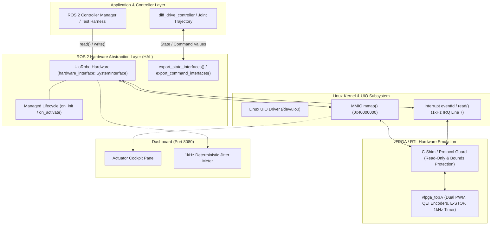

# Scenario 22: ros2_control UIO ハードウェアインターフェース - 詳細設計 & アーキテクチャ解説

本ドキュメントは、Linux UIO (`/dev/uio0`) を用いたカスタム FPGA ハードウェアと、ROS 2 の公式ハードウェア制御フレームワークである `ros2_control` (`hardware_interface::SystemInterface`) の協調動作に関する詳細仕様および実務設計ノウハウをまとめたステップアップ解説書です。

---

## 1. ros2_control & UIO 協調アーキテクチャ

本シナリオでは、ROS 2 の標準的な制御ループ規約に従い、FPGA ハードウェア（Verilator シミュレータ）の MMIO レジスタおよび 1kHz 周期割り込みと、C++ ハードウェアプラグインが密接に連携します。



---

## 2. ハードウェアインターフェース仕様 & レジスタ契約

### ライフサイクル状態遷移 (Managed Lifecycle)
`ros2_control` のハードウェアインターフェースは ROS 2 Lifecycle Node のステートマシンに準拠しています。

1. **`Unconfigured` $\to$ `Inactive` (`on_init`)**:
   - デバイスツリー (`config.dts`) を参照し、`/dev/uio0` の存在確認と mmap アドレス空間の初期マッピングを実施。
   - `export_state_interfaces()` および `export_command_interfaces()` を通じて、コントローラマネージャにバッファを公開。
2. **`Inactive` $\to$ `Active` (`on_activate`)**:
   - FPGA の制御レジスタ（`CONTROL`）に `RUN=1` を書き込み、1kHz タイマーおよび PWM 出力を有効化。
   - 初回タイムスタンプおよびエンコーダ基準値を初期化。
3. **`Active` $\to$ `Inactive` (`on_deactivate`)**:
   - FPGA の `CONTROL` レジスタを `0x0` にクリアし、モータ出力停止と割り込みタイマーの停止を実行。

### エクスポートされる Command / State インターフェース
| インターフェース名 | 種別 | 単位 | 役割 |
| :--- | :--- | :--- | :--- |
| `joint_left/velocity` | Command | ticks/s (PWM -1000〜+1000) | 左車輪モータへの指令速度（PWM Duty換算） |
| `joint_right/velocity` | Command | ticks/s (PWM -1000〜+1000) | 右車輪モータへの指令速度（PWM Duty換算） |
| `joint_left/position` | State | ticks | 左車輪エンコーダ積算パルス位置 |
| `joint_right/position` | State | ticks | 右車輪エンコーダ積算パルス位置 |
| `joint_left/velocity` | State | ticks/s | 1ms 差分から算出された左車輪角速度 |
| `joint_right/velocity` | State | ticks/s | 1ms 差分から算出された右車輪角速度 |

### DTS MMIO レジスタマップ契約 (`/dev/uio0`)
[config.dts](config.dts) で定義されている物理アドレス `0x40000000` のレジスタ配置：

| オフセット | レジスタ名 | 属性 | ビット幅 | ビットフィールド定義 & 仕様 |
| :--- | :--- | :---: | :---: | :--- |
| `0x00` | `STATUS` | RO | 32 | **Bit 0**: `RUNNING`, **Bit 1**: `IRQ_ACTIVE`, **Bit 2**: `ESTOP_STATE` |
| `0x04` | `LEFT_ENCODER` | RO | 32 | 左車輪 32-bit QEI インクリメンタルエンコーダ現在値 |
| `0x08` | `RIGHT_ENCODER`| RO | 32 | 右車輪 32-bit QEI インクリメンタルエンコーダ現在値 |
| `0x0C` | `INT_ACK` | WO | 32 | Write 1 で FPGA 側の割り込みアサートをクリア |
| `0x10` | `CONTROL` | RW | 32 | **Bit 0**: `RUN`, **Bit 1**: `ESTOP_TRIGGER`, **Bit 2**: `ENC_RESET`, **Bit 3**: `TEST_LOAD` |
| `0x14` | `LEFT_PWM` | RW | 32 | 左車輪 16-bit 符号付き PWM Duty (-1000 〜 +1000) |
| `0x18` | `RIGHT_PWM` | RW | 32 | 右車輪 16-bit 符号付き PWM Duty (-1000 〜 +1000) |
| `0x1C` | `CYCLE_CNT` | RO | 32 | 1kHz 周期ごとに自動インクリメントされるハードウェア周期カウンタ |

---

## 3. ros2_control における特徴的な設計・実装パターン

一般的な ROS 2 アプリケーションでは `rclcpp::init()` や `rclcpp::spin()`、トピックの Publisher / Subscriber が主役になりますが、本シナリオの [main.cpp](main.cpp) はロボットの関節やアクチュエータを直接駆動する「ハードウェア抽象化レイヤ（hardware_interface）」を直接テスト・駆動する構造になっています。

`ros2_control` フレームワークを採用したハードウェア制御層には、一般的なノードプログラミングとは異なる以下のような固有の設計・実装上の特徴が存在します。

### 1. ROS 2 時間管理型によるナノ秒精度周期制御 ([main.cpp:L63-L64](main.cpp#L63-L64))
```cpp
rclcpp::Time current_time(0);
rclcpp::Duration period(1000000); // 1ms = 1,000,000 ns
```
`rclcpp::Time` および `rclcpp::Duration` は ROS 2 C++ クライアントライブラリ固有のクラスです。制御周期をナノ秒精度の `period` として管理し、後述の `read()` / `write()` に渡して決定論的な周期間隔を保証します。

### 2. Managed Lifecycle ノード規約に則ったライフサイクル管理 ([main.cpp:L48-L58](main.cpp#L48-L58))
```cpp
hardware_interface::HardwareInfo info;
if (hw.on_init(info) != hardware_interface::CallbackReturn::SUCCESS) ...
if (hw.on_activate({}) != hardware_interface::CallbackReturn::SUCCESS) ...
```
`on_init`, `on_activate` や戻り値の `hardware_interface::CallbackReturn::SUCCESS` は、ROS 2 の「Managed Lifecycle Node」規約に則った `ros2_control` の公式インターフェース規約です。ハードウェアリソースの確保、初期化、有効化・無効化を段階的かつ安全に遷移させます。

### 3. コントローラマネージャへの Command / State インターフェース公開 ([main.cpp:L60-L61](main.cpp#L60-L61))
```cpp
auto state_interfaces = hw.export_state_interfaces();
auto cmd_interfaces = hw.export_command_interfaces();
```
アクチュエータへの指令値バッファやエンコーダの現在値バッファを、コントローラマネージャへ公開するための `ros2_control` 特有のメソッドです。ハードウェアプラグインはポインタを安全にラップしたハンドル経由で制御器とデータを授受します。

### 4. リアルタイム同期ループを構成する read() / write() シグネチャ ([main.cpp:L73-L74](main.cpp#L73-L74))
```cpp
hw.read(current_time, period);
hw.write(current_time, period);
```
引数に `(time, period)` を受け取り、ハードウェアからのセンサ値読み込みとモータ指令値書き込みを行うシグネチャは、`hardware_interface::SystemInterface` における標準設計パターンです。コントローラマネージャのリアルタイム更新周期と厳密に同期して呼び出されます。

---

## 4. 仕様（API）と現場ノウハウの境界線

コード内で「ドキュメント通りの仕様（API）」と「現場のエンジニアリングノウハウ」を分けると以下のようになります。

### ドキュメントに書かれている標準仕様 (API)
- `on_init()` $\to$ `on_activate()` を呼び出してから `read()` / `write()` を回すライフサイクル手順。
- `cmd_interfaces[i].set_value(...)` で指令値を渡し、`state_interfaces[i].get_value()` で計測値を読み出す手順。

### 実機トラブルを経験したエンジニアの工夫（現場ノウハウ）
1. **Criterion 5: 32-bit Wrap-around 検証とアンダーフロー正規化 ([main.cpp:L174-L201](main.cpp#L174-L201))**:
   - 符号付き32bitエンコーダが最大値 `0x7FFFFFFF` (+21億) から負の最小値 `0x80000000` (-21億) に跳ね返る際、素朴な減算を行うと「巨大な負の角速度（毎秒マイナス21億パルス）」として誤認識し、制御器が異常な最大逆トルクを発してモータや減速機を物理的に破壊します。
   - `(raw_left - prev_raw_left_)` を符号なし32bitで減算した後に `static_cast<int32_t>` でキャストすることで、2の補数のオーバーフロー特性を利用して差分（$\Delta = +1$ など）を正しく正規化しています。
2. **Criterion 2: 指令変更後のセトリング（安定待ち）ステップ ([main.cpp:L106-L108](main.cpp#L106-L108))**:
   - 指令値を0にした直後、1ステップだけ `read()` / `write()` を空回ししてパイプライン遅延を逃がしてから停止判定を行っています。FPGA のクロック同期やバス転送に存在する「1サイクル遅延」を考慮した設計です。
3. **Criterion 3: ハードウェア E-STOP による物理遮断 ([uio_robot_hardware.cpp:L136-L139](uio_robot_hardware.cpp#L136-L139))**:
   - ソフトウェア的に PWM 指令を 0 にするだけでなく、FPGA 側の `CONTROL` レジスタのビットを操作してハードウェア側でゲートドライバ出力を 0V に強制クランプします。

---

## 5. 実機開発経験がなければ見逃しやすいROS 2特有の実装パターンとテクニック

「なぜわざわざこんな冗長な・変な書き方をしているのか？」と疑問に思うような、リアルタイムロボット開発特有のノウハウを解説します。

---

### 1. read() / write() 内での動的メモリ確保（new/malloc や STL動的拡張）の完全排除

`read()` / `write()` の内部では、`std::vector::push_back` や `std::string` の文字列結合、`std::make_shared` などの動的メモリ確保は一切行われず、メンバ変数にあらかじめ確保された固定バッファのみが使用されます。

* **初見の疑問:** モダン C++ なのになぜ `std::vector` を動的に伸縮させず、固定長のメンバ変数や生配列ばかり使うのか？
* **リアルタイム制御の背景:** 1kHz（1ms）ループの制御スレッド（Linux PREEMPT_RT カーネル上）内で動的メモリ確保（ヒープ確保）を行うと、ヒープのフラグメンテーションや OS のアロケータ起因でミリ秒単位の予測不能なブロック（ジッター）が発生します。リアルタイム決定性を担保するため、初期化時（`on_init` や `on_configure`）にすべてのメモリを事前確保し、**制御ループ内での「Zero Dynamic Allocation」を徹底**します。

---

### 2. コントローラ間・トピック通信での「ロックフリー（Lock-free）FIFO」

ROS 2 トピックや非リアルタイムスレッドとデータをやり取りする際、`std::mutex` を使わず、アトミック変数や `realtime_tools::RealtimeBuffer` が選定されます。

* **初見の疑問:** スレッド間のデータ受け渡しなのに、なぜ通常の `std::mutex` を使わないのか？
* **リアルタイム制御の背景:** 一般的なミューテックスを使うと、低優先度の非リアルタイムスレッド（ROS 2 トピックのデシリアライズや通信スレッド）が高優先度の 1kHz 制御スレッドを待たせてしまう**「優先度逆転（Priority Inversion）」**が発生し、制御ループのデッドラインミスを引き起こします。`ros2_control` では共有バッファの読み書きにロックをかけない専用のリアルタイムバッファ（二重バッファ＋アトミックポインタ交換）を使うのが鉄則です。

---

### 3. read() と write() を密結合させず、内部メンバ変数経由で疎結合にする

`UioRobotHardware::read()` で取得したエンコーダ現在値は、直接 `write()` の引数や戻り値に渡されることはなく、独立したクラス内メンバ変数に保存されます。

* **初見の疑問:** `read()` で取得したセンサ値を、なぜ直接 `write()` に渡さず、わざわざクラスの内部バッファに逃がすのか？
* **リアルタイム制御の背景:** `ros2_control` のアーキテクチャでは、ハードウェアの `read()` と `write()` の間に**「複数の独立したコントローラ（PID制御、軌道補間、オドメトリ計算、セーフティ監視など）」**が挟まります。
  $$\text{hw.read()} \longrightarrow \text{controllers.update()} \longrightarrow \text{hw.write()}$$
  という厳密な実行パイプラインがコントローラマネージャによって調停されるため、ハードウェアドライバ側で計算を完結させず、状態（State）と指令（Command）を完全に分離してバッファリングします。

---

### 4. タイムスタンプと周期（period）の差分検証（Jitter監視）

引数として `period`（例: 1ms = 1,000,000 ns）が渡されているにもかかわらず、内部で `clock_gettime(CLOCK_MONOTONIC, &now)` を呼び出して実績時間を計測しています ([uio_robot_hardware.cpp:L86-L96](uio_robot_hardware.cpp#L86-L96))。

```cpp
struct timespec now;
clock_gettime(CLOCK_MONOTONIC, &now);
if (!first_read_) {
    double elapsed_us = (now.tv_sec - last_ts_.tv_sec) * 1e6 + (now.tv_nsec - last_ts_.tv_nsec) * 1e-3;
    double jitter_us = std::abs(elapsed_us - 1000.0);
    ...
}
```

* **初見の疑問:** 引数で `period`（1ms）が渡されているのに、なぜ内部でわざわざ実績時間を測るのか？
* **リアルタイム制御の背景:** 引数の `period` はあくまで「目標周期」に過ぎず、OS の負荷や割り込み応答遅延によって実時間は 0.98ms にも 1.15ms にも揺らぎます。速度や加速度の微分計算（$\text{Velocity} = \Delta x / \Delta t$）において、分母を固定の 1ms と仮定して計算すると、実速度と乖離して制御器の微分ゲイン（Dゲイン）が過剰反応して高周波発振を起こします。高精度なサーボ制御では、実績経過時間をナノ秒単位で計測して速度推定を補正するテクニックが用いられます。

---

### 5. UIO 割り込みを活用したブロッキング read() による「CPU負荷 0% 同期」

`read()` の冒頭では、UIO デバイスのファイルディスクリプタに対してブロッキング `read()` を行っています ([uio_robot_hardware.cpp:L78-L83](uio_robot_hardware.cpp#L78-L83))。

```cpp
// 1. Block on read() until 1kHz IRQ arrives from FPGA
uint32_t irq_count = 0;
ssize_t n = ::read(uio_dev_->get_fd(), &irq_count, sizeof(irq_count));
```

* **初見の疑問:** なぜレジスタのフラグを `while` ループでポーリング監視せず、OS のファイルディスクリプタでスレッドを停止させるのか？
* **リアルタイム制御の背景:** レジスタをビジーウェイト（ポーリング）で監視すると、CPU コアが 100% 張り付き、発熱や他の ROS 2 ノード（Navigation や MoveIt など）の処理時間を奪ってしまいます。Linux UIO の割り込み待ち機構を利用することで、FPGA の 1kHz タイマー割り込みが発生するまでスレッドをカーネル内でスリープさせ、**「CPU 負荷ほぼ 0% での完全なハードウェア同期」**を実現します。
