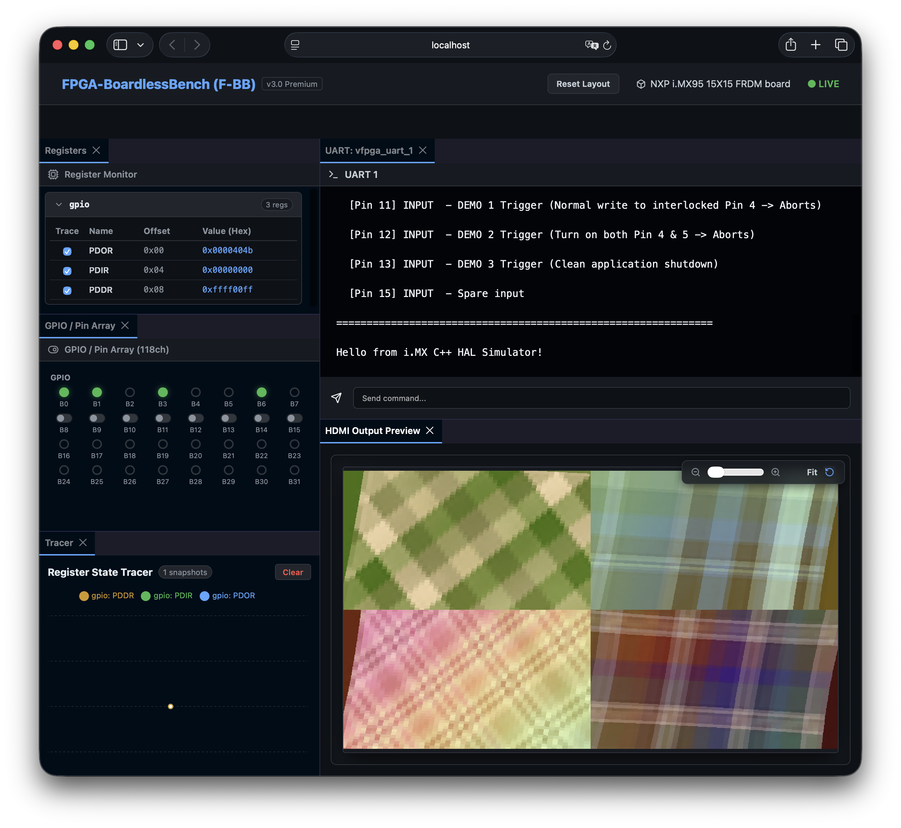
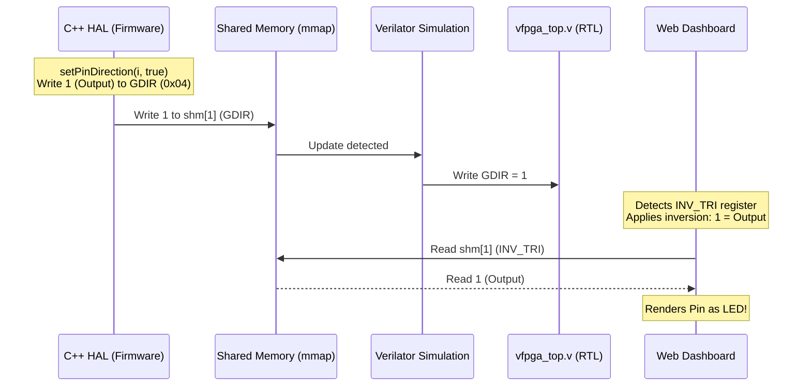

# P01_frdmIMX: i.MX95 / i.MX 8M Plus HAL シナリオ

このディレクトリは、i.MX95 FRDM評価ボードおよびi.MX 8M Plus評価ボードを模擬し、C++ HAL（ハードウェア抽象化レイヤー）を用いたデバイス制御アプリケーションの開発・テストを行うシナリオです。



---

## 実行方法 (Execution)

### 1. 事前準備 (Prerequisites)
本シナリオはシミュレーション環境における OpenGL ES / EGL を用いた画像処理（歪み補正・合成）の検証を行うため、ビルド時に Mesa の EGL/GLES 開発用ヘッダーファイルが必要になります。

開発コンテナ環境内でビルドする前に、以下のコマンドを実行して必要なライブラリをインストールしてください（`run.sh` 起動時に自動チェック・インストールも行われます）。

```bash
apt update && apt install -y libegl1-mesa-dev libgles2-mesa-dev
```

> [!NOTE]
> **EGL/OpenGL ES のソフトウェアフォールバックについて**
> 物理的な GPU ハードウェアやディスプレイ表示（X11/Wayland等）を持たないコンテナやシミュレータのホスト環境では、GPU を用いた EGL 初期化が失敗します。
> これを回避するため、ホスト上では環境変数 `FORCE_MESA_FALLBACK=1` を設定し、Mesa のサーフェスレス・ソフトウェアレンダラー（`llvmpipe`）に強制的にフォールバックさせる必要があります。
>
> 付属の `run.sh` スクリプトを使用する場合は、この環境変数が自動的に設定（`export FORCE_MESA_FALLBACK=1`）されるようになっています。手動でバイナリ（`test_bin`）を直接起動する場合は、事前に環境変数を設定してください。


### 2. 実行手順 (Run Steps)
実行スクリプトにSoC名を指定して実行します。適切なDTSのロードとファームウェアのビルド・実行が自動で行われます。

* **i.MX95 環境でテストする場合:**
  ```bash
  ./run.sh imx95
  ```

* **i.MX 8M Plus 環境でテストする場合:**
  ```bash
  ./run.sh imx8mp
  ```

シミュレーション実行後、GTKWave等の波形確認ツールを用いて `vfpga.vcd` で動作を確認できます。

---

## SoCおよび評価ボードの自動検知エミュレーション (Auto-detection Emulation)

本シナリオでは、実機でのデバイスツリー（Device Tree）を用いた自動検知の仕組みを模擬するため、以下のエミュレーション機構を実装しています。

1. **SoCタイプの自動検知 (`compatible` エミュレーション)**:
   - C++ HAL（`detectSocType()`）は、Linux標準の `/sys/firmware/devicetree/base/compatible` を読み出して、現在起動しているSoC（`imx95` または `imx8mp`）を自律判定します。
   - F-BBは、DTSの最上位ノードから `compatible` プロパティを抽出し、ヌル文字（`\0`）区切りのバイナリファイル `/tmp/fbb_compatible` を自動生成します。Shimライブラリがこのファイルへのアクセスを透過的にリダイレクトします。

2. **評価ボード名のエミュレーションとダッシュボード表示 (`model` エミュレーション)**:
   - Linux標準の `/sys/firmware/devicetree/base/model` から評価ボードモデル名（例: `"NXP i.MX95 15X15 FRDM board"`) を読み出すエミュレーションを行います。
   - ジェネレータは、DTSの最上位ノードから `model` プロパティを抽出し、`/tmp/fbb_model` に書き込みます。また、`board_manifest.json` の `"model"` フィールドを介して React ダッシュボードに引き渡し、最上部ヘッダー（`[Reset Layout]` ボタンの右隣）に詳細な評価ボードモデル名を綺麗に表示します。

---

## 開発の背景と極性変換設計（Why We Do This）

本シナリオでは、**「実機での焼損防止」**と**「シミュレータ環境（ダッシュボード）での正しい表示・操作」**を**100%透過的（ソースコード変更なし）**に両立させるための特殊なレジスタマッピング設計を採用しています。

### 1. SoC間のGPIO方向制御レジスタの極性不一致
i.MX95（NXP）とZynq（Xilinx / F-BBデフォルト）では、GPIOピンの「入力/出力」を制御する方向レジスタのビット極性が完全に逆になっています。

| SoC・環境 | レジスタ名 | 極性仕様 |
| :--- | :--- | :--- |
| **i.MX95 / i.MX8MP (NXP)** | `GDIR` | **`1` = 出力 (Driven)**<br>**`0` = 入力 (Hi-Z)** |
| **Zynq / F-BB Dashboard** | `TRI` | **`1` = 入力 (Hi-Z/Tristate)**<br>**`0` = 出力 (Driven)** |

### 2. 実機焼損のリスクとバイナリ透過性のトレードオフ
> [!CAUTION]
> **実機焼損の危険性**
> もし、ダッシュボードの表示に合わせるためにC++ HALやアプリケーションファームウェアの極性を反転（`1`を「入力」、`0`を「出力」）してビルドした場合、そのバイナリを実機に書き込むと本来「入力（Hi-Z）」であるべきピンが「出力」として駆動され、接続された外部回路と衝突して物理的なボードが短絡・焼損する危険があります。

F-BBの設計哲学である**「シミュレーションと実機で完全に同一のバイナリを動かす（透過性）」**を維持するため、ソフトウェア側には一切の変更（`#ifdef SIMULATION`等のマクロ分岐含む）を加えずに解決する必要があります。

### 3. ダッシュボードでの極性反転対応（INV_TRI）による解決
F-BBの設計哲学である**「シミュレーションと実機で完全に同一のバイナリを動かす（透過性）」**を維持するため、ソフトウェア側には一切の変更（`#ifdef SIMULATION`等のマクロ分岐含む）を加えずに解決する必要があります。

本環境では、実機レジスタ構成のみで極性の違いを吸収するため、DTSでの論理マッピング機能とダッシュボードの汎用反転ロジックを組み合わせて解決します。

* **DTSでの論理マッピングの定義:**  
  [imx95_config.dts](imx95_config.dts) では `PDDR(INV_TRI) @ 0x08`、[imx8mp_config.dts](imx8mp_config.dts) では `GDIR(INV_TRI) @ 0x04` のように、方向レジスタの論理名を **`INV_TRI`**（Inverted TRI / 反転方向レジスタ）としてマッピングします。
* **ダッシュボード側の自動極性反転:**  
  Webダッシュボード（`GpioPanel.jsx`）は、方向レジスタの論理名が `INV`（Inverted）を含む場合、SoC依存コードを一切持たずに汎用的な「アクティブロー入力方向レジスタ」として扱い、極性を反転（`0` = 出力/LED、`1` = 入力/スイッチ）して判定します。
* **RTLとHALの整合性:**  
  [vfpga_top.v](vfpga_top.v) などのRTL層では、シミュレーション専用の仮想アドレスや極性反転の追加処理は不要になり、単に実機の方向レジスタ（`GDIR`/`PDDR`）に設定された元の状態をそのまま返します。これにより、C++ HAL側のレジスタ読み戻し検証（Read-Modify-Write）の整合性も完全に維持されます。



これによって、ダッシュボード（F-BBコア）に `i.MX` などの特定のSoC名をハードコードすることなく、汎用的な「反転方向レジスタ」の概念を用いて極性差をクリーンに解決しています。

### 4. シミュレーション時の入力競合（レースコンディション）対策
シミュレータ上でダッシュボードからトグルスイッチ（入力ピン）を切り替えて値を注入する際、シミュレーション内に接続先のない `l_pins_i` (常に0) が接続されていると、ダッシュボードが共有メモリに書き込んだ入力値が即座に `0` に上書きされてしまう問題があります。

これを防ぐため、[vfpga_top.v](file:///workspaces/FPGA-BoardlessBench-main/tests/scenarios/P01_frdmIMX/vfpga_top.v) 内の `DATA` レジスタ (オフセット `0x00`) の読み出しロジックは、シミュレーション時にダッシュボードからの注入値とファームウェアからの書き込み値を競合させず透過的に保持するよう、データレジスタ `DR` から直接読み出す簡略化設計としています。
