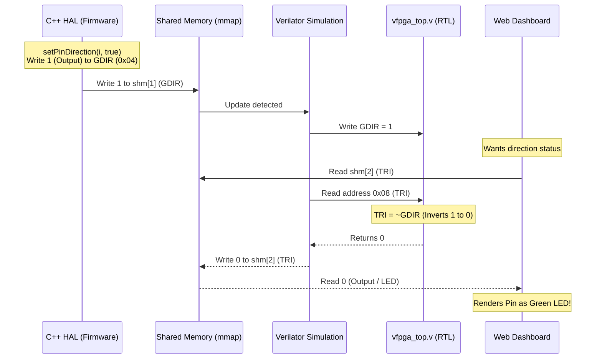

# P01_frdmIMX: i.MX95 / i.MX 8M Plus HAL シナリオ

このディレクトリは、i.MX95 FRDM評価ボードおよびi.MX 8M Plus評価ボードを模擬し、C++ HAL（ハードウェア抽象化レイヤー）を用いたデバイス制御アプリケーションの開発・テストを行うシナリオです。

詳細なシステム要件やクラス設計、マルチメディアパイプラインの設計については、設計図ドキュメントである [FRDM-IMX95-Firmware-Blueprint.md](file:///workspaces/FPGA-BoardlessBench-main/tests/scenarios/P01_frdmIMX/FRDM-IMX95-Firmware-Blueprint.md) を参照してください。

---

## 実行方法 (Execution)

実行スクリプトにSoC名を指定して実行します。適切なDTSのロードとファームウェアのビルド・実行が自動で行われます。

* **i.MX95 環境でテストする場合:**
  ```bash
  ./run.sh imx95
  ```

* **i.MX 8M Plus 環境でテストする場合:**
  ```bash
  ./run.sh imx8mp
  ```

シミュレーション実行後、GTKWave等の波形確認ツールを用いて `vfpga.vcd` で動作を確認できます。

---

## 開発の背景と極性変換設計（Why We Do This）

本シナリオでは、**「実機での焼損防止」**と**「シミュレータ環境（ダッシュボード）での正しい表示・操作」**を**100%透過的（ソースコード変更なし）**に両立させるための特殊なレジスタマッピング設計を採用しています。

### 1. SoC間のGPIO方向制御レジスタの極性不一致
i.MX95（NXP）とZynq（Xilinx / F-BBデフォルト）では、GPIOピンの「入力/出力」を制御する方向レジスタのビット極性が完全に逆になっています。

| SoC・環境 | レジスタ名 | 極性仕様 |
| :--- | :--- | :--- |
| **i.MX95 / i.MX8MP (NXP)** | `GDIR` | **`1` = 出力 (Driven)**<br>**`0` = 入力 (Hi-Z)** |
| **Zynq / F-BB Dashboard** | `TRI` | **`1` = 入力 (Hi-Z/Tristate)**<br>**`0` = 出力 (Driven)** |

### 2. 実機焼損のリスクとバイナリ透過性のトレードオフ
> [!CAUTION]
> **実機焼損の危険性**
> もし、ダッシュボードの表示に合わせるためにC++ HALやアプリケーションファームウェアの極性を反転（`1`を「入力」、`0`を「出力」）してビルドした場合、そのバイナリを実機に書き込むと本来「入力（Hi-Z）」であるべきピンが「出力」として駆動され、接続された外部回路と衝突して物理的なボードが短絡・焼損する危険があります。

F-BBの設計哲学である**「シミュレーションと実機で完全に同一のバイナリを動かす（透過性）」**を維持するため、ソフトウェア側には一切の変更（`#ifdef SIMULATION`等のマクロ分岐含む）を加えずに解決する必要があります。

### 3. RTL層での極性変換設計による解決
この不一致を解決するため、ハードウェアのシミュレーション層（DTS定義およびRTLコード）で極性を動的に変換します。

* **仮想レジスタの定義:**  
  [imx95_config.dts](imx95_config.dts) および [imx8mp_config.dts](imx8mp_config.dts) で、ダッシュボード監視用の仮想方向レジスタとして `TRI`（オフセット `0x08`）を定義します。
* **RTLでの反転処理:**  
  [vfpga_top.v](vfpga_top.v) の中で、`TRI` (アドレス `0x08`) の読み出しに対して **`~GDIR`（GDIRのビット反転値）** を返すように記述しています。



これによって、C++ファームウェアは実機と全く同じNXP仕様（`1` = 出力、`0` = 入力）で動作しながら、Webダッシュボード側では正しくLED（出力）およびトグルスイッチ（入力）が自動判定されてレンダリングされます。

### 4. シミュレーション時の入力競合（レースコンディション）対策
シミュレータ上でダッシュボードからトグルスイッチ（入力ピン）を切り替えて値を注入する際、シミュレーション内に接続先のない `l_pins_i` (常に0) が接続されていると、ダッシュボードが共有メモリに書き込んだ入力値が即座に `0` に上書きされてしまう問題があります。

これを防ぐため、[vfpga_top.v](file:///workspaces/FPGA-BoardlessBench-main/tests/scenarios/P01_frdmIMX/vfpga_top.v) 内の `DATA` レジスタ (オフセット `0x00`) の読み出しロジックは、シミュレーション時にダッシュボードからの注入値とファームウェアからの書き込み値を競合させず透過的に保持するよう、データレジスタ `DR` から直接読み出す簡略化設計としています。
