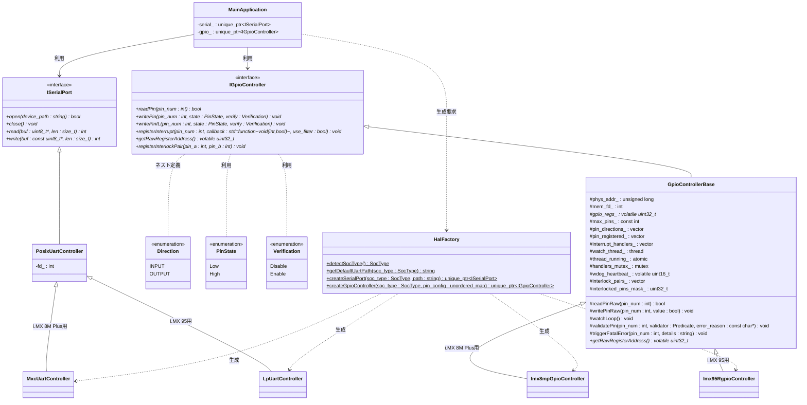

# HAL Architecture Manifest: i.MX HAL シナリオ

本ドキュメントは、i.MX 95 (FRDM-IMX95) および i.MX 8M Plus の評価ボードにおいて、ハードウェア依存性を隠蔽し、実機とシミュレータ環境で同一のファームウェアバイナリを透過的に動作させるために設計された **ハードウェア抽象化レイヤー (HAL)** のアーキテクチャ設計図です。

---

## 1. 背景と目的 (Why HAL?)

先行開発プラットフォームである i.MX 8M Plus と、本採用プラットフォームである i.MX 95 では、制御対象となる周辺I/Oハードウェア仕様やLinux上のパスが以下のように異なります。

* **UARTの違い:**
  * i.MX 8M Plus: 標準の標準UART IP を採用 (`/dev/ttymxc0` 〜 `3`)
  * i.MX 95: 低消費電力の LPUART IP を採用 (`/dev/ttyLP0` 〜 `7`)
* **GPIOの違い:**
  * i.MX 8M Plus: `GPIO1` 〜 `GPIO5`
  * i.MX 95: `GPIO1` 〜 `GPIO5` に加え、リアルタイム高速制御用の `Rapid GPIO (RGPIO1)` が搭載。
  * **方向制御の極性不一致:** NXPのGPIO仕様（`1` = 出力, `0` = 入力）と、F-BBシミュレータ等の標準UIO仕様（`0` = 出力, `1` = 入力）で極性が不一致。

**HALの目的:**
アプリケーション（[main.cpp](file:///workspaces/FPGA-BoardlessBench-main/tests/scenarios/P01_frdmIMX/main.cpp)）側からこれらのアドレスマップ、レジスタ配置、極性の違い、および Linuxのデバイスファイル名の差異を完全に隠蔽します。これにより、ビジネスロジックを変更することなく、実機とF-BBシミュレータの双方で完全に同一のソースコードで動作させる「透過性」を担保します。

---

## 2. 設計テクニックと採用技術

### 2.1. インターフェースによる抽象化 (Interface-based Design)
C++の純粋仮想クラス（[imx_hal.hpp](imx_hal.hpp)）を用いて、`ISerialPort` および `IGpioController` を定義しています。これにより、アプリケーションは具象クラスの実装やレジスタ制御の詳細を知る必要がなくなり、「依存性逆転の原則」を満たします。

### 2.2. ファクトリパターン (Factory Pattern)
システム起動時に `HalFactory` クラスが自動的に動作環境のSoCタイプを検出し、最適な具象クラス（`MxcUartController` や `Imx95RgpioController` など）のインスタンスを生成してスマートポインタとして返却します。
これにより、アプリケーション層にはSoCの違いを意識した条件分岐（`#ifdef` など）が一切現れません。

### 2.3. C++17 標準ライブラリによるポータビリティ
ユーザー空間での非同期GPIO変化監視（擬似割り込み）を実装するために、C++標準のスレッドライブラリ（`std::thread`, `std::mutex`, `std::atomic`）を採用しています。特定のOSカーネル固有の非同期APIに依存しないため、C++17対応 of コンパイラがあればどの組み込みLinuxディストリビューションでもビルドが可能です。

### 2.4. 方向設定のカプセル化 (Approach A: Configuration Mapping)
GPIOの入力/出力の方向（`IGpioController::Direction`）を実行時のAPIから隠蔽し、HALの生成初期化時に一括で設定マップ（`unordered_map`）を渡して適用するアプローチを採用しています。
特に F-BBでサポートされる Zynq 118ピン対応のような「多ピン環境」において、この設計は極めて重要な価値を持ちます。

* **ピンアサイン仕様の局所化（可読性）:**  
  118本もの多ピン構成では、コードの様々な場所で個別に `setPinDirection` を呼び出すとバグの温床になります。初期化時に一箇所のテーブルとしてピンの仕様を定義することで、仕様書とコードを1対1で対応させて保守性を向上させます。
* **信号衝突と境界外アクセスの防止（安全性・Fail-Fast）:**  
  実行中のアプリケーションコードから方向設定APIを排除し、不用意なモード変更による衝突を防ぎます。
  さらに、HAL初期化時（`init`）およびすべての実行時I/O API（`readPin` / `writePin` / `registerInterrupt`）の入り口で、SoCハードウェア仕様の上限（i.MX95なら16ピン）を超えるピン番号が指定されていないか、テンプレートメソッドによる境界・状態検証（`validatePin`）を行います。
  もし境界外アクセスや未登録ピンへの操作が検知された場合は、戻り値のチェック漏れによる暴走を防ぐため、呼び出し元に制御を一切戻さず、**その場で方向レジスタ（`GDIR`）をクリアして全ピンを入力（Hi-Z）の安全状態に強制リセットしたうえで、`abort()` を呼び出してプロセスを即座に強制終了（Fail-Fast）**させます。
* **レジスタアクセスの局所化（最適化）:**  
  起動時に一括で方向レジスタ（`GDIR`）を設定し、実行時は方向の再設定を行わないため、スレッド間の排他制御（Read-Modify-Writeのロック等）が不要になり、実行効率が最大化されます。

---

## 3. クラス設計 (Class Diagram)



---

## 3.1. GPIO HAL API メソッドリファレンス

#### 1. `readPin(int pin_num) -> bool`
- **役割**: 指定されたピンの現在の電圧状態をレジスタから読み込みます。
- **検証**: ピン番号が有効範囲内かつ、初期化マップに登録されているかを検証します（検証失敗時は安全アボート）。
- **戻り値**: ピンが HIGH の場合は `true`、LOW の場合は `false`。

#### 2. `writePin(int pin_num, PinState state, Verification verify = Verification::Disable) -> void`
- **役割**: 指定された出力ピンに HIGH/LOW 状態を書き込みます。
- **検証**: 
  - ピン番号の範囲および登録状態の検証（OUTPUTピンであることを強制）。
  - ビットマスク（`interlocked_pins_mask_`）を用いた、相互排他ペア登録ピンへの誤操作防止チェック（通常アクセスがあった場合は即時アボート）。
- **引数**:
  - `state`: `PinState::High` または `PinState::Low`。
  - `verify`: `Verification::Enable` にすると、書き込み直後に物理レジスタの値を自動的に読み戻して照合します（不一致時はアボート）。

#### 3. `writePinIL(int pin_num, PinState state, Verification verify = Verification::Disable) -> void`
- **役割**: 相互排他（インターロック）登録されたピンに対して安全に状態を書き込みます。
- **機能**: 書き込み前に排他ペアの相手側ピンの状態を読み込み、同時にON（High）になろうとした場合は、安全のため**両ピンを強制的にOFFに設定した上で、即座にアボート（Fail-Fast）**します。
- **引数**: `writePin` と同様。

#### 4. `registerInterrupt(int pin_num, std::function<void(int, bool)> callback, bool use_filter = false) -> void`
- **役割**: 入力ピンの状態変化（立ち上がり/立ち下がりエッジ）を検知した際に呼び出されるコールバックを登録します。
- **検証**: 対象ピンが `INPUT` として正しく登録されているかを検証します。
- **引数**:
  - `callback`: 状態遷移確定時に実行される関数オブジェクト（`void(int pin, bool state)`）。
  - `use_filter`: デジタルノイズフィルタ（Glitch Filter）を適用するかどうか。

#### 5. `getRawRegisterAddress() -> volatile uint32_t*`
- **役割**: mmapされたGPIOのハードウェア物理レジスタベースに対応する仮想メモリアドレスポインタを開示します。
- **用途**: ナノ秒〜マイクロ秒のトグルが必要な極限のパフォーマンス要件（ビットバンギング等）において、C++仮想関数テーブル引きや安全ガード処理を完全にバイパスして、直接メモリロード/ストアを行うために使用します。
- **コード例**:
  ```cpp
  volatile uint32_t* regs = gpio->getRawRegisterAddress();
  if (regs) {
      // Pin 0 に対応するDRレジスタ（インデックス 0）のビット0を直接 HIGH にする（オーバーヘッドゼロ）
      regs[0] |= (1 << 0); 
  }
  ```

#### 6. `registerInterlockPair(int pin_a, int pin_b) -> void`
- **役割**: ハードウェア破壊（Hブリッジ回路のショート等）を招く恐れのある2本の出力ピンを、相互に排他制御が必要なペアとして登録します。
- **効果**: 登録されたピンは `interlocked_pins_mask_` に記録され、通常の `writePin` による操作が即座にアボートされ、必ず `writePinIL` での検証付き操作が強制されるようになります。

---

---

## 4. スレッドによるピン監視とデバウンス（チャタリング防止）の仕組み

### 4.1. ユーザー空間でのイベント監視アーキテクチャ
物理的な割り込みハンドリング（IRQ）はカーネル空間の専権事項であるため、ユーザー空間で動作するアプリケーションが `/dev/mem` (MMIO) から直接ピンの状態変化を非同期に検知するには、**バックグラウンドで状態をポーリング監視するスレッド**が必要になります。

本HALでは、`registerInterrupt` が呼ばれると、`watchLoop` スレッドが自動的に立ち上がり、5ms周期で対象ピンの `DATA` レジスタを監視します。
この際、登録されたすべてのピンを**単一のスレッドでマルチプレクス（一括ポーリング）して処理する設計**を採用しています。これにより、Zynq 118ピンのような多ピン環境で多数の割り込みを登録した場合であっても、ピンごとにスレッドを立ち上げるようなリソースの無駄を防ぎ、スレッドコンテキストスイッチに伴うCPUオーバーヘッドを極限まで抑えて動作のリアルタイム性を向上させます。


### 4.2. デジタルノイズフィルタ (Glitch Filter)
Webダッシュボードからのスイッチ入力や物理スイッチのオン/オフ時に発生する「チャタリング（数ミリ秒間の不要なオンオフの繰り返し）」を排除するため、カウントベースのデジタルノイズフィルタを実装しています。

`registerInterrupt` の第3引数 `use_filter` が `true` の場合、以下のロジックで動作します。

1. スレッドが 5ms 周期で対象ピンの現在値（`current_raw_state`）をサンプリングします。
2. 生のピン状態に変化があった場合、カウントをクリアして変化後状態の監視を開始します。
3. 5ms 周期のポーリングで **4回連続して同じ状態** が検知された場合（5ms × 4 = 20ms）、その値を「ノイズではなく、真に確定した新しい入力状態」と見なします。
4. 確定した新しい状態への遷移（エッジ変化）をトリガーとして、ユーザーが登録したコールバック関数を実行します。

※ `use_filter` が `false` の場合は、5ms周期のポーリングで変化を検知した瞬間に、即時（デバウンスなし）でコールバックを叩きます。

```
【フィルタ状態推移イメージ】
Raw State   : ──┐  ┌──┐  ┌───────────────
Stable State: ──┴────────────────┴───────
Time        :   |<- 変化検知      |<- 5ms×4回(20ms)安定、変化確定 (コールバック実行)
```

このスレッド監視モデルは、将来F-BBや実機が `poll()` や `select()` によるカーネルイベント（`/sys/class/gpio/gpioX/value` の `edge` イベント等）に対応した際にも、`watchLoop` 内部の実装のみを変更するだけで、コールバックの公開API仕様は一切変えずに吸収できる拡張性を持っています。

---

## 5. HALの利用コードサンプル

ファームウェア側でGPIOの入力変化を検知し、即座にUART経由でコンソールへ通知する実装例です。

```cpp
#include "hal/imx_hal.hpp"
#include <stdio.h>
#include <unistd.h>
#include <string.h>
#include <unordered_map>

class App {
private:
    std::unique_ptr<ISerialPort> serial_;
    std::unique_ptr<IGpioController> gpio_;

public:
    void setup() {
        // SoC種類の自動検出とデフォルトUARTパスの取得
        SocType soc = HalFactory::detectSocType();
        std::string uart_path = HalFactory::getDefaultUartPath(soc);

        // ピンアサイン仕様をマップに定義
        std::unordered_map<int, IGpioController::Direction> pin_config = {
            {5, IGpioController::Direction::INPUT},
            {6, IGpioController::Direction::OUTPUT}
        };

        // 各種コントローラの生成 (初期化パラメータを渡す)
        gpio_ = HalFactory::createGpioController(soc, pin_config);
        serial_ = HalFactory::createSerialPort(soc, uart_path);

        if (!gpio_ || !serial_) {
            fprintf(stderr, "HALの初期化に失敗しました。\n");
            return;
        }

        // Pin 5 に割り込みハンドラ（コールバック）を登録
        gpio_->registerInterrupt(5, [](int pin, bool state) {
            char msg[64];
            snprintf(msg, sizeof(msg), "\r\n[Event] Pin %d changed to %s\r\n", pin, state ? "HIGH" : "LOW");
            printf("[App] GPIO Interrupt triggered on Pin %d! State: %d\n", pin, state);
            // ※シリアル送信を行う場合、通常はグローバルに保存したシリアルポートなどを使用します。
        });
    }

    void loop() {
        while (true) {
            usleep(100000); 
        }
    }
};

int main() {
    App app;
    app.setup();
    app.loop();
    return 0;
}
```

---

## 6. 応用設計：コールバックの共通化とカプセル化（std::bind の活用）

割り込み登録 `registerInterrupt` のシグネチャを `std::function<void(int pin_num, bool value)>` に拡張したことにより、カプセル化（密結合の回避）を維持したまま、複数のGPIOピンで処理を共通化する設計が非常に綺麗に行えます。

### 6.1. std::bind によるメンバ関数の直接登録 (推奨)
グローバル変数やフリー関数といった「密結合を助長する設計」を排除するため、`std::bind` を使用して、オブジェクトインスタンス（`this`）に紐づく非staticメンバ関数を直接コールバックとして登録します。これにより、オブジェクト指向のカプセル化を破壊せずに共通処理を構築できます。

```cpp
#include <functional> // std::bind と std::placeholders のため
#include <unordered_map>

class MainApplication {
private:
    std::unique_ptr<IGpioController> gpio_;

    // 共通の割り込み処理メソッド (プライベートメンバ関数)
    void handleGpioEvent(int pin_num, bool state) {
        printf("[App Common Handler] GPIO Pin %d changed to %s\n", pin_num, state ? "HIGH" : "LOW");
    }

public:
    void setup() {
        // ピンの初期仕様をマップで定義
        std::unordered_map<int, IGpioController::Direction> pin_config = {
            {8, IGpioController::Direction::INPUT},
            {10, IGpioController::Direction::INPUT}
        };
        gpio_ = HalFactory::createGpioController(SocType::IMX95, pin_config);

        // std::bind を使用してメンバ関数を直接バインド
        gpio_->registerInterrupt(8, std::bind(&MainApplication::handleGpioEvent, this, std::placeholders::_1, std::placeholders::_2));
        gpio_->registerInterrupt(10, std::bind(&MainApplication::handleGpioEvent, this, std::placeholders::_1, std::placeholders::_2));
    }
};
```

### 6.2. 引数付きラムダ式による個別処理
特定のピンに対してその場で独自のクロージャ処理を記述したい場合は、オブジェクトの `this` をキャプチャした引数付きのラムダ式が使用できます。

```cpp
void setup() {
    // 引数を受け取るラムダ式をその場で登録
    gpio_->registerInterrupt(9, [this](int pin, bool state) {
        char msg[128];
        snprintf(msg, sizeof(msg), "Pin %d is directly processed to %d", pin, state);
        serial_->write(reinterpret_cast<const uint8_t*>(msg), strlen(msg));
    });
}
```

### 6.3. ライフタイム（寿命）とメモリ安全性に関する注意点
> [!WARNING]
> **非同期コールバックでの「参照キャプチャ（`[&]`）」の禁止**
>
> 登録されたコールバックは、HAL内部のバックグラウンド監視スレッドから非同期に実行されます。
> そのため、関数内のローカル変数や一時的なオブジェクトを `[&]`（参照キャプチャ）でラムダ式に渡してはいけません。コールバックが実行されるタイミングで、すでにそのローカル変数がスタックから消滅している（スコープを抜けている）場合、ダングリングポインタを介したメモリ破壊やセグメンテーションフォールト（未定義動作）の原因になります。
>
> プリミティブな変数は、必ず **値キャプチャ（`[=]` または `[var_name]`）** を使用してコピーを渡してください。また、クラスインスタンスを渡す場合は `std::shared_ptr` をキャプチャして寿命を延ばすなどのライフタイム設計を行ってください。
 
---

## 7. 極限の低遅延化とリアルタイム安全性の両立 (Performance Optimization)

GPIO制御のようなハードウェア低レイヤのHAL設計において、**「アプリケーションエラーを防ぐ厳格な検証（安全性）」**と**「高速パルス生成などに耐えうる極小の処理時間（速度）」**はトレードオフの関係になりがちです。
本HALでは、この二重課題を克服するために、静的な設定時の厳密検証と、動的な実行時の検証排除・バイパス経路を組み合わせた**「二層分離設計」**を採用しています。

### 7.1. テーブル引き（O(1) 配列アクセス）へのリファクタリング
初期設計では、動的なピン方向情報を `std::unordered_map` で管理していました。これは利便性が高い一方で、高頻度に呼び出される `readPin` や `writePin` の中でのハッシュ値計算、バケット検索、およびメモリ間接参照（キャッシュミス）を引き起こし、実質的なレジスタアクセスの数十倍から数百倍の遅延の原因となっていました。
* **対応策**: SoCの物理的な最大ピン数（例：i.MX95なら16ピン）は起動時に確定するため、`std::vector<Direction>` および `std::vector<bool>` を用いた**直接インデックス配列アクセス**へリファクタリングしました。
* **効果**: 検証時の検索コストが $O(1)$ の極小のメモリ参照（数クロックサイクル）に短縮され、CPU負荷を限界まで低減させました。

### 7.2. 正常系パスでの動的メモリ確保（malloc/new）の完全排除
`validatePin` のエラー理由引数を `const std::string&` として受け取る設計では、呼び出し側から文字列リテラルを渡するたびに、`std::string` の一時オブジェクトが暗黙的に構築（動的確保）され、実行ジッタやヒープ断片化の原因となっていました。
* **対応策**: 引数を `const char*` に変更し、実際にエラーが検知されて `triggerFatalError` が呼ばれる瞬間まで `std::string` のオブジェクト構築が発生しないようにしました。
* **効果**: 正常動作している限り、ヒープ確保が一切発生しない決定論的（Deterministic）な時間制御を保証しました。

### 7.3. 監視ループ内での検証バイパス (`readPinRaw`)
`watchLoop` は、5ms周期でバックグラウンド監視を行うHAL内部のスレッドです。このループ内で `readPin` を呼び出すと、毎イテレーションでピン番号の境界や方向性の検証（`validatePin`）が重複して走り、CPU負荷を無駄に上昇させていました。
* **対応策**: コールバックが登録される `registerInterrupt` の時点で検証はすでに完了しているため、`watchLoop` 内部からは検証処理を完全にバイパスするインラインメソッド `readPinRaw(int pin_num)` を使用して直接レジスタを参照する構造に変更しました。
* **効果**: 走査オーバーヘッドが「直接レジスタロード＋ビットマスク判定」の1〜2命令レベルに圧縮され、スレッドによる割り込み判定ジッタも最小化されました。

### 7.4. シビアなパフォーマンス用「生アドレス開示API」の提供
ソフトウェアによるSPI/I2Cや特殊パルス制御（ビットバンギング）など、ナノ秒〜マイクロ秒単位の超高速トグルが必要なユースケースにおいて、C++の仮想関数テーブル引き（vtable lookup）や引数渡し、およびAPIレベルの安全ガード処理は、どれほど最適化しても物理ポート書き込み速度のボトルネックとなります。
* **対応策**: `IGpioController` のAPIとして `volatile uint32_t* getRawRegisterAddress()` を実装しました。
* **効果**: アプリ側で極限の性能が必要な場合、このポインタを取得して直接 `regs[0] |= (1 << pin)` のようにメモリロード/ストアを行うことで、C++ HALの呼び出しペナルティを**実質ゼロ（実機ハードウェアレジスタ直叩きと同等）**にバイパスできる手段を提供しています。

### 7.5. 高度なセーフティ保護メカニズム
安全性と信頼性の要件に基づき、極めて低いオーバーヘッドで動作する以下のセーフティ機構を追加しました。

* **ウォッチドッグタイマ (WDT) 生存ハートビート**:
  `watchLoop` スレッドがハングアップしていないことを外部/シミュレータに証明するため、ポーリングループの先頭で生存キー（`0x5555` と `0xAAAA`）を交互に `wdog_heartbeat_` 疑似レジスタに書き込みます。スレッドのフリーズはWDTタイムアウトに直結し、ハードウェアが安全にリセットされます。
* **レジスタ書き込み確認 (Write Verification)**:
  `writePin` / `writePinIL` の引数 `verify` を `true` に指定すると、書き込み直後に物理レジスタから値を読み戻して照合します。バスの異常や電気的な不一致が生じた場合は即座にアボートします。
* **デジタルノイズフィルタ (Glitch Filter) 選択**:
  割り込み登録 `registerInterrupt` の `use_filter` 引数を `true` にすると、5msサンプリングで4回連続（20ms）して状態が安定した場合のみ変化を検知します。`false` に指定した場合は、即時応答モードとなり、オーバーヘッドとレイテンシが排除されます。
* **ビットマスクによる最速のインターロック誤操作ブロック**:
  Hブリッジ上下アームなどの排他ピンは `registerInterlockPair` で排他登録されます。登録ピンは 32bit の `interlocked_pins_mask_` に記録されます。
  通常の `writePin` の開始時に `interlocked_pins_mask_ & (1 << pin)` のビット論理積（わずか 1 クロックサイクル）を実行し、登録ピンへの誤ったアクセスを即座に拒否しアボートします。
  インターロック対象ピンを操作する場合は、必ず `writePinIL` の使用を強制され、その中でのみ相手ピンのON/OFF競合チェック（衝突時は両方を強制的にOFFにしてアボートする安全ロジック）が走るため、安全でない状態を論理的に完全に防ぎつつ、一般ピンの高速操作を一切阻害しない設計を実現しています。
