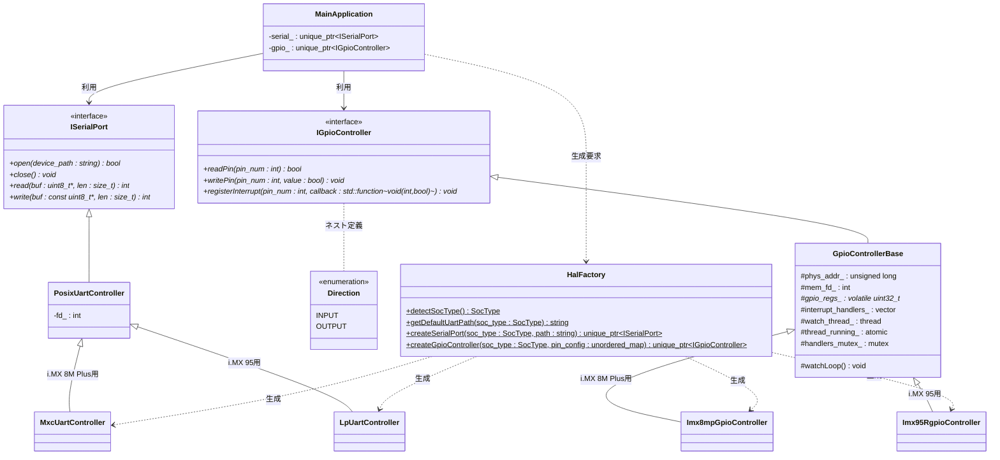

# HAL Architecture Manifest: i.MX HAL シナリオ

本ドキュメントは、i.MX 95 (FRDM-IMX95) および i.MX 8M Plus の評価ボードにおいて、ハードウェア依存性を隠蔽し、実機とシミュレータ環境で同一のファームウェアバイナリを透過的に動作させるために設計された **ハードウェア抽象化レイヤー (HAL)** のアーキテクチャ設計図です。

---

## 1. 背景と目的 (Why HAL?)

先行開発プラットフォームである i.MX 8M Plus と、本採用プラットフォームである i.MX 95 では、制御対象となる周辺I/Oハードウェア仕様やLinux上のパスが以下のように異なります。

* **UARTの違い:**
  * i.MX 8M Plus: 標準の標準UART IP を採用 (`/dev/ttymxc0` 〜 `3`)
  * i.MX 95: 低消費電力の LPUART IP を採用 (`/dev/ttyLP0` 〜 `7`)
* **GPIOの違い:**
  * i.MX 8M Plus: `GPIO1` 〜 `GPIO5`
  * i.MX 95: `GPIO1` 〜 `GPIO5` に加え、リアルタイム高速制御用の `Rapid GPIO (RGPIO1)` が搭載。
  * **方向制御の極性不一致:** NXPのGPIO仕様（`1` = 出力, `0` = 入力）と、F-BBシミュレータ等の標準UIO仕様（`0` = 出力, `1` = 入力）で極性が不一致。

**HALの目的:**
アプリケーション（[main.cpp](file:///workspaces/FPGA-BoardlessBench-main/tests/scenarios/P01_frdmIMX/main.cpp)）側からこれらのアドレスマップ、レジスタ配置、極性の違い、および Linuxのデバイスファイル名の差異を完全に隠蔽します。これにより、ビジネスロジックを変更することなく、実機とF-BBシミュレータの双方で完全に同一のソースコードで動作させる「透過性」を担保します。

---

## 2. 設計テクニックと採用技術

### 2.1. インターフェースによる抽象化 (Interface-based Design)
C++の純粋仮想クラス（[imx_hal.hpp](imx_hal.hpp)）を用いて、`ISerialPort` および `IGpioController` を定義しています。これにより、アプリケーションは具象クラスの実装やレジスタ制御の詳細を知る必要がなくなり、「依存性逆転の原則」を満たします。

### 2.2. ファクトリパターン (Factory Pattern)
システム起動時に `HalFactory` クラスが自動的に動作環境のSoCタイプを検出し、最適な具象クラス（`MxcUartController` や `Imx95RgpioController` など）のインスタンスを生成してスマートポインタとして返却します。
これにより、アプリケーション層にはSoCの違いを意識した条件分岐（`#ifdef` など）が一切現れません。

### 2.3. C++17 標準ライブラリによるポータビリティ
ユーザー空間での非同期GPIO変化監視（擬似割り込み）を実装するために、C++標準のスレッドライブラリ（`std::thread`, `std::mutex`, `std::atomic`）を採用しています。特定のOSカーネル固有の非同期APIに依存しないため、C++17対応 of コンパイラがあればどの組み込みLinuxディストリビューションでもビルドが可能です。

### 2.4. 方向設定のカプセル化 (Approach A: Configuration Mapping)
GPIOの入力/出力の方向（`IGpioController::Direction`）を実行時のAPIから隠蔽し、HALの生成初期化時に一括で設定マップ（`unordered_map`）を渡して適用するアプローチを採用しています。
特に F-BBでサポートされる Zynq 118ピン対応のような「多ピン環境」において、この設計は極めて重要な価値を持ちます。

* **ピンアサイン仕様の局所化（可読性）:**  
  118本もの多ピン構成では、コードの様々な場所で個別に `setPinDirection` を呼び出すとバグの温床になります。初期化時に一箇所のテーブルとしてピンの仕様を定義することで、仕様書とコードを1対1で対応させて保守性を向上させます。
* **信号衝突の防止（安全性）:**  
  実行中のアプリケーションコードから方向設定APIを完全に排除することで、あるモジュールが入力として使用しているピンを他のバグのあるモジュールが出力として駆動し、実機ボードがショート・焼損するリスクを未然に防ぎます。
* **レジスタアクセスの局所化（最適化）:**  
  起動時に一括で方向レジスタ（`GDIR`）を設定し、実行時は方向の再設定を行わないため、スレッド間の排他制御（Read-Modify-Writeのロック等）が不要になり、実行効率が最大化されます。

---

## 3. クラス設計 (Class Diagram)



---

## 4. スレッドによるピン監視とデバウンス（チャタリング防止）の仕組み

### 4.1. ユーザー空間でのイベント監視アーキテクチャ
物理的な割り込みハンドリング（IRQ）はカーネル空間の専権事項であるため、ユーザー空間で動作するアプリケーションが `/dev/mem` (MMIO) から直接ピンの状態変化を非同期に検知するには、**バックグラウンドで状態をポーリング監視するスレッド**が必要になります。

本HALでは、`registerInterrupt` が呼ばれると、`watchLoop` スレッドが自動的に立ち上がり、5ms周期で対象ピンの `DATA` レジスタを監視します。
この際、登録されたすべてのピンを**単一のスレッドでマルチプレクス（一括ポーリング）して処理する設計**を採用しています。これにより、Zynq 118ピンのような多ピン環境で多数の割り込みを登録した場合であっても、ピンごとにスレッドを立ち上げるようなリソースの無駄を防ぎ、スレッドコンテキストスイッチに伴うCPUオーバーヘッドを極限まで抑えて動作のリアルタイム性を向上させます。


### 4.2. ソフトウェア・デバウンス (Software Debouncing)
ダッシュボードからのスイッチ入力や物理スイッチのオン/オフ時に発生する「チャタリング（数ミリ秒間の不要なオンオフの繰り返し）」を排除するため、以下の時間ベースのデバウンスアルゴリズムを実装しています。

1. スレッドが `DATA` レジスタから対象ピンの現在値（`current_raw_state`）をサンプリングします。
2. 直前の値から変化があった場合、状態変化のタイムスタンプ（`last_change_time`）を更新します。
3. 状態変化がないまま **20ms**（`debounce_time`）が経過し、かつその値が現在の安定状態（`last_stable_state`）と異なる場合、その値を「真に確定した新しい入力状態」と見なします。
4. 確定した新しい入力状態への遷移をトリガーとして、ユーザーが登録したコールバック関数を実行します。

```
【デバウンス状態推移イメージ】
Raw State   : ──┐  ┌──┐  ┌───────────────
Stable State: ──┴────────────────┴───────
Time        :   |<- 変化検知      |<- 20ms経過、変化確定 (コールバック実行)
```

このスレッド監視モデルは、将来F-BBや実機が `poll()` や `select()` によるカーネルイベント（`/sys/class/gpio/gpioX/value` の `edge` イベント等）に対応した際にも、`watchLoop` 内部の実装のみを変更するだけで、コールバックの公開API仕様は一切変えずに吸収できる拡張性を持っています。

---

## 5. HALの利用コードサンプル

ファームウェア側でGPIOの入力変化を検知し、即座にUART経由でコンソールへ通知する実装例です。

```cpp
#include "hal/imx_hal.hpp"
#include <stdio.h>
#include <unistd.h>
#include <string.h>
#include <unordered_map>

class App {
private:
    std::unique_ptr<ISerialPort> serial_;
    std::unique_ptr<IGpioController> gpio_;

public:
    void setup() {
        // SoC種類の自動検出とデフォルトUARTパスの取得
        SocType soc = HalFactory::detectSocType();
        std::string uart_path = HalFactory::getDefaultUartPath(soc);

        // ピンアサイン仕様をマップに定義
        std::unordered_map<int, IGpioController::Direction> pin_config = {
            {5, IGpioController::Direction::INPUT},
            {6, IGpioController::Direction::OUTPUT}
        };

        // 各種コントローラの生成 (初期化パラメータを渡す)
        gpio_ = HalFactory::createGpioController(soc, pin_config);
        serial_ = HalFactory::createSerialPort(soc, uart_path);

        if (!gpio_ || !serial_) {
            fprintf(stderr, "HALの初期化に失敗しました。\n");
            return;
        }

        // Pin 5 に割り込みハンドラ（コールバック）を登録
        gpio_->registerInterrupt(5, [](int pin, bool state) {
            char msg[64];
            snprintf(msg, sizeof(msg), "\r\n[Event] Pin %d changed to %s\r\n", pin, state ? "HIGH" : "LOW");
            printf("[App] GPIO Interrupt triggered on Pin %d! State: %d\n", pin, state);
            // ※シリアル送信を行う場合、通常はグローバルに保存したシリアルポートなどを使用します。
        });
    }

    void loop() {
        while (true) {
            usleep(100000); 
        }
    }
};

int main() {
    App app;
    app.setup();
    app.loop();
    return 0;
}
```

---

## 6. 応用設計：コールバックの共通化とカプセル化（std::bind の活用）

割り込み登録 `registerInterrupt` のシグネチャを `std::function<void(int pin_num, bool value)>` に拡張したことにより、カプセル化（密結合の回避）を維持したまま、複数のGPIOピンで処理を共通化する設計が非常に綺麗に行えます。

### 6.1. std::bind によるメンバ関数の直接登録 (推奨)
グローバル変数やフリー関数といった「密結合を助長する設計」を排除するため、`std::bind` を使用して、オブジェクトインスタンス（`this`）に紐づく非staticメンバ関数を直接コールバックとして登録します。これにより、オブジェクト指向のカプセル化を破壊せずに共通処理を構築できます。

```cpp
#include <functional> // std::bind と std::placeholders のため
#include <unordered_map>

class MainApplication {
private:
    std::unique_ptr<IGpioController> gpio_;

    // 共通の割り込み処理メソッド (プライベートメンバ関数)
    void handleGpioEvent(int pin_num, bool state) {
        printf("[App Common Handler] GPIO Pin %d changed to %s\n", pin_num, state ? "HIGH" : "LOW");
    }

public:
    void setup() {
        // ピンの初期仕様をマップで定義
        std::unordered_map<int, IGpioController::Direction> pin_config = {
            {8, IGpioController::Direction::INPUT},
            {10, IGpioController::Direction::INPUT}
        };
        gpio_ = HalFactory::createGpioController(SocType::IMX95, pin_config);

        // std::bind を使用してメンバ関数を直接バインド
        gpio_->registerInterrupt(8, std::bind(&MainApplication::handleGpioEvent, this, std::placeholders::_1, std::placeholders::_2));
        gpio_->registerInterrupt(10, std::bind(&MainApplication::handleGpioEvent, this, std::placeholders::_1, std::placeholders::_2));
    }
};
```

### 6.2. 引数付きラムダ式による個別処理
特定のピンに対してその場で独自のクロージャ処理を記述したい場合は、オブジェクトの `this` をキャプチャした引数付きのラムダ式が使用できます。

```cpp
void setup() {
    // 引数を受け取るラムダ式をその場で登録
    gpio_->registerInterrupt(9, [this](int pin, bool state) {
        char msg[128];
        snprintf(msg, sizeof(msg), "Pin %d is directly processed to %d", pin, state);
        serial_->write(reinterpret_cast<const uint8_t*>(msg), strlen(msg));
    });
}
```

### 6.3. ライフタイム（寿命）とメモリ安全性に関する注意点
> [!WARNING]
> **非同期コールバックでの「参照キャプチャ（`[&]`）」の禁止**
>
> 登録されたコールバックは、HAL内部のバックグラウンド監視スレッドから非同期に実行されます。
> そのため、関数内のローカル変数や一時的なオブジェクトを `[&]`（参照キャプチャ）でラムダ式に渡してはいけません。コールバックが実行されるタイミングで、すでにそのローカル変数がスタックから消滅している（スコープを抜けている）場合、ダングリングポインタを介したメモリ破壊やセグメンテーションフォールト（未定義動作）の原因になります。
>
> プリミティブな変数は、必ず **値キャプチャ（`[=]` または `[var_name]`）** を使用してコピーを渡してください。また、クラスインスタンスを渡す場合は `std::shared_ptr` をキャプチャして寿命を延ばすなどのライフタイム設計を行ってください。
