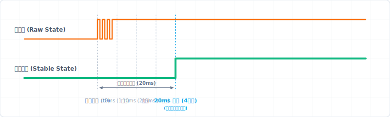
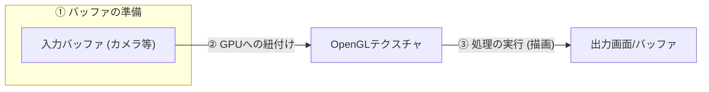
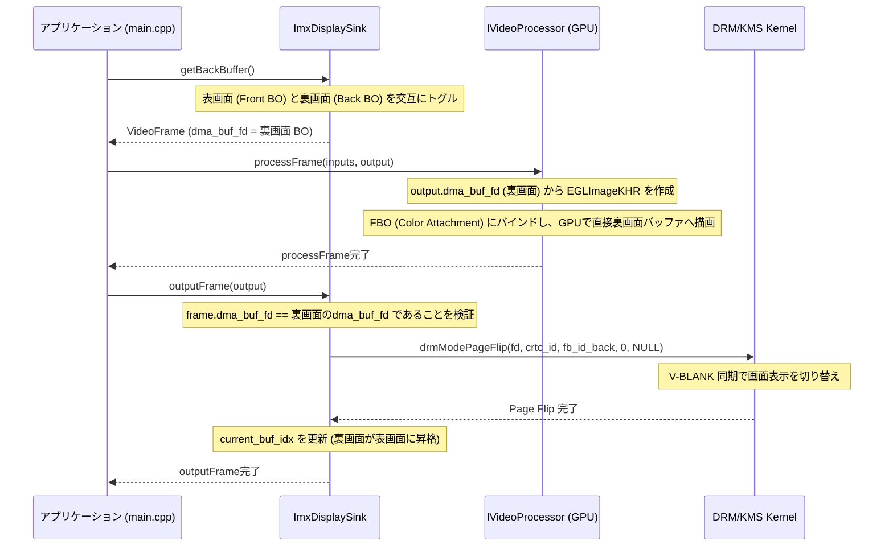

# HAL Architecture Manifest: i.MX HAL シナリオ

本ドキュメントは、i.MX 95 (FRDM-IMX95) および i.MX 8M Plus の評価ボードにおいて、ハードウェア依存性を隠蔽し、実機とシミュレータ環境で同一のファームウェアバイナリを透過的に動作させるために設計された **ハードウェア抽象化レイヤー (HAL)** のアーキテクチャ設計図です。

---

## 1. 背景と目的 (Why HAL?)

先行開発プラットフォームである i.MX 8M Plus と、本採用プラットフォームである i.MX 95 では、制御対象となる周辺I/Oハードウェア仕様やLinux上のパスが以下のように異なります。

* **UARTの違い:**
  * i.MX 8M Plus: 標準の標準UART IP を採用 (`/dev/ttymxc0` 〜 `3`)
  * i.MX 95: 低消費電力の LPUART IP を採用 (`/dev/ttyLP0` 〜 `7`)
* **GPIOの違い:**
  * i.MX 8M Plus: `GPIO1` 〜 `GPIO5`
  * i.MX 95: `GPIO1` 〜 `GPIO5` に加え、リアルタイム高速制御用の `Rapid GPIO (RGPIO1)` が搭載。
  * **方向制御の極性不一致:** NXPのGPIO仕様（`1` = 出力, `0` = 入力）と、F-BBシミュレータ等の標準UIO仕様（`0` = 出力, `1` = 入力）で極性が不一致。

**HALの目的:**
アプリケーション（[main.cpp](file:///workspaces/FPGA-BoardlessBench/tests/scenarios/P01_frdmIMX/main.cpp)）側からこれらのアドレスマップ、レジスタ配置、極性の違い、および Linuxのデバイスファイル名の差異を完全に隠蔽します。これにより、ビジネスロジックを変更することなく、実機とF-BBシミュレータの双方で完全に同一のソースコードで動作させる「透過性」を担保します。

---

## 2. 設計テクニックと採用技術

### 2.1. インターフェースによる抽象化 (Interface-based Design)
C++の純粋仮想クラス（[imx_hal.hpp](imx_hal.hpp)）を用いて、`ISerialPort` および `IGpioController` を定義しています。これにより、アプリケーションは具象クラスの実装やレジスタ制御の詳細を知る必要がなくなり、「依存性逆転の原則」を満たします。

### 2.2. ファクトリパターン (Factory Pattern)
システム起動時に `HalFactory` クラスが自動的に動作環境のSoCタイプを検出し、最適な具象クラス（`MxcUartController` や `Imx95RgpioController` など）のインスタンスを生成してスマートポインタとして返却します。
これにより、アプリケーション層にはSoCの違いを意識した条件分岐（`#ifdef` など）が一切現れません。

### 2.3. C++17 標準ライブラリによるポータビリティ
ユーザー空間での非同期GPIO変化監視（擬似割り込み）を実装するために、C++標準のスレッドライブラリ（`std::thread`, `std::mutex`, `std::atomic`）を採用しています。
特定のOSカーネル固有の非同期APIに依存しないため、C++17対応のコンパイラがあればどの組み込みLinuxディストリビューションでもビルドが可能です。

### 2.4. 方向設定のカプセル化 (Approach A: Configuration Mapping)
GPIOの入力/出力の方向（`IGpioController::Direction`）を実行時のAPIから隠蔽し、HALの生成初期化時に一括で設定マップ（`unordered_map`）を渡して適用するアプローチを採用しています。
特に F-BBでサポートされる Zynq 118ピン対応のような「多ピン環境」において、この設計は極めて重要な価値を持ちます。

* **ピンアサイン仕様の局所化（可読性）:**  
  118本もの多ピン構成では、コードの様々な場所で個別に `setPinDirection` を呼び出すとバグの温床になります。初期化時に一箇所のテーブルとしてピンの仕様を定義することで、仕様書とコードを1対1で対応させて保守性を向上させます。
* **信号衝突と境界外アクセスの防止（安全性・Fail-Fast）:**  
  実行中のアプリケーションコードから方向設定APIを排除し、不用意なモード変更による衝突を防ぎます。
  さらに、HAL初期化時（`init`）およびすべての実行時I/O API（`readPin` / `writePin` / `registerInterrupt`）の入り口で、SoCハードウェア仕様の上限（i.MX95なら16ピン）を超えるピン番号が指定されていないか、テンプレートメソッドによる境界・状態検証（`validatePin`）を行います。
  もし境界外アクセスや未登録ピンへの操作が検知された場合は、戻り値のチェック漏れによる暴走を防ぐため、呼び出し元に制御を一切戻さず、**その場で方向レジスタ（`GDIR`）をクリアして全ピンを入力（Hi-Z）の安全状態に強制リセットしたうえで、`abort()` を呼び出してプロセスを即座に強制終了（Fail-Fast）**させます。
* **レジスタアクセスの局所化（最適化）:**  
  起動時に一括で方向レジスタ（`GDIR`）を設定し、実行時は方向の再設定を行わないため、スレッド間の排他制御（Read-Modify-Writeのロック等）が不要になり、実行効率が最大化されます。

---

## 3. クラス設計 (Class Diagram)

```mermaid
classDiagram
classInterface
    class ISerialPort {
        <<interface>>
        +open(device_path : string) bool*
        +close() void*
        +read(buf : uint8_t*, len : size_t) int*
        +write(buf : const uint8_t*, len : size_t) int*
    }
    class PosixUartController {
        -fd_ : int
    }
    class MxcUartController {
    }
    class LpUartController {
    }
    ISerialPort <|-- PosixUartController
    PosixUartController <|-- MxcUartController : i.MX 8M Plus用
    PosixUartController <|-- LpUartController : i.MX 95用

    class CalibrationData {
        +distortion_k1 : float
        +distortion_k2 : float
        +affine_matrix : float[16]
        +color_balance : float[4]
    }

    class IVideoProcessor {
        <<interface>>
        +initialize() bool*
        +setCalibrationParams(camera_index : int, params : CalibrationData) void*
        +processFrame(inputs : const VideoFrame[4], output : VideoFrame&) bool*
        +terminate() void*
    }

    class HostGlesProcessor {
        -calib_params_ : CalibrationData[4]
        -tex_in_ : GLuint[4]
        -tex_out_ : GLuint
    }

    class ImxGlesProcessorBase {
        #calib_params_ : CalibrationData[4]
    }

    IVideoProcessor <|-- HostGlesProcessor : Mesaフォールバック用
    IVideoProcessor <|-- ImxGlesProcessorBase
    ImxGlesProcessorBase <|-- Imx95GlesProcessor : i.MX 95用
    ImxGlesProcessorBase <|-- Imx8mpGlesProcessor : i.MX 8M Plus用

    class IDisplaySink {
        <<interface>>
        +initialize() bool*
        +outputFrame(frame : const VideoFrame&) bool*
        +terminate() void*
    }

    class HostDisplaySink {
    }

    class ImxDisplaySink {
        -type_ : SocType
    }

    IDisplaySink <|-- HostDisplaySink : ホストダンプ用
    IDisplaySink <|-- ImxDisplaySink : 実機物理HDMI用

    class Direction {
        <<enumeration>>
        INPUT
        OUTPUT
    }

    class PinState {
        <<enumeration>>
        Low
        High
    }

    class Verification {
        <<enumeration>>
        Disable
        Enable
    }

    class IGpioController {
        <<interface>>
        +readPin(pin_num : int) bool*
        +writePin(pin_num : int, state : PinState, verify : Verification) void*
        +writePinIL(pin_num : int, state : PinState, verify : Verification) void*
        +registerInterrupt(pin_num : int, callback : std::function~void(int,bool)~, use_filter : bool) void*
        +getRawRegisterAddress() volatile uint32_t*
        +registerInterlockPair(pin_a : int, pin_b : int) void*
    }
    class GpioControllerBase {
        #phys_addr_ : unsigned long
        #mem_fd_ : int
        #gpio_regs_ : volatile uint32_t*
        #max_pins_ : const int
        #pin_directions_ : vector
        #pin_registered_ : vector
        #interrupt_handlers_ : vector
        #watch_thread_ : thread
        #thread_running_ : atomic
        #handlers_mutex_ : mutex
        #wdog_heartbeat_ : volatile uint16_t
        #interlock_pairs_ : vector
        #interlocked_pins_mask_ : uint32_t
        #readPinRaw(pin_num : int) bool
        #writePinRaw(pin_num : int, value : bool) void
        #watchLoop() void
        #validatePin(pin_num : int, validator : Predicate, error_reason : const char*) void
        #triggerFatalError(pin_num : int, details : string) void
        +getRawRegisterAddress() volatile uint32_t*
    }
    class Imx8mpGpioController {
    }
    class Imx95RgpioController {
    }
    IGpioController <|-- GpioControllerBase
    IGpioController .. Direction : ネスト定義
    IGpioController .. PinState : 利用
    IGpioController .. Verification : 利用
    GpioControllerBase <|-- Imx8mpGpioController : i.MX 8M Plus用
    GpioControllerBase <|-- Imx95RgpioController : i.MX 95用

    class HalFactory {
        +detectSocType() SocType$
        +getDefaultUartPath(soc_type : SocType) string$
        +createSerialPort(soc_type : SocType, path : string) unique_ptr~ISerialPort~$
        +createGpioController(soc_type : SocType, pin_config : unordered_map) unique_ptr~IGpioController~$
        +createVideoProcessor(soc_type : SocType) unique_ptr~IVideoProcessor~$
        +createDisplaySink(soc_type : SocType) unique_ptr~IDisplaySink~$
    }

    class MainApplication {
        -serial_ : unique_ptr~ISerialPort~
        -gpio_ : unique_ptr~IGpioController~
        -display_ : unique_ptr~IDisplaySink~
        -soc_type_ : SocType
        -running_ : atomic~bool~
    }

    MainApplication --> ISerialPort : 利用 (メンバ保持)
    MainApplication --> IGpioController : 利用 (メンバ保持)
    MainApplication --> IDisplaySink : 利用 (メンバ保持)
    MainApplication ..> IVideoProcessor : 利用 (ローカル利用)
    MainApplication ..> HalFactory : 生成要求
    HalFactory ..> MxcUartController : 生成
    HalFactory ..> LpUartController : 生成
    HalFactory ..> Imx8mpGpioController : 生成
    HalFactory ..> Imx95RgpioController : 生成
    HalFactory ..> HostGlesProcessor : 生成
    HalFactory ..> Imx95GlesProcessor : 生成
    HalFactory ..> Imx8mpGlesProcessor : 生成
    HalFactory ..> HostDisplaySink : 生成
    HalFactory ..> ImxDisplaySink : 生成

```



---

## 3.1. GPIO HAL API メソッドリファレンス

#### 1. `readPin(int pin_num) -> bool`
- **役割**: 指定されたピンの現在の電圧状態をレジスタから読み込みます。
- **検証**: ピン番号が有効範囲内かつ、初期化マップに登録されているかを検証します（検証失敗時は安全アボート）。
- **戻り値**: ピンが HIGH の場合は `true`、LOW の場合は `false`。

#### 2. `writePin(int pin_num, PinState state, Verification verify = Verification::Disable) -> void`
- **役割**: 指定された出力ピンに HIGH/LOW 状態を書き込みます。
- **検証**: 
  - ピン番号の範囲および登録状態の検証（OUTPUTピンであることを強制）。
  - ビットマスク（`interlocked_pins_mask_`）を用いた、相互排他ペア登録ピンへの誤操作防止チェック（通常アクセスがあった場合は即時アボート）。
- **引数**:
  - `state`: `PinState::High` または `PinState::Low`。
  - `verify`: `Verification::Enable` にすると、書き込み直後に物理レジスタの値を自動的に読み戻して照合します（不一致時はアボート）。

#### 3. `writePinIL(int pin_num, PinState state, Verification verify = Verification::Disable) -> void`
- **役割**: 相互排他（インターロック）登録されたピンに対して安全に状態を書き込みます。
- **機能**: 書き込み前に排他ペアの相手側ピンの状態を読み込み、同時にON（High）になろうとした場合は、安全のため**両ピンを強制的にOFFに設定した上で、即座にアボート（Fail-Fast）**します。
- **引数**: `writePin` と同様。

#### 4. `registerInterrupt(int pin_num, std::function<void(int, bool)> callback, bool use_filter = false) -> void`
- **役割**: 入力ピンの状態変化（立ち上がり/立ち下がりエッジ）を検知した際に呼び出されるコールバックを登録します。
- **検証**: 対象ピンが `INPUT` として正しく登録されているかを検証します。
- **引数**:
  - `callback`: 状態遷移確定時に実行される関数オブジェクト（`void(int pin, bool state)`）。
  - `use_filter`: デジタルノイズフィルタ（Glitch Filter）を適用するかどうか。

#### 5. `getRawRegisterAddress() -> volatile uint32_t*`
- **役割**: mmapされたGPIOのハードウェア物理レジスタベースに対応する仮想メモリアドレスポインタを開示します。
- **用途**: ナノ秒〜マイクロ秒のトグルが必要な極限のパフォーマンス要件（ビットバンギング等）において、C++仮想関数テーブル引きや安全ガード処理を完全にバイパスして、直接メモリロード/ストアを行うために使用します。
- **コード例**:
  ```cpp
  volatile uint32_t* regs = gpio->getRawRegisterAddress();
  if (regs) {
      // Pin 0 に対応するDRレジスタ（インデックス 0）のビット0を直接 HIGH にする（オーバーヘッドゼロ）
      regs[0] |= (1 << 0); 
  }
  ```

#### 6. `registerInterlockPair(int pin_a, int pin_b) -> void`
- **役割**: ハードウェア破壊（Hブリッジ回路のショート等）を招く恐れのある2本の出力ピンを、相互に排他制御が必要なペアとして登録します。
- **効果**: 登録されたピンは `interlocked_pins_mask_` に記録され、通常の `writePin` による操作が即座にアボートされ、必ず `writePinIL` での検証付き操作が強制されるようになります。

---

## 3.2. Video Processor (OpenGL ES) HAL API メソッドリファレンス

#### 1. `initialize() -> bool`
- **役割**: OpenGL ES レンダリングコンテキスト（Mesa Surfaceless EGL または 実機固有のEGL/GBMコンテキスト）および GLSL シェーダープログラム、テクスチャ、FBO などのリソースを初期化・バインドします。
- **戻り値**: 初期化に成功した場合は `true`、失敗した場合は `false`。

#### 2. `setCalibrationParams(int camera_index, const CalibrationData& params) -> void`
- **役割**: 特定の入力カメラ（インデックス 0〜3）に対応するキャリブレーションパラメータ（レンズ歪み補正係数、4x4アフィン変換行列、RGB/ガンマ色調調整値）を個別に設定し、HAL内部メモリへ格納します。
- **効果**: 設定されたパラメータは、`processFrame()` 実行時に自動的に GLSL の `uniform` 変数として GPU シェーダーに転送・適用されます。

#### 3. `processFrame(const VideoFrame inputs[4], VideoFrame& output) -> bool`
- **役割**: 4台の入力カメラからのデコード済み RGBA フレームバッファ（または DMA-BUF）を受け取り、マルチテクスチャとして GPU に転送し、GLSL シェーダーを用いてアフィン変換・歪み補正・カラー調整・2x2 合成（Stitching）を一括実行し、結果を出力バッファ（または DMA-BUF）へ書き出します。
- **戻り値**: フレーム処理が成功した場合は `true`、失敗した場合は `false`。

#### 4. `terminate() -> void`
- **役割**: 作成されたテクスチャ、FBO、GLSL プログラム、および EGL コンテキスト/ディスプレイの解放を行い、リソースリークを防ぎます。

---

## 3.3. HDMI Display Sink HAL API メソッドリファレンス

#### 1. `initialize() -> bool`
- **役割**: ディスプレイ出力デバイス（実機物理モニター、またはホスト側ダンプ領域）を初期化します。
- **戻り値**: 初期化に成功した場合は `true`、失敗した場合は `false`。

#### 2. `outputFrame(const VideoFrame& frame) -> bool`
- **役割**: 補正・合成済みの RGBA 画像データ（または DMA-BUF）をディスプレイに出力します。実機では DRM/KMS または Wayland 経由でモニター表示を行い、ホスト環境（F-BB）ではマニフェスト定義の `/tmp/hdmi_output.bmp` ファイルへ BMP 形式で保存します。
- **戻り値**: 出力処理が成功した場合は `true`、失敗した場合は `false`。

#### 3. `terminate() -> void`
- **役割**: 確保されたディスプレイドライバのコンテキスト、描画資源、あるいはファイルディスクリプタを安全に解放・クローズします。


---

## 4. スレッドによるピン監視とデバウンス（チャタリング防止）の仕組み

### 4.1. ユーザー空間でのイベント監視アーキテクチャ
物理的な割り込みハンドリング（IRQ）はカーネル空間の専権事項であるため、ユーザー空間で動作するアプリケーションが `/dev/mem` (MMIO) から直接ピンの状態変化を非同期に検知するには、**バックグラウンドで状態をポーリング監視するスレッド**が必要になります。

本HALでは、`registerInterrupt` が呼ばれると、`watchLoop` スレッドが自動的に立ち上がり、5ms周期で対象ピンの `DATA` レジスタを監視します。
この際、登録されたすべてのピンを**単一のスレッドでマルチプレクス（一括ポーリング）して処理する設計**を採用しています。これにより、Zynq 118ピンのような多ピン環境で多数の割り込みを登録した場合であっても、ピンごとにスレッドを立ち上げるようなリソースの無駄を防ぎ、スレッドコンテキストスイッチに伴うCPUオーバーヘッドを極限まで抑えて動作のリアルタイム性を向上させます。


### 4.2. デジタルノイズフィルタ (Glitch Filter)
Webダッシュボードからのスイッチ入力や物理スイッチのオン/オフ時に発生する「チャタリング（数ミリ秒間の不要なオンオフの繰り返し）」を排除するため、カウントベースのデジタルノイズフィルタを実装しています。

`registerInterrupt` の第3引数 `use_filter` が `true` の場合、以下のロジックで動作します。

1. スレッドが 5ms 周期で対象ピンの現在値（`current_raw_state`）をサンプリングします。
2. 生のピン状態に変化があった場合、カウントをクリアして変化後状態の監視を開始します。
3. 5ms 周期のポーリングで **4回連続して同じ状態** が検知された場合（5ms × 4 = 20ms）、その値を「ノイズではなく、真に確定した新しい入力状態」と見なします。
4. 確定した新しい状態への遷移（エッジ変化）をトリガーとして、ユーザーが登録したコールバック関数を実行します。

※ `use_filter` が `false` の場合は、5ms周期のポーリングで変化を検知した瞬間に、即時（デバウンスなし）でコールバックを叩きます。



このスレッド監視モデルは、将来F-BBや実機が `poll()` や `select()` によるカーネルイベント（`/sys/class/gpio/gpioX/value` の `edge` イベント等）に対応した際にも、`watchLoop` 内部の実装のみを変更するだけで、コールバックの公開API仕様は一切変えずに吸収できる拡張性を持っています。

---

## 5. HALの利用コードサンプル

ファームウェア側でGPIOの入力変化を検知し、即座にUART経由でコンソールへ通知する実装例です。

```cpp
#include "hal/imx_hal.hpp"
#include <stdio.h>
#include <unistd.h>
#include <string.h>
#include <unordered_map>

class App {
private:
    std::unique_ptr<ISerialPort> serial_;
    std::unique_ptr<IGpioController> gpio_;

public:
    void setup() {
        // SoC種類の自動検出とデフォルトUARTパスの取得
        SocType soc = HalFactory::detectSocType();
        std::string uart_path = HalFactory::getDefaultUartPath(soc);

        // ピンアサイン仕様をマップに定義
        std::unordered_map<int, IGpioController::Direction> pin_config = {
            {5, IGpioController::Direction::INPUT},
            {6, IGpioController::Direction::OUTPUT}
        };

        // 各種コントローラの生成 (初期化パラメータを渡す)
        gpio_ = HalFactory::createGpioController(soc, pin_config);
        serial_ = HalFactory::createSerialPort(soc, uart_path);

        if (!gpio_ || !serial_) {
            fprintf(stderr, "HALの初期化に失敗しました。\n");
            return;
        }

        // Pin 5 に割り込みハンドラ（コールバック）を登録
        gpio_->registerInterrupt(5, [](int pin, bool state) {
            char msg[64];
            snprintf(msg, sizeof(msg), "\r\n[Event] Pin %d changed to %s\r\n", pin, state ? "HIGH" : "LOW");
            printf("[App] GPIO Interrupt triggered on Pin %d! State: %d\n", pin, state);
            // ※シリアル送信を行う場合、通常はグローバルに保存したシリアルポートなどを使用します。
        });
    }

    void loop() {
        while (true) {
            usleep(100000); 
        }
    }
};

int main() {
    App app;
    app.setup();
    app.loop();
    return 0;
}
```

---

## 6. 応用設計：コールバックの共通化とカプセル化（std::bind の活用）

割り込み登録 `registerInterrupt` のシグネチャを `std::function<void(int pin_num, bool value)>` に拡張したことにより、カプセル化（密結合の回避）を維持したまま、複数のGPIOピンで処理を共通化する設計が非常に綺麗に行えます。

### 6.1. std::bind によるメンバ関数の直接登録 (推奨)
グローバル変数やフリー関数といった「密結合を助長する設計」を排除するため、`std::bind` を使用して、オブジェクトインスタンス（`this`）に紐づく非staticメンバ関数を直接コールバックとして登録します。これにより、オブジェクト指向のカプセル化を破壊せずに共通処理を構築できます。

```cpp
#include <functional> // std::bind と std::placeholders のため
#include <unordered_map>

class MainApplication {
private:
    std::unique_ptr<IGpioController> gpio_;

    // 共通の割り込み処理メソッド (プライベートメンバ関数)
    void handleGpioEvent(int pin_num, bool state) {
        printf("[App Common Handler] GPIO Pin %d changed to %s\n", pin_num, state ? "HIGH" : "LOW");
    }

public:
    void setup() {
        // ピンの初期仕様をマップで定義
        std::unordered_map<int, IGpioController::Direction> pin_config = {
            {8, IGpioController::Direction::INPUT},
            {10, IGpioController::Direction::INPUT}
        };
        gpio_ = HalFactory::createGpioController(SocType::IMX95, pin_config);

        // std::bind を使用してメンバ関数を直接バインド
        gpio_->registerInterrupt(8, std::bind(&MainApplication::handleGpioEvent, this, std::placeholders::_1, std::placeholders::_2));
        gpio_->registerInterrupt(10, std::bind(&MainApplication::handleGpioEvent, this, std::placeholders::_1, std::placeholders::_2));
    }
};
```

### 6.2. 引数付きラムダ式による個別処理
特定のピンに対してその場で独自のクロージャ処理を記述したい場合は、オブジェクトの `this` をキャプチャした引数付きのラムダ式が使用できます。

```cpp
void setup() {
    // 引数を受け取るラムダ式をその場で登録
    gpio_->registerInterrupt(9, [this](int pin, bool state) {
        char msg[128];
        snprintf(msg, sizeof(msg), "Pin %d is directly processed to %d", pin, state);
        serial_->write(reinterpret_cast<const uint8_t*>(msg), strlen(msg));
    });
}
```

### 6.3. ライフタイム（寿命）とメモリ安全性に関する注意点
> [!WARNING]
> **非同期コールバックでの「参照キャプチャ（`[&]`）」の禁止**
>
> 登録されたコールバックは、HAL内部のバックグラウンド監視スレッドから非同期に実行されます。
> そのため、関数内のローカル変数や一時的なオブジェクトを `[&]`（参照キャプチャ）でラムダ式に渡してはいけません。コールバックが実行されるタイミングで、すでにそのローカル変数がスタックから消滅している（スコープを抜けている）場合、ダングリングポインタを介したメモリ破壊やセグメンテーションフォールト（未定義動作）の原因になります。
>
> プリミティブな変数は、必ず **値キャプチャ（`[=]` または `[var_name]`）** を使用してコピーを渡してください。また、クラスインスタンスを渡す場合は `std::shared_ptr` をキャプチャして寿命を延ばすなどのライフタイム設計を行ってください。
 
---

## 7. 極限の低遅延化とリアルタイム安全性の両立 (Performance Optimization)

GPIO制御のようなハードウェア低レイヤのHAL設計において、**「アプリケーションエラーを防ぐ厳格な検証（安全性）」**と**「高速パルス生成などに耐えうる極小の処理時間（速度）」**はトレードオフの関係になりがちです。
本HALでは、この二重課題を克服するために、静的な設定時の厳密検証と、動的な実行時の検証排除・バイパス経路を組み合わせた**「二層分離設計」**を採用しています。

### 7.1. テーブル引き（O(1) 配列アクセス）へのリファクタリング
初期設計では、動的なピン方向情報を `std::unordered_map` で管理していました。これは利便性が高い一方で、高頻度に呼び出される `readPin` や `writePin` の中でのハッシュ値計算、バケット検索、およびメモリ間接参照（キャッシュミス）を引き起こし、実質的なレジスタアクセスの数十倍から数百倍の遅延の原因となっていました。
* **対応策**: SoCの物理的な最大ピン数（例：i.MX95なら16ピン）は起動時に確定するため、`std::vector<Direction>` および `std::vector<bool>` を用いた**直接インデックス配列アクセス**へリファクタリングしました。
* **効果**: 検証時の検索コストが $O(1)$ の極小のメモリ参照（数クロックサイクル）に短縮され、CPU負荷を限界まで低減させました。

### 7.2. 正常系パスでの動的メモリ確保（malloc/new）の完全排除
`validatePin` のエラー理由引数を `const std::string&` として受け取る設計では、呼び出し側から文字列リテラルを渡するたびに、`std::string` の一時オブジェクトが暗黙的に構築（動的確保）され、実行ジッタやヒープ断片化の原因となっていました。
* **対応策**: 引数を `const char*` に変更し、実際にエラーが検知されて `triggerFatalError` が呼ばれる瞬間まで `std::string` のオブジェクト構築が発生しないようにしました。
* **効果**: 正常動作している限り、ヒープ確保が一切発生しない決定論的（Deterministic）な時間制御を保証しました。

### 7.3. 監視ループ内での検証バイパス (`readPinRaw`)
`watchLoop` は、5ms周期でバックグラウンド監視を行うHAL内部のスレッドです。このループ内で `readPin` を呼び出すと、毎イテレーションでピン番号の境界や方向性の検証（`validatePin`）が重複して走り、CPU負荷を無駄に上昇させていました。
* **対応策**: コールバックが登録される `registerInterrupt` の時点で検証はすでに完了しているため、`watchLoop` 内部からは検証処理を完全にバイパスするインラインメソッド `readPinRaw(int pin_num)` を使用して直接レジスタを参照する構造に変更しました。
* **効果**: 走査オーバーヘッドが「直接レジスタロード＋ビットマスク判定」の1〜2命令レベルに圧縮され、スレッドによる割り込み判定ジッタも最小化されました。

### 7.4. シビアなパフォーマンス用「生アドレス開示API」の提供
ソフトウェアによるSPI/I2Cや特殊パルス制御（ビットバンギング）など、ナノ秒〜マイクロ秒単位の超高速トグルが必要なユースケースにおいて、C++の仮想関数テーブル引き（vtable lookup）や引数渡し、およびAPIレベルの安全ガード処理は、どれほど最適化しても物理ポート書き込み速度のボトルネックとなります。
* **対応策**: `IGpioController` のAPIとして `volatile uint32_t* getRawRegisterAddress()` を実装しました。
* **効果**: アプリ側で極限の性能が必要な場合、このポインタを取得して直接 `regs[0] |= (1 << pin)` のようにメモリロード/ストアを行うことで、C++ HALの呼び出しペナルティを**実質ゼロ（実機ハードウェアレジスタ直叩きと同等）**にバイパスできる手段を提供しています。

### 7.5. 高度なセーフティ保護メカニズム
安全性と信頼性の要件に基づき、極めて低いオーバーヘッドで動作する以下のセーフティ機構を追加しました。

* **ウォッチドッグタイマ (WDT) 生存ハートビート**:
  `watchLoop` スレッドがハングアップしていないことを外部/シミュレータに証明するため、ポーリングループの先頭で生存キー（`0x5555` と `0xAAAA`）を交互に `wdog_heartbeat_` 疑似レジスタに書き込みます。スレッドのフリーズはWDTタイムアウトに直結し、ハードウェアが安全にリセットされます。
* **レジスタ書き込み確認 (Write Verification)**:
  `writePin` / `writePinIL` の引数 `verify` を `true` に指定すると、書き込み直後に物理レジスタから値を読み戻して照合します。バスの異常や電気的な不一致が生じた場合は即座にアボートします。
* **デジタルノイズフィルタ (Glitch Filter) 選択**:
  割り込み登録 `registerInterrupt` の `use_filter` 引数を `true` にすると、5msサンプリングで4回連続（20ms）して状態が安定した場合のみ変化を検知します。`false` に指定した場合は、即時応答モードとなり、オーバーヘッドとレイテンシが排除されます。
* **ビットマスクによる最速のインターロック誤操作ブロック**:
  Hブリッジ上下アームなどの排他ピンは `registerInterlockPair` で排他登録されます。登録ピンは 32bit の `interlocked_pins_mask_` に記録されます。
  通常の `writePin` の開始時に `interlocked_pins_mask_ & (1 << pin)` のビット論理積（わずか 1 クロックサイクル）を実行し、登録ピンへの誤ったアクセスを即座に拒否しアボートします。
  インターロック対象ピンを操作する場合は、必ず `writePinIL` の使用を強制され、その中でのみ相手ピンのON/OFF競合チェック（衝突時は両方を強制的にOFFにしてアボートする安全ロジック）が走るため、安全でない状態を論理的に完全に防ぎつつ、一般ピンの高速操作を一切阻害しない設計を実現しています。

### 7.6. HDMI出力抽象化（IDisplaySink）による遅延への影響評価
実機ターゲットにおけるリアルタイム表示性能を損なわないため、HDMI出力の抽象化レイヤーは以下の通り遅延（レイテンシ）を徹底的に排除した設計になっています。
* **仮想関数テーブル参照コストの極小化**:  
  `IDisplaySink` のインターフェース切り替えはC++の仮想関数テーブルを介して実行されますが、このCPUペナルティは数ナノ秒以下（数クロックサイクル）であり、60fps等の表示周期に対して完全に無視できます。
* **実機ゼロコピーラインの維持**:  
  API設計上 `VideoFrame` を渡す形式にしており、本番用の `ImxDisplaySink` 等のハードウェア具象実装においては、CPUへのメモリコピーバック（`glReadPixels`）やピクセルコピーを必要とせず、直接 GPU バッファハンドル（DMA-BUF等）をディスプレイエンジン（DRM/KMS）へ直接ゼロコピーパスで紐付ける構造にするため、追加の処理遅延は発生しません。
* **ホストファイルI/Oの非同期スレッド分離**:  
  ホスト（F-BB）上でのみ実行される `/tmp/hdmi_output.bmp` へのBMPファイル書き込み処理は、メインの処理・制御ループをブロックしないよう、専用のバックグラウンドスレッド（`hdmi_thread_`）内で非同期的に実行されます。これにより、メインループの制御ジッタを防止しています。


---

## 8. Video Processor (OpenGL ES) 統合とフォールバック設計

### 8.1. ASICボード開発におけるOpenGLエミュレーション
i.MX 95 および i.MX 8M Plus のような高性能ASICボードでは、周辺デバイス（カメラ等）の物理歪み補正や画面合成（サラウンドビュー合成）をリアルタイムに実行するためにGPUが活用されます。
F-BB環境では、実機GPU（MaliやVivante）の代わりにホスト環境の Mesa ソフトウェアレンダリングライブラリを利用し、**「透過的」**かつ**「無修正のアプリケーションファームウェア」**でOpenGL ES処理をシミュレートする機構を備えています。

* **`FORCE_MESA_FALLBACK` 環境変数による制御**:
  SoCタイプの自動検出（compatible 判定）により実機ボードではないと判定された場合、あるいは環境変数 `FORCE_MESA_FALLBACK=1` が明示されている場合、HALファクトリは本番機用クラスではなく、透過的に **Mesa Surfaceless EGL** をバインドするエミュレーションクラス（`HostGlesProcessor`）のインスタンスを生成してアプリへ返却します。

### 8.2. マルチテクスチャによる4画面合成 (Stitching) と幾何・色調補正のGLSL実装
`HostGlesProcessor` の `processFrame` では、4台の入力カメラに対応する 4 つのテクスチャをマルチテクスチャユニット（`GL_TEXTURE0` 〜 `3`）にバインドし、GLSL（フラグメントシェーダー）内で同時にサンプリングして 2x2 Layout に配置（田の字型合成）します。

さらに、各カメラ個別に設定された `CalibrationData` をシェーダーの `uniform` 変数に引き渡し、以下の補正処理を一括・リアルタイムにエミュレートします。

1. **アフィン変換 (Affine Transform)**:
   GLSL 内でサンプリング座標（UV）に対して 4x4 アフィン行列（`u_affine_matrix`）を乗算し、カメラの物理的な傾きやズレによる変形をシミュレート・補正します。
2. **レンズ歪み補正 (Lens Distortion Correction)**:
   放射方向の歪みモデル（$r_{distorted} = r(1 + k_1r^2 + k_2r^4)$）に基づき、GLSL の数式演算でサンプリング座標を操作し、広角レンズ特有の樽型・糸巻き型歪みを補正します。
3. **色調・ガンマ補正 (Color / Gamma Correction)**:
   カメラ間の個体差を埋めるため、GLSL内でカラー（RGB）に乗算をかけ、さらに `pow` 関数を用いてガンマ補正（`color_balance.a`）を適用します。

### 8.3. ゼロコピーのハードウェア設計骨格 (実機用)
実機ターゲット（`Imx95GlesProcessor` 等）の製品実装では、CPUメモリ（RGBA配列）とGPUテクスチャ間の低速なコピー（`glTexImage2D`/`glReadPixels`）をバイパスする必要があります。
HALの実機クラス骨格では、Linux の **DMA-BUF** ファイル記述子から **EGLImageKHR** を生成し、OpenGL ES のテクスチャターゲットに直接バインドする拡張機能（`eglCreateImageKHR`, `glEGLImageTargetTexture2DOES`）をロード・実行することで、メモリコピーを一切排除した「超高速ゼロコピー・ハードウェアパイプライン」を構築する設計になっています。
これにより、シミュレーション環境での簡易動作検証（Mesa）と、実機ボードでのリアルタイム運用（DMA-BUFゼロコピー）が、HALインターフェースによって完全に抽象化・両立されます。

### 8.4. 環境ごとのグラフィックス・アーキテクチャの根本的な違い

HALを使わずに、「PCエミュレーション（Mesa）」「i.MX 8M Plus (Vivante)」「i.MX 95 (Mali)」の3つの環境で画像処理パイプラインを実装する場合、バッファの確保とOpenGL ESへの紐付け手順（API呼び出しや作法）は大きく異なります。しかし、それらは概念レベルでは共通した3つのステップ（論理データフロー）に集約されます。



1. **バッファの準備**: 映像が格納されている（または格納する）メモリ領域を特定します。
2. **GPUへの紐付け**: メモリをOpenGL ESに「テクスチャ（画像データ）」としてバインドして認識させます。
3. **処理の実行**: シェーダー（GLSL）等を動かして、画面出力または出力バッファへ描画します。

この共通データフローの中で、各環境は以下のようなアーキテクチャの根本的な違いを持っています。

#### 1. PCエミュレーション と 実機（GPU）の違い (CPUコピー vs ゼロコピー)
- **PCエミュレーション環境 (Mesa)**: CPUが管理するシステムメモリ（メインRAM）に確保したバッファから、毎フレーム `glTexImage2D` などのAPIを用いてGPU側のメモリ領域へ**CPUコピー（データ転送）**します。転送のオーバーヘッドが発生するため、組み込み向けのリアルタイム処理としては非効率です。
- **実機環境 (i.MX 8M Plus / i.MX 95)**: カメラ（V4L2）やデコーダなどの周辺ペリフェラルが確保した物理連続メモリ上のバッファ情報（DMA-BUFのファイル記述子: FD）を、`EGLImage` を経由してOpenGLテクスチャへ直接バインドする**ゼロコピー（Zero-Copy）**を行います。メモリ空間を直接共有するため、コピーのオーバーヘッドは発生しません。

#### 2. Vivante GPU (i.MX 8M Plus) と Mali GPU (i.MX 95) の違い
ゼロコピーを行う実機同士であっても、GPUのメモリ構造や同期の仕組みが異なります。
- **バッファ形状（レイアウト）の違い**:
  - **i.MX 8M Plus (Vivante)**: メモリ上でピクセルが左上から右下に順次並ぶ「リニア（直線的）なレイアウト」を扱い、EGLImageへのバインドもシンプルです。
  - **i.MX 95 (Mali)**: タイルベースレンダリングを行い、メモリ帯域節約のためにデータを圧縮する **AFBC (ARM Frame Buffer Compression)** という特殊なフォーマットを使用します。バインド時に適切なモディファイア（Modifier）属性を指定してGPUへ圧縮を明示しないと、描画が正常に行われません。
- **同期制御（コヒーレンシ）の複雑さ**:
  - **i.MX 8M Plus**: GPUの周辺処理が比較的シンプルであり、ドライバ内のフェンス機構で自動的に競合（同期処理）が解決されるケースが主流です。
  - **i.MX 95**: NPU（AI）、ISP（カメラ画像処理）、GPUなどの複数の強力なアクセラレータが同一の共有メモリに超高速に並列アクセスします。それぞれのキャッシュ不整合を防ぐため、OSカーネルに対して明示的に `ioctl(dma_buf_fd, DMA_BUF_IOCTL_SYNC, ...)` を呼び出し、GPUアクセス前後にキャッシュコヒーレンシの同期（交通整理）を指示する必要があります。

#### 3. HALによるグラフィックス処理隠蔽の意義
これら3環境の「APIの違い」「エクステンション関数ポインタの取得処理」「実機SoC特有の `ioctl` 同期」「圧縮フォーマット（AFBC等）の指定」などをそのまま記述すると、ファームウェア（`main.cpp`）がSoCごとに異なるボイラープレートコードや `#ifdef` 分岐で汚染されてしまいます。
HALがこれらのプラットフォーム固有の差異を具象クラス内部へ完全にカプセル化（隠蔽）することで、アプリケーションのポータビリティ（透過性）と実機での極限のパフォーマンス（ゼロコピー・同期最適化）が両立されます。

### 8.5. オブジェクト指向による i.MX95 / i.MX 8M Plus の疎結合化設計

基底クラスである `ImxGlesProcessorBase` は、標準的な Linux DMA-BUF 規格に基づいた EGLImage 生成および OpenGL ES の共通レンダリングループ（`processFrame`）を提供します。
SoCごとの機能差異（i.MX 95の Mali GPU 向け最適化等）による密結合やファームウェアコードの分岐を防ぐため、以下の**保護された仮想関数（仮想フック）**が定義されています。

1. `setupEglImageAttribs(attribs, fd, width, height, stride)`: 
   EGLImage の生成属性（`img_attribs`）をカスタマイズするためのフック。
2. `preDrawSync(fd)`: 
   GPUが描画を開始する前に実行される同期フック。
3. `postDrawSync(fd)`: 
   GPUが描画を完了した後に実行される同期フック。

#### i.MX 95 固有の具象実装 (`Imx95GlesProcessor`):
- **AFBC (ARM Frame Buffer Compression) への対応**: 
  `setupEglImageAttribs` をオーバーライドし、Mali GPU が圧縮テクスチャをデコードするために必要な `EGL_DMA_BUF_PLANE0_MODIFIER_LO/HI_EXT` 属性と `DRM_FORMAT_MOD_ARM_AFBC` モディファイアを自動挿入します。
- **キャッシュコヒーレンシ同期の保証**: 
  `preDrawSync` および `postDrawSync` をオーバーライドし、`ioctl(fd, DMA_BUF_IOCTL_SYNC)` を用いて描画前後に明示的な同期（`DMA_BUF_SYNC_START` / `DMA_BUF_SYNC_END`）を実行し、並列動作する他コア（NPUやISP）とのメモリ不整合を防止します。

---

### 8.6. 3つの環境におけるOpenGL ES / EGL 処理フローのステップ別比較

各環境の具体的な実装コードをステップごとに並べています。横方向にスクロールまたは目線を移動することで、同じ機能がそれぞれの環境でどう実装されているかを直接比較できます。

<table style="width: 100%; table-layout: fixed; border-collapse: collapse;">
  <thead>
    <tr style="background-color: #f2f2f2;">
      <th style="width: 33.3%; padding: 10px; border: 1px solid #ddd; text-align: left;">① PCエミュレーション (Mesa)</th>
      <th style="width: 33.3%; padding: 10px; border: 1px solid #ddd; text-align: left;">② i.MX 8M Plus (Vivante)</th>
      <th style="width: 33.3%; padding: 10px; border: 1px solid #ddd; text-align: left;">③ i.MX 95 (Mali)</th>
    </tr>
  </thead>
  <tbody>
    <!-- Row 1: 特徴・概要 -->
    <tr>
      <td valign="top" style="padding: 10px; border: 1px solid #ddd; font-size: 0.9em; background-color: #fafafa;">
        <strong>【特徴・概要】</strong><br>
        物理的なDMA-BUFが存在しないベースライン。システムメモリ（RAM）上のピクセル配列をGPUテクスチャへ毎フレーム転送するため、<strong>CPUコピー</strong>が発生。
      </td>
      <td valign="top" style="padding: 10px; border: 1px solid #ddd; font-size: 0.9em; background-color: #fafafa;">
        <strong>【特徴・概要】</strong><br>
        Vivante GPU搭載。Linux標準 of DMA-BUF（EGLImage）による<strong>ゼロコピー</strong>が主流。描画時の明示的なキャッシュ同期は不要なケースが多い。
      </td>
      <td valign="top" style="padding: 10px; border: 1px solid #ddd; font-size: 0.9em; background-color: #fafafa;">
        <strong>【特徴・概要】</strong><br>
        ARM Mali GPU搭載。AFBC（圧縮形式）などのMali特有モディファイア指定が必須。また他コアとの協調のため、<code>ioctl</code>による<strong>明示的なキャッシュ同期</strong>が必須。
      </td>
    </tr>
    <!-- Row 2: 必要なヘッダー -->
    <tr>
      <td valign="top" style="padding: 10px; border: 1px solid #ddd;">
        <strong>【必要なヘッダー】</strong>
        <pre><code class="language-cpp">#include &lt;GLES2/gl2.h&gt;
</code></pre>
      </td>
      <td valign="top" style="padding: 10px; border: 1px solid #ddd;">
        <strong>【必要なヘッダー】</strong>
        <pre><code class="language-cpp">#include &lt;EGL/egl.h&gt;
#include &lt;EGL/eglext.h&gt;
#include &lt;GLES2/gl2.h&gt;
#include &lt;GLES2/gl2ext.h&gt;</code></pre>
      </td>
      <td valign="top" style="padding: 10px; border: 1px solid #ddd;">
        <strong>【必要なヘッダー】</strong>
        <pre><code class="language-cpp">#include &lt;EGL/egl.h&gt;
#include &lt;EGL/eglext.h&gt;
#include &lt;linux/dma-buf.h&gt;
#include &lt;sys/ioctl.h&gt;</code></pre>
      </td>
    </tr>
    <!-- Row 3: 1. バッファの準備 -->
    <tr>
      <td valign="top" style="padding: 10px; border: 1px solid #ddd;">
        <strong>【1. バッファの準備】</strong>
        <pre><code class="language-cpp">int width = 1920, height = 1080;
// システムメモリ上にバッファ確保
uint8_t* cpu_data = 
  new uint8_t[width * height * 4];</code></pre>
      </td>
      <td valign="top" style="padding: 10px; border: 1px solid #ddd;">
        <strong>【1. バッファの準備】</strong>
        <pre><code class="language-cpp">// すでに確保されたDMA-BUFの
// FDを取得している前提
int dma_buf_fd = 
  get_camera_dma_buf_fd(); 
int stride = 1920 * 4;</code></pre>
      </td>
      <td valign="top" style="padding: 10px; border: 1px solid #ddd;">
        <strong>【1. バッファの準備】</strong>
        <pre><code class="language-cpp">// メディアバッファ用の
// DMA-BUFのFDを取得している前提
int dma_buf_fd = 
  get_imx95_media_buffer_fd();</code></pre>
      </td>
    </tr>
    <!-- Row 4: 2. GPUへの紐付け -->
    <tr>
      <td valign="top" style="padding: 10px; border: 1px solid #ddd;">
        <strong>【2. GPUへの紐付け】</strong>
        <pre><code class="language-cpp">// CPUからGPUへのコピー転送
GLuint texture;
glGenTextures(1, &amp;texture);
glBindTexture(GL_TEXTURE_2D, texture);
 
glTexImage2D(GL_TEXTURE_2D, 0, 
  GL_RGBA, width, height, 0, 
  GL_RGBA, GL_UNSIGNED_BYTE, 
  cpu_data);</code></pre>
      </td>
      <td valign="top" style="padding: 10px; border: 1px solid #ddd;">
        <strong>【2. GPUへの紐付け】</strong>
        <pre><code class="language-cpp">// DMA-BUFをEGLImage経由で
// テクスチャに直接バインド
EGLint attribs[] = {
  EGL_WIDTH, 1920,
  EGL_HEIGHT, 1080,
  EGL_LINUX_DRM_FOURCC_EXT, 
  DRM_FORMAT_ABGR8888,
  EGL_DMA_BUF_PLANE0_FD_EXT, 
  dma_buf_fd,
  EGL_DMA_BUF_PLANE0_OFFSET_EXT, 0,
  EGL_DMA_BUF_PLANE0_PITCH_EXT, 
  stride,
  EGL_NONE
};
 
EGLDisplay egl_dpy = 
  eglGetCurrentDisplay();
PFNEGLCREATEIMAGEKHRPROC 
  eglCreateImageKHR = 
  (PFNEGLCREATEIMAGEKHRPROC)
  eglGetProcAddress(
    "eglCreateImageKHR");
 
EGLImageKHR egl_img = 
  eglCreateImageKHR(egl_dpy, 
    EGL_NO_CONTEXT, 
    EGL_LINUX_DMA_BUF_EXT, 
    NULL, attribs);
 
GLuint texture;
glGenTextures(1, &amp;texture);
glBindTexture(GL_TEXTURE_2D, texture);
 
PFNGLEGLIMAGETARGETTEXTURE2DOESPROC 
  glEGLImageTargetTexture2DOES = 
  (PFNGLEGLIMAGETARGETTEXTURE2DOESPROC)
  eglGetProcAddress(
    "glEGLImageTargetTexture2DOES");
glEGLImageTargetTexture2DOES(
  GL_TEXTURE_2D, egl_img);</code></pre>
      </td>
      <td valign="top" style="padding: 10px; border: 1px solid #ddd;">
        <strong>【2. GPUへの紐付け】</strong>
        <pre><code class="language-cpp">// AFBC（圧縮）などのモディファイア
// を明示的に指定してバインド
EGLint attribs[] = {
  EGL_WIDTH, 1920,
  EGL_HEIGHT, 1080,
  EGL_LINUX_DRM_FOURCC_EXT, 
  DRM_FORMAT_ABGR8888,
  EGL_DMA_BUF_PLANE0_FD_EXT, 
  dma_buf_fd,
  EGL_DMA_BUF_PLANE0_OFFSET_EXT, 0,
  EGL_DMA_BUF_PLANE0_PITCH_EXT, 
  1920 * 4,
  // Modifierの指定がほぼ必須
  EGL_DMA_BUF_PLANE0_MODIFIER_LO_EXT, 
  (EGLint)(DRM_FORMAT_MOD_ARM_AFBC 
           &amp; 0xFFFFFFFF),
  EGL_DMA_BUF_PLANE0_MODIFIER_HI_EXT, 
  (EGLint)(DRM_FORMAT_MOD_ARM_AFBC 
           &gt;&gt; 32),
  EGL_NONE
};
 
EGLDisplay egl_dpy = 
  eglGetCurrentDisplay();
PFNEGLCREATEIMAGEKHRPROC 
  eglCreateImageKHR = 
  (PFNEGLCREATEIMAGEKHRPROC)
  eglGetProcAddress(
    "eglCreateImageKHR");
 
EGLImageKHR egl_img = 
  eglCreateImageKHR(egl_dpy, 
    EGL_NO_CONTEXT, 
    EGL_LINUX_DMA_BUF_EXT, 
    NULL, attribs);
 
GLuint texture;
glGenTextures(1, &amp;texture);
glBindTexture(GL_TEXTURE_2D, texture);
 
PFNGLEGLIMAGETARGETTEXTURE2DOESPROC 
  glEGLImageTargetTexture2DOES = 
  (PFNGLEGLIMAGETARGETTEXTURE2DOESPROC)
  eglGetProcAddress(
    "glEGLImageTargetTexture2DOES");
glEGLImageTargetTexture2DOES(
  GL_TEXTURE_2D, egl_img);</code></pre>
      </td>
    </tr>
    <!-- Row 5: 3. 処理の実行 -->
    <tr>
      <td valign="top" style="padding: 10px; border: 1px solid #ddd;">
        <strong>【3. 処理の実行】</strong>
        <pre><code class="language-cpp">glDrawArrays(GL_TRIANGLE_STRIP, 
  0, 4);
 
// 不要になったCPUメモリを解放
delete[] cpu_data;</code></pre>
      </td>
      <td valign="top" style="padding: 10px; border: 1px solid #ddd;">
        <strong>【3. 処理の実行】</strong>
        <pre><code class="language-cpp">// 描画を実行する
// （同期はドライバ内のフェンス等
//   で自動処理されることが多い）
glDrawArrays(GL_TRIANGLE_STRIP, 
  0, 4);</code></pre>
      </td>
      <td valign="top" style="padding: 10px; border: 1px solid #ddd;">
        <strong>【3. 処理の実行】</strong>
        <pre><code class="language-cpp">// 描画前後にDMA-BUFキャッシュの
// 明示的なコヒーレンシ同期が必要
struct dma_buf_sync sync_start = { 
  .flags = DMA_BUF_SYNC_START | 
           DMA_BUF_SYNC_RW 
};
ioctl(dma_buf_fd, DMA_BUF_IOCTL_SYNC, 
  &amp;sync_start);
 
// 描画を実行する
glDrawArrays(GL_TRIANGLE_STRIP, 
  0, 4);
 
struct dma_buf_sync sync_end = { 
  .flags = DMA_BUF_SYNC_END | 
           DMA_BUF_SYNC_RW 
};
ioctl(dma_buf_fd, DMA_BUF_IOCTL_SYNC, 
  &amp;sync_end);</code></pre>
      </td>
    </tr>
  </tbody>
</table>

#### 手順・要点の比較まとめ

| 比較項目 | ① PCエミュレーション (Mesa) | ② i.MX 8M Plus (Vivante) | ③ i.MX 95 (Mali) |
| --- | --- | --- | --- |
| **バッファの正体** | 通常のシステム配列（`uint8_t*`） | 物理連続メモリ（`dma_buf_fd`） | 物理連続メモリ（`dma_buf_fd`） |
| **APIの呼び出し** | 標準の `glTexImage2D` のみ。 | `eglCreateImageKHR` などの拡張関数ポインタ of 取得が必要。 | 同左、さらに `ioctl(dma_buf_fd)` による同期が必要。 |
| **グラフィックスの転送** | **CPUコピー**（毎フレーム `memcpy` 相当の重い処理が発生）。 | **ゼロコピー**（GPUがメモリを直接覗きに行く）。 | **ゼロコピー**（さらにAFBC圧縮等でバス帯域を節約）。 |
| **同期の責任** | 同期は不要（コピー完了）。 | ドライバ（フェンス）が自動で同期することが多い。 | ISP、NPU、GPUが超高速で並列動作するため、**`ioctl`（`DMA_BUF_IOCTL_SYNC`）での明示的同期**が必要になるケースがある。 |


---

## 9. ゼロコピーディスプレイ表示パイプライン (EGL/DRM/GBM Swapchain)

本リファクタリングにより、EGL/OpenGL ES レンダリングコンテキストと Linux のディスプレイエンジン（DRM/KMSおよびGBM）との間における完全ゼロコピー表示パイプライン（ダブルバッファリング Swapchain）をHALへ統合しました。

### 9.1. ゼロコピー Swapchain 設計図 (EGL Image to DRM Framebuffer)



### 9.2. 追加・更新された HAL API メソッド

#### `IDisplaySink::getBackBuffer() -> VideoFrame`
- **役割**: ダブルバッファ構成の Swapchain から、現在描画可能な非表示バッファ（裏画面バッファ）を取得します。
- **実装詳細**:
  - **`HostDisplaySink`**: 1920x1080x4 のホストシステムメモリバッファを `VideoFrame.cpu_data` にセットし、`dma_buf_fd = -1` として返却します。
  - **`ImxDisplaySink` (実機)**: GBM デバイスからあらかじめ確保されている 2枚の `gbm_bo`（ダブルバッファ）のうち、現在非表示状態のバッファの `dma_buf_fd` を `VideoFrame` のメンバとして返却します。`cpu_data` は `nullptr` に設定されます。

#### `IDisplaySink::outputFrame(const VideoFrame& frame) -> bool`
- **役割**: 描画完了バッファをディスプレイの表示対象へ切り替えます。
- **実装詳細**:
  - **`HostDisplaySink`**: 受信した `frame.cpu_data` を `/tmp/hdmi_output.bmp` ファイルへ同期的に書き出します（PC Mesa用ダンプ）。
  - **`ImxDisplaySink` (実機)**: `frame.dma_buf_fd` が有効な場合、それが Swapchain の裏画面バッファの FD であることを照合し、カーネルの `drmModePageFlip()` を呼び出して瞬時にV-BLANK同期で画面表示を切り替えます。これにより、CPUによるピクセルコピーや glReadPixels などのブロッキング読み込みを完全に排除した「ゼロコピー画面表示」が実現されます。

### 9.3. アプリケーション層 (main.cpp) のリファクタリング効果
従来、`main.cpp` 側で行われていた以下の CPU 負荷の高い処理がすべて廃止されました。
1. `resizeRGBA` による CPU スケール（縦横サイズ変換・ピクセルコピー）のループ。
2. 上下反転（`av_top_down`）のための CPU メモリ転送処理。
3. `memcpy` による左右画面レイアウト（左側2x2生カメラ、右側AroundView）の組み立て処理。

これらがすべて GPU 側の GLSL フラグメントシェーダー内での座標マッピング（`u_mode = 2.0`）として完全自動・統合化されました。アプリケーション層は、取得した `getBackBuffer()` のバッファを `processFrame()` の出力先として GPU に直接渡すだけで、自動的に合成・補正・レイアウト配置が施されたフレームが生成され、`outputFrame()` でゼロコピー表示されるシンプルな設計へ洗練されました。


