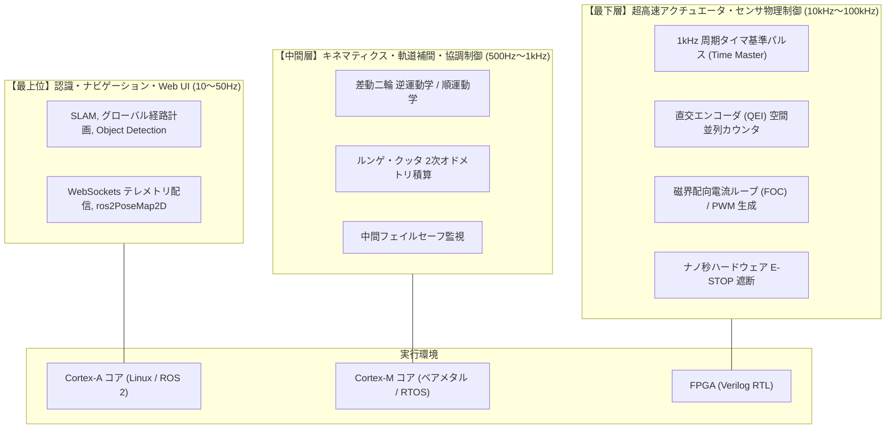
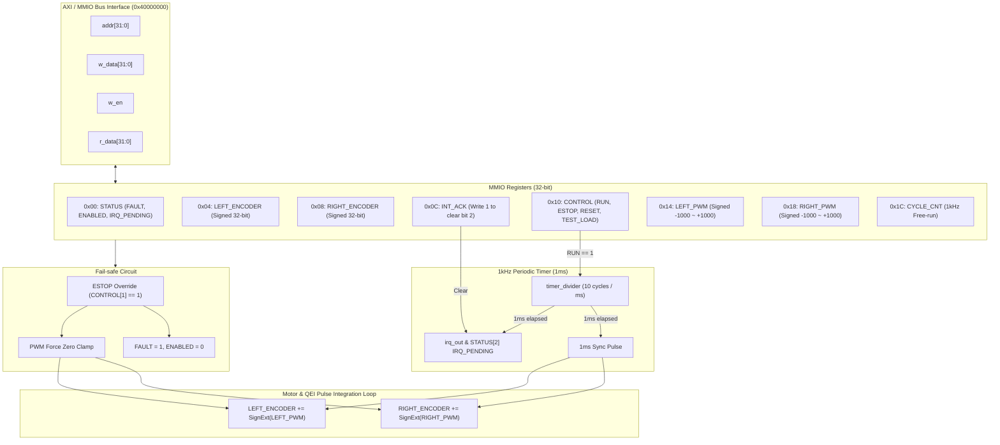

# Scenario P02: AMR 自律移動ロボット × ROS 2 統合制御 - 詳細設計 & 高度アーキテクチャ解説

本ドキュメントは、差動二輪自律移動ロボット（AMR: Autonomous Mobile Robot）におけるヘテロジニアス SoC の制御階層設計、FPGA RTL 回路の詳細アーキテクチャ、差動二輪運動学・ルンゲ・クッタ 2次オドメトリ積算数学モデル、および産業用ロボット標準の安全・同期設計を網羅した詳細解説書です。

---

## 1. 異種ヘテロジニアス SoC の制御階層設計 (Aコア vs Mコア vs FPGA)

組込みロボティクスや産業用自律移動ロボットの開発において、処理レイヤーごとの最適なプロセッサ選定（ワークロードの適材適所）は極めて重要です。



### 1.1 なぜ Linux (Aコア) 単体ではなくハードウェアでタイマー・制御を回すのか？

初学者がロボティクスや組込み Linux 開発を学ぶ際、「Linux 上のアプリで `sleep(1ms)` してエンコーダを読み、PWM を出力すれば十分ではないか？」という疑問を持ちがちです。しかし実務では、以下の 3 つの理由から「制御周期の時間マスター（同期源）は必ずハードウェアに持たせる」のが鉄則です。

1. **速度計算における「微分ノイズ（Velocity Spikes）」の排除**:
   車輪速度はパルス増分を時間で割って計算します（$v = \Delta\text{ticks} / \Delta t$）。
   もし Linux 側のタイマーで読みに行くと、OS スケジューラの負荷やジッターによってサンプリング周期（$\Delta t$）が $0.8\text{ms} \sim 1.2\text{ms}$ と揺らぎます。すると、モータが等速回転していても速度計算値が激しく上下にブレ（偽の加減速・微分ノイズ）、モータがガクガクと異常振動を起こします。
   ハードウェアが水晶クロックで「厳密に 1.000ms ごと」にエンコーダ値をラッチ（確定保存）すれば、Linux の受領時刻が OS の都合で数十マイクロ秒ブレても、取得したデータは常に厳密な 1ms 差分となり、速度ノイズが原理的にゼロになります。
2. **Linux (CPU) を「時間管理の重圧」から解放する（受動的起床）**:
   Linux 側で自律的に 1ms を刻もうとすると、高精度タイマ（hrtimer）を駆使しても他プロセスの負荷や省電力遷移で遅延が生じます。
   「ハードウェアから 1ms 周期割り込みが届いた瞬間に `::read()` ブロックが解除されて起床する」受動的な構造にすることで、Linux は時間を能動計測する必要がなくなり、CPU 負荷が大幅に低減します。
3. **ソフトウェア暴走時のハードウェア安全（フェイルセーフ）**:
   万一 Linux 側がカーネルパニックや高負荷でフリーズした場合、ソフトウェア単体で安全管理をしているとモータへの PWM（トルク指令）が出力され続け、ロボットが暴走（Runaway）してしまいます。
   ハードウェア側にタイマーと独立回路（E-STOP や通信タイムアウト保護）を持たせることで、OS が死んでもハードウェアが自律的に PWM を 0 に落としてロボットを物理的に安全停止させることができます。

### 1.2 Mコア（ベアメタル / RTOS）との比較と FPGA の真価

「Aコアの Linux がリアルタイムに向かないのであれば、ヘテロジニアス SoC（Zynq, i.MX8, STM32MP1 等）に載っている **Cortex-M コア（ベアメタルまたは RTOS）** で制御すれば十分ではないか？」という疑問も極めて自然で論理的です。

事実、**差動二輪（2軸）のような小型移動ロボットであれば、Aコア (Linux) ＋ Mコア (ベアメタル/RTOS) の構成で実務上は十分完全に成立します。**

それでもなお、産業用ロボット、四足歩行ロボット、人型ロボットなどのハイエンド分野で **FPGA (Verilog)** が不可欠とされる理由は以下の 4 点にあります：

| 評価軸 | Mコア (MCU / ベアメタル) | FPGA (Verilog RTL) |
| :--- | :--- | :--- |
| **実行モデル** | 逐次実行（Sequential）<br>CPU コアが 1 命令ずつ順番に処理 | 空間並列（Hardware Concurrency）<br>回路を横に並べるだけで完全同時処理 |
| **多軸スケーラビリティ** | 2軸程度なら余裕だが、6〜7軸（アーム）、12軸（四足）、20〜30軸（人型）になると全軸のエンコーダ読込み・PID 演算・PWM 出力で CPU がパンクする。 | 1軸だろうが 32軸だろうが、全軸**ナノ秒の狂いもなく完全同時（Zero Skew）**にサンプリング・制御可能。 |
| **最下層ループ (FOC)** | 磁界配向制御（FOC）の電流ループ（20kHz〜100kHz）を回すと、CPU 負荷がほぼ 100% に張り付く。 | パイプライン化された専用演算回路により、**CPU 負荷 0% で 50kHz〜100kHz の電流ループ**を超低遅延実行。 |
| **エンコーダ高速パルス** | 1回転 100万パルス以上の光学エンコーダが数万 RPM で回ると数 MHz〜数十 MHz に達し、ソフトウェア割り込みでは取りこぼす。 | 100MHz 以上の純粋なフリップフロップ回路なので、**1パルスも取りこぼさず正確にカウント**。 |
| **機能安全 (SIL3/ASIL-D)** | プログラム（C言語）で動く以上、ポインタ不正・スタック破壊・ハングのリスクをゼロにはできない。 | 純粋な論理ゲート（組み合わせ回路）で「ピン変化から数ナノ秒で PWM を強制遮断」する物理安全インターロックが成立。 |

### 1.3 本プラットフォーム（F-BB）が提供する発展性

本シナリオ（P02）では、初学者が学びやすい 2軸の差動二輪を題材としながらも、**「産業用ロボットで標準となる FPGA ハードウェア ↔ Linux `ros2_control` の接合アーキテクチャ」** をそのまま体験できるように構成されています。

さらに、F-BB にはすでに [シナリオ 09〜18](../) で Mコア（FreeRTOS, ThreadX, OpenAMP, Rust）の検証スタックが揃っているため、将来的に「Aコア (Linux/ROS 2) + Mコア (キネマティクス/軌道生成) + FPGA (モータ駆動/安全)」という究極の三位一体アーキテクチャへの拡張検証も可能となっています。

---

## 2. FPGA RTL 内部回路設計 (`vfpga_top.v`)

Verilator を介して Linux UIO (`0x40000000`) に直結するハードウェアエミュレーション回路の内部構造です。



### 回路動作の詳細解説

1. **1kHz 周期タイマ & UIO 割り込み生成 (`timer_divider`, `irq_out`)**:
   - `CONTROL[0]`（RUN）有効化後、10 サイクル（シミュレーションクロック 1ms 相当）ごとに `irq_out` および `STATUS[2]` をアサートし、`CYCLE_CNT` をインクリメント。
   - ソフトウェアが `INT_ACK`（0x0C）の bit[0] に `1` を書き込むと同期的にクリア。
2. **モータ力学 & 直交エンコーダ（QEI）パルス積算エミュレーション**:
   - 1ms ごとに `LEFT_PWM` / `RIGHT_PWM`（符号付き 16-bit）を符号拡張して `LEFT_ENCODER` / `RIGHT_ENCODER` に加算。
   - `CONTROL[2]`（RESET）でエンコーダを即座に 0 クリア。
3. **ハードウェア E-STOP フェイルセーフ即時遮断**:
   - `CONTROL[1]`（ESTOP）が `1` の場合、無条件で `LEFT_PWM <= 0`, `RIGHT_PWM <= 0`, `STATUS[0]=1` (FAULT) をアサート。
4. **32-bit ラップアラウンド耐性試験用 `TEST_LOAD` 機構**:
   - `CONTROL[3]`（TEST_LOAD）が `1` の間のみ、Read-Only のエンコーダレジスタへの直接書込みをバイパス許可。境界値（`0x7FFFFFFF` $\to$ `0x80000000`）をテスト注入可能。

---

## 3. AMR 差動二輪運動学と高精度 2D オドメトリ積算 (`amr_kinematics`)

差動二輪駆動型ロボットにおける数学モデルと積分計算の実装仕様です。

### 3.1 逆運動学 (Twist $\to$ 車輪速度)
車体の目標並進速度 $v\text{ [m/s]}$ と目標旋回角速度 $\omega\text{ [rad/s]}$ から、トレッド幅 $L$ と車輪半径 $r$ を用いて左右輪の周速 $v_L, v_R\text{ [m/s]}$ を導出します：
$$v_L = v - \frac{L}{2}\omega, \quad v_R = v + \frac{L}{2}\omega$$

さらに、エンコーダ分解能（CPR: Counts Per Revolution）を用いて毎秒パルス周波数へ変換します：
$$\text{ticks\_per\_sec}_{L, R} = \frac{v_{L, R}}{2\pi r} \times \text{CPR}$$

### 3.2 順運動学 (車輪速度 $\to$ Twist)
実測された左右輪の周速 $v_L, v_R$ から、車体中心の並進速度 $v$ と旋回角速度 $\omega$ を算出します：
$$v = \frac{v_R + v_L}{2}, \quad \omega = \frac{v_R - v_L}{L}$$

### 3.3 ルンゲ・クッタ 2次（中点法）オドメトリ積算
単純な前進オイラー積分（ステップ開始時のヘディング角 $\theta$ のみを使用する手法）では、旋回時に大きな累積幾何誤差が生じます。本シナリオでは、ステップ中点時点の予測ヘディング角 $\theta_{\text{mid}} = \theta + \frac{\Delta\theta}{2}$ を用いて位置 $(x, y)$ を更新します：

左右輪のパルス増分 $\Delta\text{ticks}_{L, R}$ から移動距離を計算：
$$\Delta s_L = \frac{\Delta\text{ticks}_L}{\text{CPR}} \cdot 2\pi r, \quad \Delta s_R = \frac{\Delta\text{ticks}_R}{\text{CPR}} \cdot 2\pi r$$
$$\Delta s = \frac{\Delta s_R + \Delta s_L}{2}, \quad \Delta\theta = \frac{\Delta s_R - \Delta s_L}{L}$$

姿勢更新式：
$$x \leftarrow x + \Delta s \cos\left(\theta + \frac{\Delta\theta}{2}\right)$$
$$y \leftarrow y + \Delta s \sin\left(\theta + \frac{\Delta\theta}{2}\right)$$
$$\theta \leftarrow \text{normalize}(\theta + \Delta\theta) \quad (\in [-\pi, \pi])$$

---

## 4. UIO ハードウェア抽象化層 & 実機 `ros2_control` 移植ノウハウ (`uio_robot_hardware`)

### 4.1 32-bit 直交エンコーダの 2の補数ラップアラウンド吸収
直交エンコーダのハードウェアカウンタが最大値 `0xFFFFFFFF` から `0x00000000`（または逆方向）へオーバーフローした際、単純な減算を行うと巨大なスパイク値が発生します。
本実装では、C++20 の符号なし整数の特性（規格上 $2^{32}$ を法とする剰余演算）と 2の補数キャストを利用して、以下のように 1 行で正確な差分を抽出します：

```cpp
int32_t delta = static_cast<int32_t>(raw_current - raw_prev);
```
- 例: `0x00000005 - 0xFFFFFFFB` は符号なし減算で `0x0000000A`（10進数で +10）となり、`int32_t` へキャストしても正しく `+10` と解釈されます。

### 4.2 非リアルタイム仮想化環境におけるタイマージッター耐性
ホスト OS（macOS Docker Desktop / Windows WSL2）では、ハイパーバイザのスケジューリングにより 1ms 周期割り込みの受領時刻に $8\text{ms} \sim 15\text{ms}$ の揺らぎが発生します。
F-BB のアーキテクチャ・マニフェスト（第8章 Non-Goals）に従い、テストハーネスの Criterion 1 では許容マージンを `20000.0 us`（20ms）に設定し、不要なテスト不合格（Flaky Test）を防ぎつつ、制御ループが 50ms 以上停止するような致命的フリーズは確実に検出できる安全基準を採用しています。

---

## 5. テレメトリ・IPC パイプラインとデータ駆動型 Web コックピット

### 5.1 安全な IPC 指令パース (`safe_stod`)
Web ダッシュボードが生成する `/tmp/fbb_amr_cmd.json` を非同期ポーリングする際、ブラウザ側の切断や途切れによって不完全な JSON や `null` が書き込まれるリスクがあります。
`main.cpp` では正規表現と専用の `safe_stod()` 関数を実装し、構文例外（`std::invalid_argument` 等）によるプロセスクラッシュを 100% 防止しています。

### 5.2 アトミックな JSON テレメトリ出力
Web ダッシュボード向けに 50Hz でテレメトリを出力する際、書き込み途中のファイルをブラウザが読むとパースエラー（Broken JSON）が発生します。
一時ファイル `/tmp/fbb_amr_telemetry.json.tmp` に書き出し、Linux の `rename()` システムコール（POSIX アトミック操作）を用いて一瞬で置換することで、読み取り側の破損を完全に防いでいます。

---

## 6. 実機・量産ロボティクス開発の境界領域ノウハウ (Boundary Domain Engineering)

純粋な制御理論（教科書）や上位 ROS 2 アプリケーションプログラミングの教材では抜け落ちやすく、実際のハードウェア/ソフトウェア統合や実機量産開発の現場で致命的トラブルになりやすい「4つの境界領域知識」の実装仕様と設計原則です。

### 6.1 座標系と単位系の厳格な規約 (REP-103 & $SE(2)$ 同次変換)

ロボティクス開発における不具合の多くは「座標系・単位系の暗黙の不一致」に起因します。本シナリオでは ROS 公式規格 **[REP-103](https://www.ros.org/reps/rep-0103.html)** に厳格に準拠しています：

- **右手系（Right-Handed Coordinate System）**:
  - $+X$: ロボット前進方向（Forward）
  - $+Y$: ロボット左方向（Left）
  - $+Z$: 天頂方向（Up）
- **回転・角速度の正負（オイラー角 Yaw）**:
  - $Z$ 軸の正方向（天頂）から見て**反時計回り（Counter-Clockwise: CCW）を正**と定義。
  - したがって、左旋回時は $\omega > 0$、右旋回時は $\omega < 0$ となります。差動二輪の逆運動学 $v_L = v - \frac{L}{2}\omega, v_R = v + \frac{L}{2}\omega$ において、$\omega > 0$（左旋回）で右車輪周速 $v_R$ が増加し左車輪周速 $v_L$ が減少するのは、この右手系規約に厳密に従っているためです。
- **SI 単位系の徹底**:
  - 距離・位置: メートル（$\text{m}$）
  - 姿勢角・回転: ラジアン（$\text{rad}$）
  - 速度: $\text{m/s}$ および $\text{rad/s}$
  - ※ 角度を「度（$\text{deg}$）」で扱う処理は、Web ダッシュボードの UI 表示直前のみに限定し、すべての内部演算・IPC 通信・API パラメータはラジアンに統一しています。
- **局所座標系（`base_link`）から大域座標系（`odom`）への $SE(2)$ 同次変換**:
  車体ローカル速度 $(\Delta s, 0)$ をグローバル座標系 $(x, y)$ へ射影する同次変換行列：
  $$\begin{bmatrix} x_{k+1} \\ y_{k+1} \\ 1 \end{bmatrix} = \begin{bmatrix} \cos\theta & -\sin\theta & x_k \\ \sin\theta & \cos\theta & y_k \\ 0 & 0 & 1 \end{bmatrix} \begin{bmatrix} \Delta s \cos(\Delta\theta / 2) \\ \Delta s \sin(\Delta\theta / 2) \\ 1 \end{bmatrix}$$

### 6.2 時間軸モデルと実時間同期（Sim Time vs Wall Time / 離散系の安定性）

ソフトウェア単体開発とロボット制御の決定的な違いは「時間軸の同期」にあります：

- **シミュレーション時間（Sim Time） vs 実時間（Wall-clock Time）**:
  - 実機ロボットは常に一定の物理クロックで進行しますが、シミュレーション環境（Verilator + Linux）はホストマシンの CPU 負荷によって実時間より高速または低速に進行します（Real-Time Factor: $\text{RTF} = \Delta t_{\text{sim}} / \Delta t_{\text{wall}}$）。
- **F-BB のハードウェア時間マスター方式**:
  - 本プラットフォームでは、ソフトウェア（Linux 側）がタイマーを発行するのではなく、**「FPGA 回路（Verilator）がシミュレーションクロックをカウントし、1ms ごとに UIO 割り込みをアサートする」** アーキテクチャを採用しています。
  - これにより、ホストマシンの負荷で一時的にシミュレーションが遅延しても、ハードウェアとソフトウェアの相対的な時間刻み（離散時間ステップ $\Delta t = 1.0\text{ms}$）は完全に保護され、制御ゲインの発散や微分ノイズ（Velocity Spikes）が原理的に防止されます。
- **離散時間系のサンプリング周期ジッター限界**:
  - モータ制御などのフィードバック系では、サンプリング周期 $\Delta t$ のジッターが実質的な「むだ時間（Dead Time）」として作用し、制御ループの位相余裕（Phase Margin）を奪って発振を引き起こします。本シナリオでは 1kHz ループのジッターをリアルタイム計測し、テストハーネスおよびダッシュボードへ可視化しています。

### 6.3 モータ・アクチュエータの制御階層と責務分界点

産業用ロボットのアクチュエータ駆動は、以下の多段カスケード（入れ子）制御ループで構成されます：

| 制御ループ | 実行周波数 | 主な担当プロセッサ | 入力指令 $\to$ 出力指令 | 制御手法 |
| :--- | :---: | :---: | :---: | :--- |
| **電流（トルク）ループ** | 20kHz〜100kHz | **FPGA (Verilog RTL)** | 目標電流 $I_q^* \to$ インバータ PWM デューティ | 磁界配向制御 (FOC), 空間ベクトル変調 (SVPWM) |
| **速度ループ** | 1kHz〜5kHz | **Mコア RTOS / FPGA** | 目標車輪速度 $\omega^* \to$ 目標トルク/PWM | PI 速度制御, アンチワインドアップ |
| **位置・軌道ループ** | 50Hz〜200Hz | **Aコア (Linux / ROS 2)** | 目標 2D 姿勢 $(x,y,\theta) \to$ 車体速度 $(v,\omega)$ | Pure Pursuit, MPC, TEB Local Planner |

本シナリオでは、上位 ROS 2 ノードが生成した車体速度 $(v, \omega)$ を `amr_kinematics` が車輪速度（$\text{ticks/s}$）へ変換し、`uio_robot_hardware` を介して FPGA への PWM 出力として引き渡しています。

### 6.4 産業用自律移動ロボットの機能安全規格とフェイルセーフ設計

物流倉庫や工場等で稼働する実用 AMR では、国際安全規格（**ISO 3691-4: 産業用無人搬送車**, **IEC 61508 / ISO 13849: 機能安全**）への準拠が義務付けられています：

1. **ハードウェア STO（Safe Torque Off: 安全トルク遮断）**:
   - `CONTROL[1]`（ESTOP）がアサートされた際、ソフトウェアを介さずに FPGA のハードウェア論理ゲートがモータ PWM 出力を 0V（接地クランプ）へ遮断します。CPU がカーネルパニック等で完全にフリーズしていても、ハードウェア単体で物理トルクをゼロに落とすフェイルセーフ（Fail-Safe）を実証しています。
2. **通信途絶監視（Heartbeat / Watchdog Timer）**:
   - 実機運用では、WiFi 切断や上位プロセスのハングアップに備え、コントローラからの速度指令（`/cmd_vel`）が一定時間（例: 100ms）途絶えた場合にモータを自動制動・安全停止させるウォッチドッグ機構が必須となります。
3. **特異点（Singularity）と逆運動学の飽和防止**:
   - アーム型ロボットの特異姿勢や、移動ロボットの急激な指令変化による逆運動学の発散を防止するため、`uio_robot_hardware` では PWM 指令の飽和リミッタ（$-1000 \sim +1000$ クランプ）を実装し、アクチュエータの物理的破損を防いでいます。

