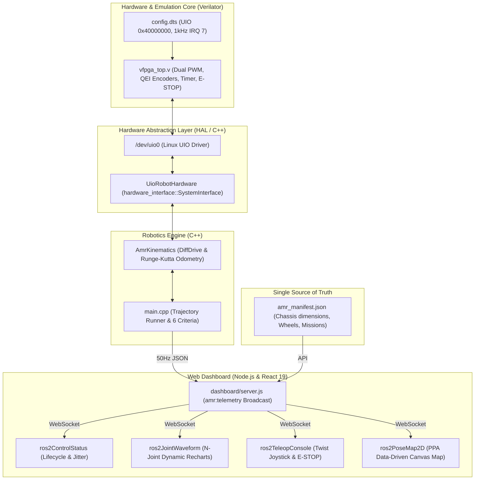

# Architecture Manifest: Scenario P02 自律移動ロボット (AMR) × ROS 2 統合制御

本ドキュメントは、自律移動ロボット（AMR: Autonomous Mobile Robot）の差動二輪運動学、Linux UIO (`/dev/uio0`) を用いた 1kHz リアルタイム制御ループ、および Web ダッシュボードのマルチペイン・コックピットを統合した実践フラッグシッププロジェクト **`P02_robot_amr_ros2`** のアーキテクチャ設計仕様書です。

---

## 1. 背景と目的 (Why P02?)

先行する基盤技術検証シナリオ `22_ros2_control_minimal` において、「Linux UIO ↔ C-Shim ↔ Verilator 1kHz 周期タイマ割込 ↔ `hardware_interface::SystemInterface`」のハードウェア/ソフトウェア接合部の完全な透過動作が実証されました。

本シナリオ `P02_robot_amr_ros2` は、この最小基盤の上に、以下のロボティクス実践スタックを統合します：
1. **差動二輪運動学 (Differential Drive Kinematics) と高精度オドメトリ計算法**:
   - 並進・旋回速度 $(v, \omega)$ と左右車輪回転速度 $(v_L, v_R)$ の双方向変換。
   - ルンゲ・クッタ（Runge-Kutta 2次）積分によるロボットの 2D 姿勢 $(x, y, \theta)$ のリアルタイム追従。
2. **DPPA (Dashboard Pane Plugin Architecture) マルチペイン統合**:
   - 従来の ROS 2 開発における複数の CLI ツール（`ros2 topic echo /odom`, `rqt_plot`, `ros2 control list_...`, `teleop_twist_keyboard`）を、Web ブラウザ上で視覚的に集約・統合。
   - ドッキングウィンドウおよびマルチモニタ Pop-out (`createPortal`) に完全対応。
3. **PPA (Peripheral Plugin Architecture) に基づくデータ駆動型アドオン設計**:
   - ロボットの車体外形（幅・長さ・トレッド幅）やテスト走行ミッション（直進1m、ピボット旋回、S字等）は、シナリオ配下の `amr_manifest.json` に集約（Single Source of Truth）。
   - ダッシュボード側のマップ描画コンポーネントは、この JSON を動的に解釈して車体やボタンをレンダリングするため、フロントエンドのハードコードを完全に排除。

---

## 2. システム協調アーキテクチャ

---

## 3. レジスタ契約とハードウェア仕様 (`/dev/uio0`)

[config.dts](config.dts) に基づく物理アドレス `0x40000000` のレジスタマップ：

| オフセット | レジスタ名 | 属性 | ビット幅 | ビットフィールド定義 & 仕様 |
| :--- | :--- | :---: | :---: | :--- |
| `0x00` | `STATUS` | RO | 32 | **Bit 0**: `FAULT/ESTOP`, **Bit 1**: `ENABLED`, **Bit 2**: `IRQ_PENDING` |
| `0x04` | `LEFT_ENCODER` | RO | 32 | 左輪 32-bit QEI インクリメンタル直交エンコーダ現在値 |
| `0x08` | `RIGHT_ENCODER`| RO | 32 | 右輪 32-bit QEI インクリメンタル直交エンコーダ現在値 |
| `0x0C` | `INT_ACK` | WO | 32 | Write 1 で FPGA 側の割り込みアサート (`irq_out`) をクリア |
| `0x10` | `CONTROL` | RW | 32 | **Bit 0**: `RUN`, **Bit 1**: `ESTOP`, **Bit 2**: `RESET`, **Bit 3**: `TEST_LOAD` |
| `0x14` | `LEFT_PWM` | RW | 32 | 左輪 16-bit 符号付き PWM Duty (-1000 〜 +1000) |
| `0x18` | `RIGHT_PWM` | RW | 32 | 右輪 16-bit 符号付き PWM Duty (-1000 〜 +1000) |
| `0x1C` | `CYCLE_CNT` | RO | 32 | 1kHz 周期ごとに自動インクリメントされるハードウェア周期カウンタ |

---

## 4. 自動検証の合否基準 (The 6 Criteria)

自動回帰テストスクリプト（`scenario_runner.sh`）実行時、以下の 6 項目が検証されます：

1. **1kHz Real-time Deterministic Jitter**:
   - 40制御ループを回し、平均ジッターが許容範囲内（シミュレーション環境で < 2500 $\mu$s）であることを検証。
2. **Dual-wheel Closed-loop Symmetry & Kinematics**:
   - 直進指令（$v = 0.2\text{m/s}$）を与え、左右車輪が対称に正回転し、停止指令で正常に整定することを検証。
3. **Pivot Turn & Curvature Kinematics**:
   - ピボット超信地旋回指令（$\omega = 0.5\text{rad/s}$）を与え、左輪が逆回転、右輪が正回転（$v_L \approx -v_R$）することを検証。
4. **Closed-loop 2D Odometry Accumulation**:
   - ルンゲ・クッタ積分によるロボット座標 $(x, y, \theta)$ が、車輪エンコーダ差分から幾何学的に正しく積算されることを検証。
5. **Hardware E-STOP Immediate Cutoff & Recovery**:
   - `CONTROL[1]` のアサートにより、PWM出力が即座にハードウェア遮断（0Vクランプ）され、解除後に正常復帰することを検証。
6. **Protocol RO Protection & 32-bit Counter Wrap-around**:
   - Read-Only レジスタへの不正書き込みが C-Shim により保護されること、および `0x7FFFFFFF` $\to$ `0x80000000` の符号付き 32-bit オーバーフロー時に速度スパイクが発生しないことを検証。

---

## 5. 設計意思決定ログ (Architecture Decision Records)

- **ADR #013: 差動二輪 AMR の統合制御と 2層 DPPA/PPA マルチペイン・アーキテクチャの導入**
  - **Decision**:
    1. シナリオ 22 の基盤の上に差動二輪運動学（$v, \omega \leftrightarrow v_L, v_R$）およびルンゲ・クッタオドメトリ積算器を統合したフラッグシップ実践シナリオ `P02_robot_amr_ros2` を新設した。
    2. 単一の巨大コックピットペインを排し、3つの完全汎用コアペイン（`ros2ControlStatus`, `ros2JointWaveform`, `ros2TeleopConsole`）と、1つの PPA データ駆動型アドオンペイン（`ros2PoseMap2D`）による 2層 DPPA アーキテクチャを確立した。
    3. ロボットの幾何構造やミッションプリセットは、シナリオ配下の `amr_manifest.json` に集約し、フロントエンドへのハードコードを完全に排除した。
  - **Rationale**:
    - DPPA の最大の強みであるマルチモニタ Pop-out (`createPortal`) およびグリッドレイアウト分割を最大限に活かし、ROS 2 CLI を大幅に凌駕する直感的なデバッグ体験を提供するため。
    - 将来の「4輪メカナム車」や「多関節ロボットアーム」シナリオにおいて、フロントエンドの修正なしに同一の汎用ペイン群を 100% 再利用可能にするため。
