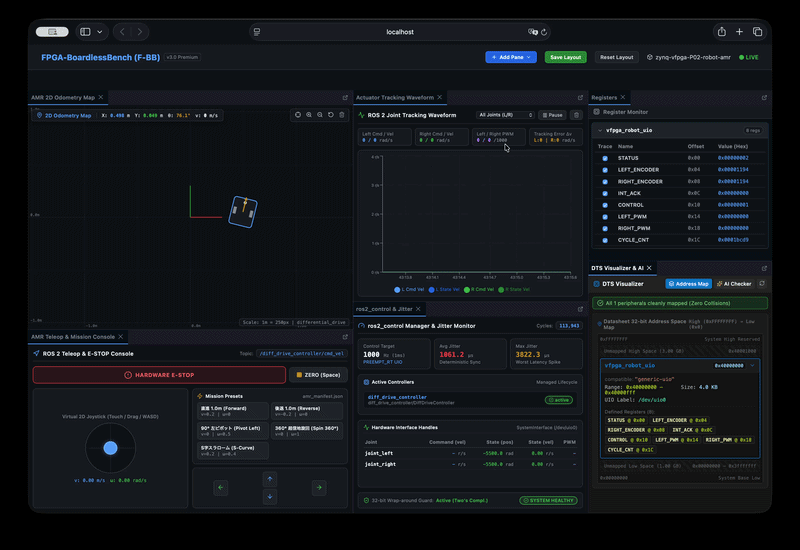
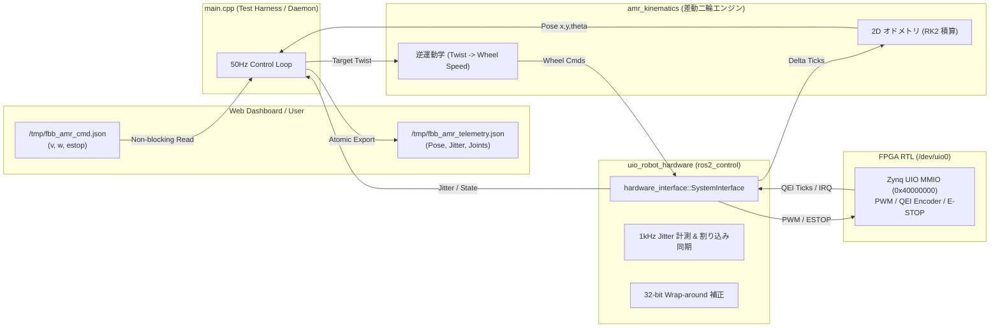

# P02_robot_amr_ros2: 自律移動ロボット (AMR) × ROS 2 統合制御 & Web コックピット

本シナリオは、車載 SurroundView 画像処理シナリオ（`P01_frdmIMX`）に続く、ロボティクス分野のフラッグシップ実践プロジェクトです。

差動二輪ロボット（AMR: Autonomous Mobile Robot）の運動学・オドメトリ積算エンジン、FPGA（Verilator）の 1kHz 周期割り込み・デュアル PWM・直交エンコーダ回路、Linux UIO (`/dev/uio0`) ハードウェア抽象化レイヤ（`ros2_control`）、そして Web ダッシュボードの 4つの特化型ペインを統合した環境を提供します。



---

## 1. システム概要と特徴

### ① 差動二輪運動学 (Differential Drive Kinematics) & オドメトリ
- **逆運動学 (Twist $\to$ 車輪速度)**:
  $$v_L = v - \frac{L}{2}\omega, \quad v_R = v + \frac{L}{2}\omega$$
  （$L$: トレッド幅 $0.16\text{m}$、$r$: 車輪半径 $0.033\text{m}$）
- **オドメトリ積算 (ルンゲ・クッタ 2次)**:
  左右のエンコーダパルス増分（$\Delta\text{ticks}$）から車輪移動距離 $\Delta s_L, \Delta s_R$ を算出し、中間ヘディング角を用いてロボットの 2D 姿勢 $(x, y, \theta)$ を高精度に更新します。

### ② ゼロ・ヘビーインストール設計 (Learner-Centric Purity)
- 10GB を超える重厚な ROS 2 デスクトップ環境を一切必要とせず、軽量互換 C++ ヘッダーによりクリーンな開発コンテナ上で **数秒でビルド・即時実行** できます。
- 実機 ROS 2 / `colcon` 環境が存在する場合は、自動検出して公式の `hardware_interface` ライブラリと透過的にリンクします。

### ③ Web ダッシュボード 4特化型ペイン (DPPA 統合)
従来の ROS 2 開発における複数の CLI ツール（`ros2 topic echo /odom`, `rqt_plot`, `ros2 control list_...`, `teleop_twist_keyboard`）をブラウザ上で視覚的に集約：
1. **`ros2PoseMap2D` (AMR 2D 走行軌跡マップ)**: 2D Canvas によるロボット車体、向き、走行軌跡のリアルタイム描画。
2. **`ros2JointWaveform` (アクチュエータ追従波形)**: Recharts による左右輪「目標速度 vs 実測エンコーダ速度」および PWM 波形。
3. **`ros2ControlStatus` (ros2_control & ジッター診断)**: コントローラ状態、エクスポートされたインターフェース値、1kHz 制御周期ジッターメーター。
4. **`ros2TeleopConsole` (AMR 操縦 & ミッションコンソール)**: 仮想ジョイスティック、キーボード (WASD)、テスト走行ミッションボタン、ハードウェア E-STOP。

---

## 2. ソフトウェアアーキテクチャと C++ ソースコード構成

本シナリオのファームウェアは、ROS 2 の標準的な制御スタック構成（ハードウェア抽象化・運動学・オドメトリ・テストハーネス）に倣い、責務ごとに明確に分離された複数の C++20 ソースコードで構築されています。

### 2.1 ソースコード一覧と主要責務

| ソースファイル | 役割・分類 | 主な責務と実装内容 |
| :--- | :--- | :--- |
| **[`main.cpp`](main.cpp)** | テストハーネス &<br>テレメトリデーモン | ・自動検証テスト（全6基準）の決定論的実行・合否判定<br>・対話モード（`VFPGA_INTERACTIVE=1`）での 50Hz 周期テレメトリ出力（`/tmp/fbb_amr_telemetry.json`）<br>・Web ダッシュボードからの走行指令（`/tmp/fbb_amr_cmd.json`）の安全パース（`safe_stod`）と反映 |
| **[`uio_robot_hardware.hpp`](uio_robot_hardware.hpp)<br>[`uio_robot_hardware.cpp`](uio_robot_hardware.cpp)** | `ros2_control`<br>ハードウェアインターフェース | ・`hardware_interface::SystemInterface` の具象クラス実装（`fbb_robot::UioRobotHardware`）<br>・`/dev/uio0` の MMIO レジスタマッピングと 1kHz タイマ割り込み同期（`read()` ブロッキング待機）<br>・32-bit QEI 直交エンコーダ値の読み出しと 2の補数ラップアラウンド（オーバーフロー）耐性計算<br>・左右輪 PWM 出力指令とハードウェア E-STOP / FAULT 状態の監視・制御 |
| **[`amr_kinematics.hpp`](amr_kinematics.hpp)<br>[`amr_kinematics.cpp`](amr_kinematics.cpp)** | AMR 差動二輪運動学 &<br>2D オドメトリエンジン | ・順運動学（左右輪速度 $\to$ 並進・旋回速度 $v, \omega$）および逆運動学（Twist $\to$ 左右輪目標速度）の演算<br>・エンコーダパルス増分（$\Delta\text{ticks}$）に基づくルンゲ・クッタ2次（中点法）オドメトリ積算<br>・姿勢角 $\theta$ の $[-\pi, \pi]$ 正規化および総走行距離・累積軌跡の算出 |
| **[`include/hardware_interface/`<br>`hardware_interface.hpp`](include/hardware_interface/hardware_interface.hpp)** | ゼロ・ヘビーインストール<br>互換レイヤー | ・重厚な ROS 2 パッケージ群（10GB超）を不要とする軽量互換 C++20 ヘッダー群<br>・公式 `ros2_control` の `SystemInterface`, `StateInterface`, `CommandInterface`, `CallbackReturn`, `HardwareInfo` を完全な API 互換で提供<br>・実機 ROS 2 環境では公式ライブラリへのシームレスな切り替えをサポート |
| **[`vfpga_device_config.h`](vfpga_device_config.h)** | デバイス設定ヘッダー | ・静的解析ツールやビルド環境向けに、UIO デバイスパス（`/dev/uio0`）などの基本定数を定義 |

---

### 2.2 各 C++ ソースコードの詳細解説

#### ① [`main.cpp`](main.cpp) — 統合テストハーネス & テレメトリデーモン
本シナリオの最上位エントリーポイントです。ビルドされたバイナリ（`test_bin`）は、実行環境に応じて以下の2つの動作モードを自律的に切り替えます：

1. **自動テストハーネス (Automated Test Harness)**:
   - `./tests/scenario_runner.sh tests/scenarios/P02_robot_amr_ros2` などから呼び出された際、ロボティクス制御における **6 つの重要判定基準**（1kHz 周期ジッター、左右輪対称駆動、超信地旋回、2D オドメトリ積算精度、ハードウェア E-STOP 即時遮断・復旧、32-bit レジスタ保護・ラップアラウンド）を自動実行し、ミリ秒単位で合否判定（PASS/FAIL）を出力します。
2. **対話型テレメトリデーモン (`VFPGA_INTERACTIVE=1` / `--interactive`)**:
   - `start_lab.sh` から実行された場合、自動テスト完了後に 50Hz 周期のテレメトリデーモンループへ移行します。
   - **安全な IPC 指令パース (`safe_stod`)**: Web ダッシュボード（仮想ジョイスティックやキーボード操作）が `/tmp/fbb_amr_cmd.json` に書き込んだ速度指令 $(v, \omega)$ や E-STOP 指令をポーリングします。文字列解析時に `null` や異常入力が含まれていても `std::invalid_argument` 等で異常終了しないよう堅牢な数値抽出ガードを備えています。
   - **アトミックな JSON テレメトリ出力**: 現在の 2D 姿勢 $(x, y, \theta)$、実測並進・旋回速度、左右車輪の PWM・エンコーダ状態、1kHz 制御ジッター指標、安全ステータスを集約し、一時ファイル（`.tmp`）からアトミックリネームで `/tmp/fbb_amr_telemetry.json` に書き出します。

#### ② [`uio_robot_hardware.hpp`](uio_robot_hardware.hpp) / [`uio_robot_hardware.cpp`](uio_robot_hardware.cpp) — `ros2_control` ハードウェアインターフェース
Linux 標準の Userspace I/O（`/dev/uio0`）を介して FPGA のモータ制御・エンコーダ回路と通信する、公式 `ros2_control` 仕様のハードウェアプラグイン実装です。AMD Xilinx Kria KR260 や Zynq-7000 の実機 FPGA ボード上でも、コードを 1 行も変更することなくそのままコンパイル・動作します。

- **`UioDevice` クラス (RAII パターン)**:
  - `/dev/uio0` を `open` し、`mmap` により `0x1000` バイトの MMIO レジスタ領域をユーザ空間にマッピングします。デストラクタで確実に `munmap` および `close` を行い、リソースリークを防ぎます。
  - レジスタへの 32-bit アトミックな読み書き（`read32`, `write32`）を提供します。
- **`UioRobotHardware` クラス (`hardware_interface::SystemInterface` 実装)**:
  - `on_init()`: UIO デバイスを接続し、モータ PWM と制御レジスタを初期化（停止状態）します。
  - `export_state_interfaces()`: 上位の `diff_drive_controller` などに向けて、左右輪のエンコーダ位置（`position`）と速度（`velocity`）インターフェースをエクスポートします。
  - `export_command_interfaces()`: コントローラからの目標車輪速度指令を受け取る `velocity` コマンドインターフェースをエクスポートします。
  - `on_activate()`: UIO の割り込みマスクを解除（`write(fd, &unmask)`）し、FPGA の RUN ビットを有効化して制御周期タイマを始動します。
  - `read()`: FPGA からの 1kHz タイマ割り込みを `::read(fd)` のブロッキング待機で同期受領します。`CLOCK_MONOTONIC` による高精度タイマで割り込みジッター（μs）を計測しつつ、左右の 32-bit QEI エンコーダパルスを取得します。
    > [!NOTE]
    > **32-bit エンコーダの 2の補数ラップアラウンド吸収**
    > 直交エンコーダが `0xFFFFFFFF` から `0x00000000`（または逆方向）へオーバーフローした際、符号なし整数の減算 `static_cast<int32_t>(raw - prev_raw)` を行うことで、C++20 の規格に基づき 2の補数表現で正確な差分パルス（$\Delta\text{ticks}$）が自動的に得られます。
  - `write()`: コマンドインターフェースの目標値を 16-bit 符号付き PWM 比（-1000 〜 +1000）にクランプして FPGA レジスタに書き込みます。ハードウェア E-STOP が有効な場合は即座に 0 出力に遮断されます。
  - `trigger_estop()` / `reset_encoders()`: ハードウェア E-STOP ビットの操作やエンコーダカウンタのリセットなどの診断・保護関数を提供します。

#### ③ [`amr_kinematics.hpp`](amr_kinematics.hpp) / [`amr_kinematics.cpp`](amr_kinematics.cpp) — 差動二輪運動学 & 2D オドメトリ積算エンジン
UIO レジスタや ROS 2 ミドルウェアから完全に独立した、純粋な C++20 数学ライブラリです。差動二輪駆動型ロボットの幾何学的モデル計算と、累積誤差の極めて小さいオドメトリ積算を担当します。

- **`Pose2D`, `Twist2D`, `WheelSpeeds` 構造体**:
  - ロボットの位置・姿勢 $(x, y, \theta)$、車体速度 $(v, \omega)$、左右車輪の物理速度（m/s, rad/s, ticks/s）を明瞭に表現します。
- **逆運動学 (`twist_to_wheel_speeds`)**:
  - 車体並進速度 $v\text{ [m/s]}$ と旋回角速度 $\omega\text{ [rad/s]}$ から、車体トレッド幅 $L$ と車輪半径 $r$ を用いて左右輪の目標周速 $v_L, v_R$ を導出します：
    $$v_L = v - \frac{L}{2}\omega, \quad v_R = v + \frac{L}{2}\omega$$
  - さらに車輪半径 $r$ とエンコーダ分解能（CPR: Counts Per Revolution）を用いて、毎秒あたりのパルス周波数（ticks/s）へと正確に変換します。
- **順運動学 (`wheel_speeds_to_twist`)**:
  - 実測された左右輪の周速 $v_L, v_R$ から、車体全体の進行速度 $v$ と旋回角速度 $\omega$ を逆算します。
- **ルンゲ・クッタ 2次（中点法）オドメトリ積算 (`update_odometry`)**:
  - 1kHz の周期割り込みごとに得られる左右輪のエンコーダ増分パルス $\Delta\text{ticks}_{L, R}$ から、左右輪の移動距離 $\Delta s_L, \Delta s_R$ を計算します。
  - 単純なオイラー積分（ステップ開始時のヘディング角 $\theta$ をそのまま使う手法）では旋回時に急速に累積誤差が発散するため、ステップ中間時点の予測ヘディング角 $\theta_{\text{mid}} = \theta + \frac{\Delta\theta}{2}$ を用いて $(x, y)$ を更新します：
    $$\Delta s = \frac{\Delta s_R + \Delta s_L}{2}, \quad \Delta\theta = \frac{\Delta s_R - \Delta s_L}{L}$$
    $$x \leftarrow x + \Delta s \cos\left(\theta + \frac{\Delta\theta}{2}\right), \quad y \leftarrow y + \Delta s \sin\left(\theta + \frac{\Delta\theta}{2}\right), \quad \theta \leftarrow \text{normalize}(\theta + \Delta\theta)$$
- **角度正規化 (`normalize_angle`)**:
  - 姿勢角 $\theta$ が長時間走行で発散しないよう、常に $[-\pi, \pi]$ の範囲に折りたたみます。

#### ④ [`include/hardware_interface/hardware_interface.hpp`](include/hardware_interface/hardware_interface.hpp) — ゼロ・ヘビーインストール互換レイヤー
重厚な ROS 2 ディストリビューション（10GB 超のデスクトップ環境）をホストやコンテナにインストールすることなく、公式 `ros2_control` と 100% 同一のシグネチャとセマンティクスでビルド・実行できるようにする自己完結型の互換ヘッダー群です。

- 公式 ROS 2 の `hardware_interface::SystemInterface`、`StateInterface`、`CommandInterface`、`CallbackReturn`、`HardwareInfo`、および `rclcpp::Time` / `Duration` を軽量なインラインクラスとして完全網羅。
- 本シナリオの `uio_robot_hardware.cpp` は、実機 ROS 2 環境に持ち込んだ際もコード変更なしで公式の `hardware_interface` パッケージとリンクできます。

#### ⑤ [`vfpga_device_config.h`](vfpga_device_config.h) — 仮想 FPGA デバイス設定ヘッダー
UIO デバイスパス（`/dev/uio0`）や MMIO リージョンサイズ、クロック周波数などの基本定数を静的解析ツール（clangd / IntelliSense）およびビルド環境向けに共有するための定数ヘッダーです。

---

### 2.3 クリーンアーキテクチャと関心の分離 (Separation of Concerns)

本シナリオの C++ コード群は、以下のように各コンポーネントが互いの内部事情に立ち入らないよう厳格に関心が分離されています：

1. **`amr_kinematics` はハードウェアも ROS 2 も知らない**:
   - 純粋な数学モデルと幾何計算のみを行い、ファイル I/O やレジスタ MMIO、ROS 2 の依存関係を一切含みません。単体テストが極めて容易です。
2. **`uio_robot_hardware` はロボットの外形寸法や走行軌跡を知らない**:
   - FPGA レジスタとの通信と、`ros2_control` のインターフェースエクスポートのみに専念します。ロボットが二輪か四輪か、車輪半径がいくつかといった上位の解釈を持ちません。
3. **`main.cpp` がオーケストレーションを担当**:
   - 運動学エンジンとハードウェアプラグインを接続し、テストシナリオの進行や Web ダッシュボードとの IPC を仲介します。

### モジュール間連携データフロー



---

## 3. 実行方法 (Execution)

### ① 自動テスト（全 6 基準の検証）
リポジトリルートから以下のコマンドを実行します：

```bash
./tests/scenario_runner.sh tests/scenarios/P02_robot_amr_ros2
```

実行後、ターミナル上に全 6 項目の `[ PASS ]` と `>>> ALL 6 CRITERIA PASSED! Scenario P02 Verification SUCCESS. <<<` が出力されます。

### ② インタラクティブ・ラボ（Web ダッシュボード連携）
Web ダッシュボード（ポート 8080）と連携して、ロボットのリアルタイム走行を観察・操縦する場合：

```bash
./start_lab.sh tests/scenarios/P02_robot_amr_ros2
```

ブラウザで **`http://localhost:8080`** を開くと、`fbb_layout.json` に基づき 4 つのコックピットペインが自動配置されます。各ペインの右上にある「Pop-out」ボタンをクリックすることで、サブディスプレイへの全画面切り離し表示も可能です。

---

## 4. UIO レジスタマップ仕様書 (`vfpga_robot_uio@40000000`)

[config.dts](config.dts) で定義されている物理アドレス `0x40000000` のレジスタ配置：

| オフセット | レジスタ名 | 属性 | ビット幅 | 詳細仕様 |
| :---: | :--- | :---: | :---: | :--- |
| `0x00` | **`STATUS`** | RO | 32 | モータドライバステータス<br>・**bit[0]**: FAULT / ESTOP アクティブ<br>・**bit[1]**: ENABLED（走行可能状態）<br>・**bit[2]**: IRQ_PENDING（1kHz タイマ割込発生中） |
| `0x04` | **`LEFT_ENCODER`** | RO | 32 (signed) | 左輪直交エンコーダ累積パルス（32bit 符号付きカウンタ） |
| `0x08` | **`RIGHT_ENCODER`**| RO | 32 (signed) | 右輪直交エンコーダ累積パルス（32bit 符号付きカウンタ） |
| `0x0C` | **`INT_ACK`** | WO | 32 | 1kHz タイマ割込クリアレジスタ<br>・**bit[0]** に 1 を書き込むと `STATUS[2]` および `irq_out` がクリア |
| `0x10` | **`CONTROL`** | RW | 32 | 制御レジスタ<br>・**bit[0]**: RUN（タイマ・モータ有効化）<br>・**bit[1]**: ESTOP（ハードウェア非常停止）<br>・**bit[2]**: RESET（エンコーダカウンタのリセット）<br>・**bit[3]**: TEST_LOAD（テスト用エンコーダ値プリロード許可） |
| `0x14` | **`LEFT_PWM`** | RW | 32 (signed) | 左輪目標 PWM デューティ比（-1000 〜 +1000） |
| `0x18` | **`RIGHT_PWM`** | RW | 32 (signed) | 右輪目標 PWM デューティ比（-1000 〜 +1000） |
| `0x1C` | **`CYCLE_CNT`** | RO | 32 | 1kHz 周期フリーランニングサイクルカウンタ |

---

## 5. Single Source of Truth (`amr_manifest.json`)

ロボットの車体寸法、車輪パラメータ、および走行テストパターンは、シナリオ配下の [amr_manifest.json](amr_manifest.json) で一元管理されています。Web ダッシュボードはこの定義を自動で読み込み、動的にロボット外形やミッションボタンをレンダリングします。

---

## 6. さらに詳しく知りたい方へ
`ros2_control` のライフサイクル詳細仕様、リアルタイムジッター補正、32-bit エンコーダのラップアラウンド耐性設計、および実機開発特有のノウハウは、**[シナリオ22 ADVANCED.md](../22_ros2_control_minimal/ADVANCED.md)** を参照してください。

