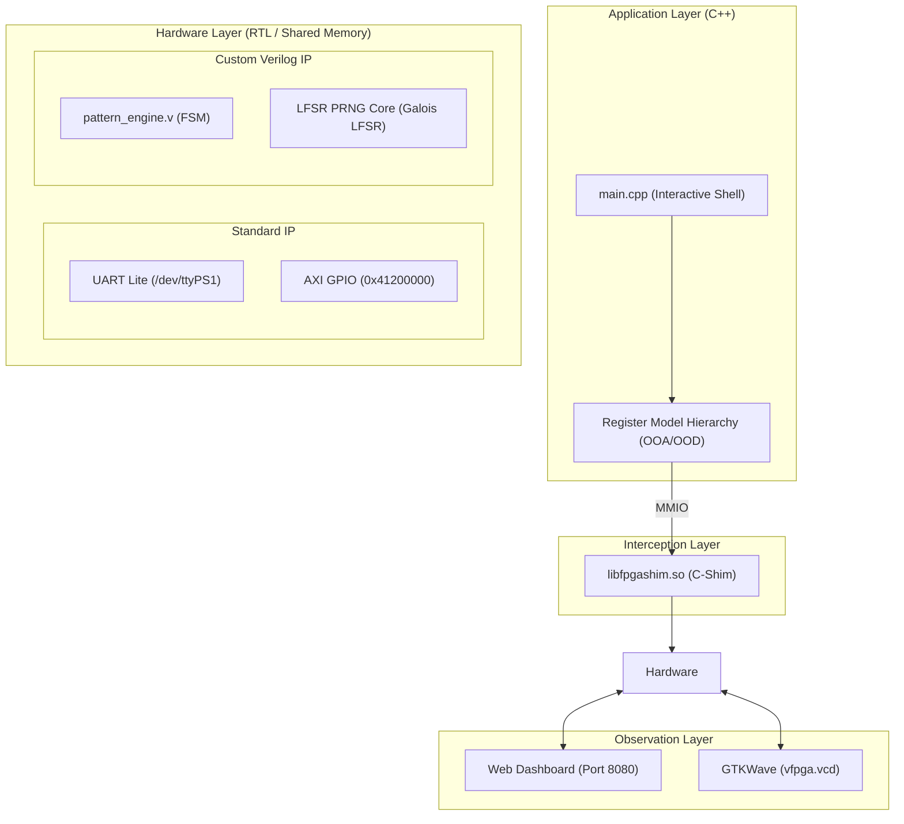

# Scenario S01: C++ LFSR シーケンサー - 詳細設計 & アーキテクチャ解説

本ドキュメントは、C++ オブジェクト指向 HAL 設計、カスタム Verilog LFSR (線形帰還シフトレジスタ) パターンエンジン、およびシステム統合ショーケースの詳細仕様書です。

---

## 1. システム統合アーキテクチャ

---

## 2. C++ ファームウェアクラス設計

- **`MemoryMappedDevice`**: 物理 MMIO アクセスを抽象化した基底クラス。
- **`UioDevice`**: `/dev/uioX` の `open` / `mmap` / `munmap` を RAII パターンで安全に管理するカプセル化クラス。
- **`LfsrEngine`**: パターン生成・ステートマシン制御を担当する高水準ドライバクラス。
