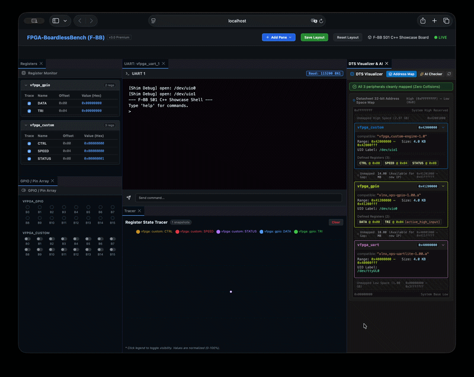
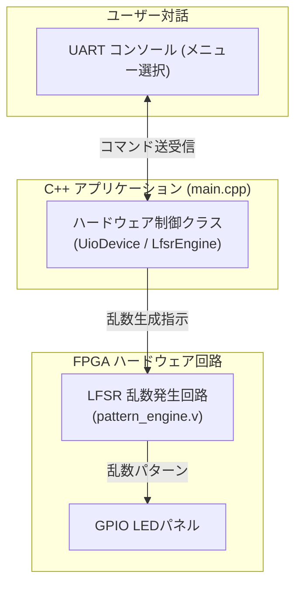

# S01_cpp_lfsr_sequencer: ハードとソフトを束ねる「C++システム統合」

おめでとうございます！いよいよステップアップ学習ロードマップの最終シナリオです。

このシナリオは、F-BBの主要機能（レジスタMMIO、UARTシリアル通信、GPIO LED制御、そして自分で書いたVerilog回路）をすべて組み合わせた **「システム統合ショーケース」** です。

C++のオブジェクト指向プログラミングを使って、ハードウェア全体をエレガントに制御します。



---

## このシナリオのゴール
**「C++クラスでハードウェアを抽象化し、乱数生成回路（LFSR）とLED/UARTを連動させた総合対話システムを動かす」**

---

## 直感イメージ：CPUとFPGAのやり取り
C++アプリケーションが、UARTからのコマンドに応じてカスタムFPGA回路（LFSR乱数エンジン）を動かし、結果をLEDに点灯させます。



---

## 3つの基本ステップ（コードの読み方）

[main.cpp](main.cpp) で行っていることは、以下の3ステップです。

1. **C++クラスでデバイスを安全に開く (RAIIパターン)**
   - `UioDevice` クラスがコンストラクタで `mmap` し、スコープを抜けると自動で `munmap` します。
2. **カスタム回路（LFSRパターンエンジン）にパラメータを設定する**
   - シード値や点滅モード（チェイス・ストロボ・乱数）をレジスタに書き込みます。
3. **対話メニューからハードウェアをリアルタイム操作する**
   - UARTから `1`〜`5` のキーを押すことで、LEDの光り方を自在に切り替えます。

---

## 1. まずは動かしてみよう！

Webダッシュボードでフル機能の統合体験を楽しむため、以下を実行します。

```bash
./start_lab.sh tests/scenarios/S01_cpp_lfsr_sequencer/
```

ブラウザで **`http://localhost:8080`** を開くと、**「LEDパネル」「レジスタモニタ」「UARTコンソール」** がすべて同時に連動して動く大迫力の統合システムを体験できます！

*(※CLIで自動テストだけ実行したい場合は `./run.sh` を実行します)*

---

## 2. ちょこっと改造チャレンジ！

- **実験:** [pattern_engine.v](pattern_engine.v) のVerilog回路コードを開き、乱数の計算式やシフトパターンを書き換えて `./run.sh` を実行してみてください。自分が改造したハードウェアがC++アプリから直ちに呼び出される感動を味わえます！

---

## ロードマップ完走！次のステップへ
これで **FPGA & 組み込みLinux ステップアップ学習ロードマップ（全5ステージ）** の全課程を修了しました！

- **自作シナリオへの挑戦 [07_minimum_template](../07_minimum_template/README.md)**:  
  これまでに身につけた知識を武器に、自分だけのオリジナルFPGA回路やデバイスドライバを自由に作成・検証してみましょう！

---

## さらに詳しく知りたい方へ
C++ クラス階層設計や Galois LFSR 回路の数学的仕様は、**[ADVANCED.md](ADVANCED.md)** を参照してください。
